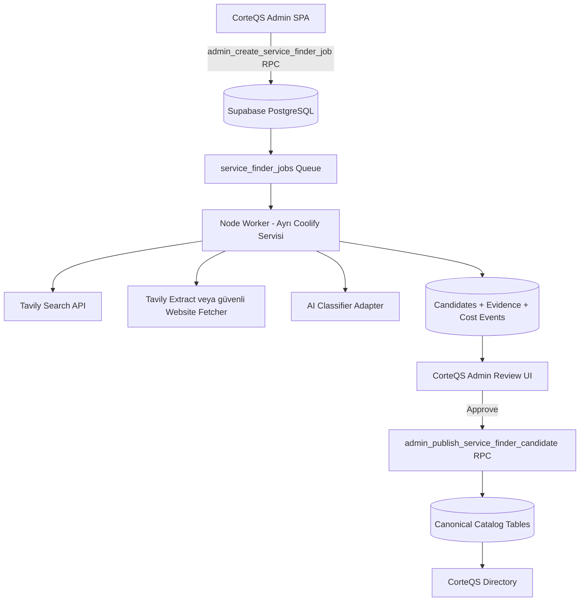
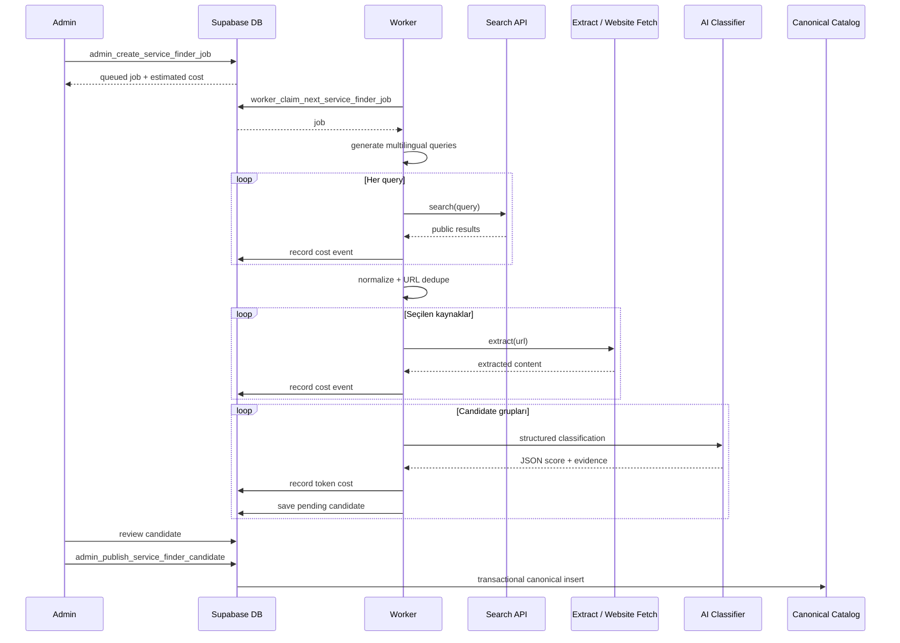

# CorteQS Admin Panelinden Çalışan Parametreli Türkçe Servis Bulucu
## E2E AI Kurulum ve Uygulama Master Planı

> **Hedef okuyucu:** Claude Code veya projede geliştirme yapacak teknik ekip  
> **Repo:** `corteqssocial-web/corfin-mvp`  
> **Hazırlanma tarihi:** 2026-06-10  
> **Doküman tipi:** Aktif implementation plan  
> **Önerilen repo konumu:** `docs/plans/corteqs-service-finder-e2e-implementation-plan.md`

---

# 0. Yönetici Özeti: Ortaya Çıkacak Sistem 5 Maddede

1. CorteQS admin panelinden şehir, ülke, rol veya meslek ve dil seçilerek arama başlatılabilecek. Örnek: `Dortmund + Doktor + Türkçe`.

2. Sistem Türkçe, Almanca ve gerektiğinde İngilizce arama sorgularını otomatik üretecek; Search API üzerinden kamuya açık sonuçları bulacak ve uygun web sayfalarından veri çıkaracak.

3. AI her sonucu kaynaklara dayanarak inceleyecek; lokasyon, rol, Türkçe hizmet sinyali, güven seviyesi ve olası duplicate durumunu puanlayacak. AI isimden etnik köken tahmini yapmayacak ve kaynakta olmayan bilgi üretmeyecek.

4. Sonuçlar doğrudan yayına alınmayacak. Önce admin panelde `İnceleme Bekliyor` durumuna düşecek; admin `Onayla`, `Düzenle`, `Reddet`, `Duplicate Olarak İşaretle` veya `Kaynağı Aç` aksiyonlarını kullanabilecek.

5. Tavily, SerpAPI, AI modeli ve website extraction kullanımı işlem bazında kaydedilecek. Admin panelde job, gün, ay, provider ve yayınlanan kayıt başına yaklaşık maliyet canlı izlenebilecek; bütçe limitleri aşılırsa sistem yeni harcamayı durduracak.

---

# 1. Repo İncelemesine Dayalı Gerçekler

Bu plan soyut bir yeni proje tasarımı değildir. Mevcut `corfin-mvp` reposunun gerçek mimarisine göre hazırlanmıştır.

## 1.1 Mevcut Stack

Repo bir **Next.js uygulaması değildir**. Doğru teknoloji yapısı:

```text
React 18
Vite 5
TypeScript 5.8
react-router-dom
Tailwind CSS
shadcn/ui + Radix
Supabase PostgreSQL + Auth + RLS + RPC + Edge Functions
TanStack React Query
Zod
Vitest
Playwright
Docker / Coolify
node server.mjs
```

Bu nedenle yeni modül için Next.js API Routes oluşturulmayacaktır.

Doğru entegrasyon yaklaşımı:

```text
React Admin SPA
      ↓
Supabase RPC / RLS-safe reads
      ↓
PostgreSQL Job Queue
      ↓
Ayrı Node Worker Servisi
      ↓
Search API + Extract API + AI API
      ↓
Supabase Candidate ve Cost tabloları
```

## 1.2 Mevcut Admin Panel Yapısı

Mevcut admin route ağacı `src/App.tsx` altında yer alır.

Muhasebe modülü aşağıdaki pattern ile modüler route yapısını kullanır:

```text
src/pages/admin/muhasebe/routes.tsx
```

Yeni servis bulucu aynı pattern ile eklenmelidir:

```text
src/pages/admin/service-finder/routes.tsx
```

`src/App.tsx` içine yalnızca şu ekleme yapılmalıdır:

```tsx
import { serviceFinderRoutes } from "@/pages/admin/service-finder/routes";
```

ve `/admin` route ağacının içine:

```tsx
{serviceFinderRoutes}
```

## 1.3 Mevcut Admin Yetkilendirme Yapısı

Yeni kod eski `admin_users` tablosunu kullanmamalıdır.

Canonical kontrol:

```text
public.is_admin()
public.is_moderator()
```

Frontend admin erişimi mevcut pattern ile yapılır:

```ts
import { userIsAdmin } from "@/lib/admin";
```

Yeni Service Finder RPC fonksiyonlarında ayrıca server-side admin kontrolü zorunludur. Frontend menüsünün gizlenmesi güvenlik önlemi değildir; yalnızca kullanıcı deneyimi iyileştirmesidir.

## 1.4 Mevcut Katalog ve Flat-Role / AFS Sistemi

Repo 2026-06-09 tarihinde büyük catalog/role/AFS rebuild geçirmiştir.

Canonical tablolar:

```text
catalog_items
catalog_item_roles
catalog_item_attribute_values
catalog_item_claims
catalog_item_managers

roles
afs_attributes
afs_features
afs_sections
role_attributes
role_features
role_sections
```

Önemli kural:

```text
Catalog Item → Role bağlantısı catalog_item_roles üzerinden kurulmalıdır.
```

Eski yaklaşım olan yalnızca `platform_role_key` alanına güvenmek yeni kod için yeterli değildir.

AFS:

```text
AFS = Attributes / Features / Sections
```

Rol aileleri kaldırılmıştır. Roller flat yapıdadır.

## 1.5 Mevcut Import Altyapısı

Repo içinde zaten aşağıdaki script bulunmaktadır:

```text
scripts/import-profiles-csv.mjs
scripts/catalog-role-importer.mjs
scripts/catalog-role-import-map.json
```

Ayrıca `package.json` içinde Dortmund doktorları için özel komut tanımlanmıştır:

```text
npm run import:doctors:dortmund
npm run import:doctors:dortmund:write
```

Bu çok faydalı bir başlangıç noktasıdır çünkü mevcut script içinde şu reusable mantıklar vardır:

```text
CSV parsing
Türkçe slugify
telefon / e-posta / website alan okuma
şehir ve ülke defaults
hizmet listesi ayrıştırma
rol eşleme
tag üretme
kaynak snapshot saklama
```

Ancak script yeni sistemde doğrudan kullanılmamalıdır.

## 1.6 Kritik Uyumsuzluk: Eski CSV Scripti Güncel Şemaya Tam Uyumlu Değil

Mevcut import scriptinin yeni modül için doğrudan çağrılması risklidir.

Tespit edilen sorunlar:

```text
1. Kayıtları doğrudan published ve public yapıyor.
2. Manual review aşamasını atlıyor.
3. Removed *_details tablolarına yazmaya çalışıyor:
   - advisor_details
   - business_details
   - organization_details
4. Eski item-type mantığının bazı izlerini taşıyor.
5. Arama maliyetini kaydetmiyor.
6. AI doğrulaması ve evidence saklama yapmıyor.
```

Bu nedenle:

```text
npm run import:doctors:dortmund:write
```

komutu Service Finder kurulumu tamamlanana kadar yeni otomasyonun parçası yapılmamalıdır.

Doğru yaklaşım:

```text
Eski scriptin normalize ve CSV parsing mantığını referans al
              ↓
Yeni candidate ingestion katmanı oluştur
              ↓
Manual admin review zorunlu olsun
              ↓
Onay sonrası canonical catalog publish RPC çalışsın
```

## 1.7 Mevcut AI Edge Function Pattern'i

Repo içinde:

```text
supabase/functions/find-matches/index.ts
```

dosyasında faydalı bir örnek vardır:

```text
Zod request validation
CORS kontrolü
payload size limiti
database-backed rate limit
service-role Supabase client
Gemini API entegrasyonu
structured function calling
AI çıktısını Zod ile parse etme
```

Bu pattern yeni Service Finder sınıflandırma mantığı için referans alınmalıdır.

Ancak uzun süren Service Finder job'ları Edge Function içinde inline çalıştırılmamalıdır. Edge Function süre limitleri ve operasyonel hata yönetimi nedeniyle uzun job'lar ayrı worker servisinde yürütülmelidir.

## 1.8 Dokunulmaması Gereken Alanlar

Yeni modül kurulurken aşağıdakiler korunmalıdır:

```text
server.mjs içindeki SPA serve ve /api/chat proxy davranışı
vite.config.ts standalone HTML emit mantığı
src/integrations/supabase/client.ts
src/components/ui/* generated shadcn dosyaları
Mevcut migration sırası
SEO kilitli public route'lar
```

Eski migration dosyaları değiştirilmemelidir. Yalnızca yeni migration eklenmelidir.

---

# 2. Ürün Hedefi

## 2.1 Temel Problem

CorteQS içinde farklı lokasyonlarda Türkçe hizmet sunan kişi, işletme ve kurumların katalog verisini düzenli, kontrollü ve ölçeklenebilir şekilde oluşturmak istiyoruz.

Örnekler:

```text
Dortmund'da Türkçe hizmet veren doktorlar
Berlin'de Türkçe konuşan avukatlar
Köln'de Türkçe hizmet veren psikologlar
Amsterdam'da Türk restoranları
Paris'te Türk dernekleri
Hamburg'da Türkçe konuşan muhasebeciler
```

## 2.2 Temel Admin Kullanımı

Admin formu:

```text
Ülke: Almanya
Şehir: Dortmund
Rol: Doktor
Hedef Dil: Türkçe
Search Provider: Tavily
Search Depth: Basic
Maksimum Sonuç: 20
Website Extraction: Açık
AI Doğrulama: Açık
Auto Publish: Kapalı
Job Bütçesi: 1.00 USD
```

Admin `Aramayı Başlat` dediğinde:

```text
Job oluşturulur
      ↓
Worker job'u claim eder
      ↓
Çok dilli query üretilir
      ↓
Search API çağrıları yapılır
      ↓
Sonuçlar normalize edilir
      ↓
Website extraction yapılır
      ↓
AI sınıflandırma yapılır
      ↓
Duplicate kontrol edilir
      ↓
Candidate kayıtlar oluşur
      ↓
Admin incelemesi beklenir
```

---

# 3. Temel Mimari Kararı

## 3.1 Seçilen Mimari



## 3.2 Neden Ayrı Worker?

`server.mjs` şu anda static SPA serve ve RAG proxy görevi görüyor. Uzun süren arama işlemleri bu dosyanın içine eklenmemelidir.

Ayrı worker avantajları:

```text
HTTP request timeout riski azalır
Job retry kolaylaşır
Worker crash olsa bile job kaybolmaz
Admin panel kapanınca job devam eder
Rate limit ve bütçe kontrolü merkezi olur
Coolify üzerinde ayrı ölçeklenebilir
server.mjs sade kalır
```

## 3.3 Frontend Doğrudan API Key Kullanmayacak

Kesinlikle yapılmaması gereken:

```text
VITE_TAVILY_API_KEY
VITE_SERPAPI_API_KEY
VITE_GEMINI_API_KEY
VITE_OPENAI_API_KEY
```

Provider API key'leri frontend'e gönderilmemelidir.

Doğru yer:

```text
Coolify Worker Service environment variables
```

Admin frontend yalnızca Supabase RPC çağırır.

---

# 4. Modül İsimlendirmesi

Kod içinde önerilen teknik isim:

```text
service-finder
```

Admin panelde görünen Türkçe isim:

```text
Servis Bulucu
```

Alt açıklama:

```text
Lokasyon, rol ve dil bazlı kamuya açık servis sağlayıcı araştırması
```

---

# 5. Admin Panel Route Planı

## 5.1 Route Ağacı

```text
/admin/service-finder
/admin/service-finder/new
/admin/service-finder/jobs
/admin/service-finder/jobs/:jobId
/admin/service-finder/candidates
/admin/service-finder/candidates/:candidateId
/admin/service-finder/costs
/admin/service-finder/settings
```

## 5.2 Route Dosyası

Yeni dosya:

```text
src/pages/admin/service-finder/routes.tsx
```

Örnek yapı:

```tsx
import { lazy, Suspense } from "react";
import { Route } from "react-router-dom";

const ServiceFinderLayout = lazy(() => import("./ServiceFinderLayout"));
const ServiceFinderDashboardPage = lazy(() => import("./ServiceFinderDashboardPage"));
const ServiceFinderNewJobPage = lazy(() => import("./ServiceFinderNewJobPage"));
const ServiceFinderJobsPage = lazy(() => import("./ServiceFinderJobsPage"));
const ServiceFinderJobDetailPage = lazy(() => import("./ServiceFinderJobDetailPage"));
const ServiceFinderCandidatesPage = lazy(() => import("./ServiceFinderCandidatesPage"));
const ServiceFinderCandidateDetailPage = lazy(() => import("./ServiceFinderCandidateDetailPage"));
const ServiceFinderCostsPage = lazy(() => import("./ServiceFinderCostsPage"));
const ServiceFinderSettingsPage = lazy(() => import("./ServiceFinderSettingsPage"));

function PageFallback() {
  return (
    <div className="flex items-center justify-center py-12 text-sm text-muted-foreground">
      Yükleniyor...
    </div>
  );
}

export const serviceFinderRoutes = (
  <Route
    path="service-finder"
    element={
      <Suspense fallback={<PageFallback />}>
        <ServiceFinderLayout />
      </Suspense>
    }
  >
    <Route index element={<ServiceFinderDashboardPage />} />
    <Route path="new" element={<ServiceFinderNewJobPage />} />
    <Route path="jobs" element={<ServiceFinderJobsPage />} />
    <Route path="jobs/:jobId" element={<ServiceFinderJobDetailPage />} />
    <Route path="candidates" element={<ServiceFinderCandidatesPage />} />
    <Route path="candidates/:candidateId" element={<ServiceFinderCandidateDetailPage />} />
    <Route path="costs" element={<ServiceFinderCostsPage />} />
    <Route path="settings" element={<ServiceFinderSettingsPage />} />
  </Route>
);
```

## 5.3 Navigation Entegrasyonu

Değiştirilecek dosya:

```text
src/components/admin/admin-navigation.ts
```

Önerilen ekleme:

```ts
import { ScanSearch } from "lucide-react";
```

ve uygun admin menü listesine:

```ts
{ to: "/admin/service-finder", label: "Servis Bulucu", icon: ScanSearch }
```

`AdminLayout.tsx` içinde ayrıca mobile link listesi hardcoded tutulduğu için mobil menüye de eklenmelidir.

Tercihen küçük refactor:

```text
mobileMainLinks shared nav array'lerinden türetilsin
```

Ancak bu refactor kapsamı büyütürse yalnızca ilgili mobil link eklenebilir.

---

# 6. UI Sayfaları ve Bileşenleri

## 6.1 Dashboard

Route:

```text
/admin/service-finder
```

Kartlar:

```text
Bugünkü Harcama
Bu Ayki Harcama
Kalan Aylık Bütçe
Bekleyen Candidate Sayısı
Bu Ay Tamamlanan Job
Onaylanan ve Yayınlanan Kayıt
```

Son job'lar tablosu:

```text
Job ID
Şehir
Rol
Dil
Durum
Bulunan
Pending
Published
Maliyet
Başlatılma Tarihi
```

## 6.2 Yeni Arama Sayfası

Route:

```text
/admin/service-finder/new
```

Form alanları:

```text
Preset
Ülke
Şehir
Rol
Hedef Dil
Ek Anahtar Kelimeler
Search Provider
Search Depth
Maksimum Search Query
Query Başına Sonuç Limiti
Maksimum Extract URL
AI Doğrulama
Duplicate Kontrol
Job Bütçesi
```

Butonlar:

```text
Yaklaşık Maliyeti Hesapla
Aramayı Başlat
Preset Olarak Kaydet
```

## 6.3 Job Detay Sayfası

Route:

```text
/admin/service-finder/jobs/:jobId
```

Gösterilecek alanlar:

```text
Job Parametreleri
Job Status
Progress
Generated Queries
Search Provider
AI Provider
Başlangıç / Bitiş
Heartbeat
Son Hata
Retry Sayısı
Cost Breakdown
Candidate Summary
Job Event Timeline
```

Job aksiyonları:

```text
İptal Et
Tekrar Dene
Durdur
Devam Ettir
CSV İndir
```

MVP kapsamı:

```text
İptal Et
Tekrar Dene
CSV İndir
```

Pause/resume Faz 2 olabilir.

## 6.4 Candidate Review Sayfası

Route:

```text
/admin/service-finder/candidates
```

Filtreler:

```text
Şehir
Ülke
Rol
Status
Confidence
Türkçe Hizmet Sinyali
Duplicate Durumu
Job
Tarih Aralığı
```

Tablo:

```text
İsim
Rol
Şehir
Website
Türkçe Sinyali
AI Score
Duplicate Score
Kaynak Sayısı
Durum
Maliyet
Aksiyon
```

## 6.5 Candidate Detay Sayfası

Route:

```text
/admin/service-finder/candidates/:candidateId
```

Sekmeler:

```text
Özet
Kaynaklar
AI Değerlendirmesi
Alanlar
Duplicate Kontrolü
Maliyet
Geçmiş
```

Aksiyonlar:

```text
Onayla ve Yayınla
Düzenleyerek Yayınla
Reddet
Duplicate Olarak İşaretle
Manual Review Gerekiyor
```

## 6.6 Cost Dashboard

Route:

```text
/admin/service-finder/costs
```

Kartlar:

```text
Bugün
Bu Hafta
Bu Ay
Kalan Bütçe
Tahmini Ay Sonu
Candidate Başına Ortalama
Published Kayıt Başına Ortalama
```

Grafikler:

```text
Günlük Harcama Trendi
Provider Bazında Maliyet
Operation Type Bazında Maliyet
Job Bazında Maliyet
Approved / Rejected Candidate Maliyeti
```

Repo içinde `recharts` zaten bulunduğu için yeni chart bağımlılığı eklenmemelidir.

## 6.7 Settings Sayfası

Route:

```text
/admin/service-finder/settings
```

Ayarlar:

```text
Default Search Provider
Fallback Search Provider
Default AI Provider
Default AI Model
Aylık Bütçe
Günlük Bütçe
Job Başına Bütçe
Warning Threshold
Hard Stop
Default Result Limit
Default Query Count
Default Extract URL Limit
Sensitive Role Auto Publish Kuralı
Manual EUR / USD FX Rate
```

---

# 7. Frontend Dosya Yapısı

```text
src/
├── pages/
│   └── admin/
│       └── service-finder/
│           ├── routes.tsx
│           ├── ServiceFinderLayout.tsx
│           ├── ServiceFinderDashboardPage.tsx
│           ├── ServiceFinderNewJobPage.tsx
│           ├── ServiceFinderJobsPage.tsx
│           ├── ServiceFinderJobDetailPage.tsx
│           ├── ServiceFinderCandidatesPage.tsx
│           ├── ServiceFinderCandidateDetailPage.tsx
│           ├── ServiceFinderCostsPage.tsx
│           └── ServiceFinderSettingsPage.tsx
│
├── components/
│   └── admin/
│       └── service-finder/
│           ├── CostKpiCard.tsx
│           ├── BudgetProgressCard.tsx
│           ├── NewSearchJobForm.tsx
│           ├── JobStatusBadge.tsx
│           ├── JobProgressCard.tsx
│           ├── JobTimeline.tsx
│           ├── CandidateTable.tsx
│           ├── CandidateStatusBadge.tsx
│           ├── ConfidenceBadge.tsx
│           ├── CandidateEvidencePanel.tsx
│           ├── CandidateReviewActions.tsx
│           ├── CostBreakdownTable.tsx
│           └── ProviderUsageChart.tsx
│
├── lib/
│   ├── service-finder-api.ts
│   ├── service-finder-schemas.ts
│   ├── service-finder-types.ts
│   ├── service-finder-format.ts
│   ├── service-finder-aggregations.ts
│   └── service-finder-query-keys.ts
│
└── hooks/
    ├── useServiceFinderJobs.ts
    ├── useServiceFinderCandidates.ts
    ├── useServiceFinderCosts.ts
    └── useServiceFinderSettings.ts
```

## 7.1 Veri Katmanı Kuralı

Yeni component içinde doğrudan karmaşık:

```ts
supabase.from(...)
```

kullanımı yapılmamalıdır.

Doğru yaklaşım:

```text
src/lib/service-finder-api.ts
        ↓
React Query hooks
        ↓
UI components
```

Bu, repo dokümantasyonunda önerilen Muhasebe pattern'ine uygundur.

---

# 8. Veritabanı Tasarımı

Yeni tablolar için iki veya üç ayrı migration önerilir:

```text
supabase/migrations/YYYYMMDDHHMMSS_service_finder_core.sql
supabase/migrations/YYYYMMDDHHMMSS_service_finder_rls_and_rpcs.sql
supabase/migrations/YYYYMMDDHHMMSS_service_finder_seed_rates.sql
```

Eski migration dosyaları değiştirilmemelidir.

## 8.1 `service_finder_jobs`

Bir admin aramasını temsil eder.

```sql
create table public.service_finder_jobs (
  id uuid primary key default gen_random_uuid(),

  created_by uuid not null references auth.users(id),
  preset_id uuid null,

  country_code text not null,
  city text not null,
  role_key text not null,
  target_language_code text not null default 'tr',

  additional_keywords text[] not null default '{}',
  generated_queries jsonb not null default '[]'::jsonb,

  search_provider text not null default 'tavily',
  extract_provider text null default 'tavily',
  ai_provider text not null default 'gemini',
  ai_model text null,

  search_depth text not null default 'basic',
  max_queries integer not null default 6,
  results_per_query integer not null default 10,
  max_extract_urls integer not null default 20,

  ai_verification_enabled boolean not null default true,
  duplicate_check_enabled boolean not null default true,
  auto_publish_enabled boolean not null default false,

  status text not null default 'queued',
  progress_percent integer not null default 0,

  total_search_results integer not null default 0,
  total_unique_urls integer not null default 0,
  total_extracted_sources integer not null default 0,
  total_candidates integer not null default 0,
  total_duplicates integer not null default 0,
  total_auto_rejected integer not null default 0,
  total_pending_review integer not null default 0,
  total_published integer not null default 0,

  estimated_cost_usd numeric(14, 6) not null default 0,
  actual_cost_usd numeric(14, 6) not null default 0,

  max_job_cost_usd numeric(14, 6) null,

  worker_id text null,
  heartbeat_at timestamptz null,
  started_at timestamptz null,
  finished_at timestamptz null,

  attempt_count integer not null default 0,
  last_error_code text null,
  last_error_message text null,

  created_at timestamptz not null default now(),
  updated_at timestamptz not null default now(),

  constraint service_finder_jobs_status_check check (
    status in (
      'queued',
      'running',
      'completed',
      'completed_with_warnings',
      'failed',
      'cancel_requested',
      'cancelled'
    )
  ),

  constraint service_finder_jobs_progress_check check (
    progress_percent between 0 and 100
  )
);
```

Indexler:

```sql
create index service_finder_jobs_status_created_idx
  on public.service_finder_jobs (status, created_at);

create index service_finder_jobs_created_by_idx
  on public.service_finder_jobs (created_by, created_at desc);

create index service_finder_jobs_geo_role_idx
  on public.service_finder_jobs (country_code, city, role_key);
```

## 8.2 `service_finder_queries`

Her job için üretilmiş query kayıtları.

```sql
create table public.service_finder_queries (
  id uuid primary key default gen_random_uuid(),

  job_id uuid not null references public.service_finder_jobs(id) on delete cascade,

  query_text text not null,
  query_language_code text not null,
  query_order integer not null default 0,

  provider text not null,
  status text not null default 'pending',

  result_count integer not null default 0,
  credits_used numeric(14, 6) not null default 0,
  cost_usd numeric(14, 6) not null default 0,

  started_at timestamptz null,
  finished_at timestamptz null,
  error_message text null,

  created_at timestamptz not null default now(),

  constraint service_finder_queries_status_check check (
    status in ('pending', 'running', 'completed', 'failed', 'skipped')
  )
);
```

## 8.3 `service_finder_candidates`

AI ve normalize pipeline sonucunda oluşan aday kayıt.

```sql
create table public.service_finder_candidates (
  id uuid primary key default gen_random_uuid(),

  job_id uuid not null references public.service_finder_jobs(id) on delete cascade,

  role_key text not null,
  country_code text not null,
  city text not null,

  display_name text not null,
  normalized_name text not null,
  slug_candidate text null,

  website_url text null,
  normalized_domain text null,
  phone text null,
  normalized_phone text null,
  email text null,
  address_line text null,

  language_codes text[] not null default '{}',
  service_names text[] not null default '{}',
  tag_labels text[] not null default '{}',

  short_description text null,
  long_description text null,

  relevance_score numeric(6, 2) not null default 0,
  profession_score numeric(6, 2) not null default 0,
  location_score numeric(6, 2) not null default 0,
  language_evidence_score numeric(6, 2) not null default 0,
  source_quality_score numeric(6, 2) not null default 0,
  duplicate_score numeric(6, 2) not null default 0,

  turkish_service_signal text null,
  ai_summary text null,
  ai_reasoning text null,
  ai_recommendation text null,

  deterministic_fingerprint text not null,
  possible_duplicate_catalog_item_id uuid null references public.catalog_items(id),
  possible_duplicate_candidate_id uuid null references public.service_finder_candidates(id),

  sensitive_role boolean not null default false,

  status text not null default 'pending_review',

  reviewed_by uuid null references auth.users(id),
  reviewed_at timestamptz null,
  review_note text null,

  published_catalog_item_id uuid null references public.catalog_items(id),
  published_at timestamptz null,

  raw_candidate_snapshot jsonb not null default '{}'::jsonb,
  raw_ai_snapshot jsonb not null default '{}'::jsonb,

  estimated_candidate_cost_usd numeric(14, 6) not null default 0,
  actual_candidate_cost_usd numeric(14, 6) not null default 0,

  created_at timestamptz not null default now(),
  updated_at timestamptz not null default now(),

  constraint service_finder_candidates_status_check check (
    status in (
      'pending_review',
      'needs_manual_review',
      'auto_rejected',
      'duplicate',
      'approved',
      'published',
      'publish_failed',
      'rejected'
    )
  )
);
```

Indexler:

```sql
create index service_finder_candidates_job_status_idx
  on public.service_finder_candidates (job_id, status);

create index service_finder_candidates_geo_role_idx
  on public.service_finder_candidates (country_code, city, role_key);

create index service_finder_candidates_domain_idx
  on public.service_finder_candidates (normalized_domain)
  where normalized_domain is not null;

create index service_finder_candidates_phone_idx
  on public.service_finder_candidates (normalized_phone)
  where normalized_phone is not null;

create index service_finder_candidates_fingerprint_idx
  on public.service_finder_candidates (deterministic_fingerprint);
```

## 8.4 `service_finder_candidate_sources`

Her aday için kaynak ve evidence kayıtları.

```sql
create table public.service_finder_candidate_sources (
  id uuid primary key default gen_random_uuid(),

  candidate_id uuid not null references public.service_finder_candidates(id) on delete cascade,
  query_id uuid null references public.service_finder_queries(id) on delete set null,

  provider text not null,
  source_type text not null,

  source_url text not null,
  normalized_url text not null,
  page_title text null,
  search_snippet text null,

  extracted_text text null,
  extraction_status text not null default 'not_requested',

  evidence_type text null,
  evidence_text text null,
  evidence_strength numeric(6, 2) not null default 0,

  source_rank integer null,
  raw_source_snapshot jsonb not null default '{}'::jsonb,

  fetched_at timestamptz null,
  created_at timestamptz not null default now(),

  constraint service_finder_candidate_sources_type_check check (
    source_type in (
      'search_result',
      'official_website',
      'directory_page',
      'public_profile',
      'manual_source'
    )
  ),

  constraint service_finder_candidate_sources_extract_status_check check (
    extraction_status in (
      'not_requested',
      'queued',
      'completed',
      'failed',
      'blocked',
      'skipped'
    )
  )
);
```

## 8.5 `service_finder_cost_events`

Canlı maliyet takibinin temel tablosu.

```sql
create table public.service_finder_cost_events (
  id uuid primary key default gen_random_uuid(),

  job_id uuid not null references public.service_finder_jobs(id) on delete cascade,
  candidate_id uuid null references public.service_finder_candidates(id) on delete set null,
  query_id uuid null references public.service_finder_queries(id) on delete set null,

  provider text not null,
  operation_type text not null,
  model text null,

  request_count integer not null default 1,

  credits_used numeric(14, 6) not null default 0,

  input_tokens integer not null default 0,
  cached_input_tokens integer not null default 0,
  output_tokens integer not null default 0,

  unit_type text not null,
  unit_price_usd numeric(18, 8) not null default 0,
  calculated_cost_usd numeric(18, 8) not null default 0,

  is_estimate boolean not null default false,

  provider_request_id text null,
  metadata jsonb not null default '{}'::jsonb,

  created_at timestamptz not null default now(),

  constraint service_finder_cost_events_unit_type_check check (
    unit_type in (
      'request',
      'credit',
      'input_token',
      'cached_input_token',
      'output_token',
      'fixed_monthly',
      'internal_zero_cost'
    )
  )
);
```

Indexler:

```sql
create index service_finder_cost_events_job_idx
  on public.service_finder_cost_events (job_id, created_at);

create index service_finder_cost_events_provider_idx
  on public.service_finder_cost_events (provider, created_at);

create index service_finder_cost_events_candidate_idx
  on public.service_finder_cost_events (candidate_id, created_at)
  where candidate_id is not null;
```

## 8.6 `service_finder_provider_rates`

Provider fiyatlarının kod içine gömülmesini engeller.

```sql
create table public.service_finder_provider_rates (
  id uuid primary key default gen_random_uuid(),

  provider text not null,
  operation_type text not null,
  model text null,

  unit_type text not null,
  unit_price_usd numeric(18, 8) not null,

  included_monthly_units numeric(18, 4) null,
  monthly_subscription_usd numeric(18, 4) null,

  effective_from date not null,
  effective_to date null,

  source_url text null,
  note text null,

  is_active boolean not null default true,

  created_at timestamptz not null default now(),
  updated_at timestamptz not null default now()
);
```

Önemli:

```text
Fiyatlar değişebilir.
Dashboard hesapları provider_rates tablosundaki aktif fiyatlarla yapılmalı.
Admin bu değerleri Settings ekranından güncelleyebilmeli.
```

## 8.7 `service_finder_budget_settings`

```sql
create table public.service_finder_budget_settings (
  id uuid primary key default gen_random_uuid(),

  monthly_budget_usd numeric(14, 4) not null default 100,
  daily_budget_usd numeric(14, 4) not null default 10,
  default_per_job_budget_usd numeric(14, 4) not null default 2,

  warning_threshold_percent integer not null default 80,
  hard_stop_enabled boolean not null default true,

  default_search_provider text not null default 'tavily',
  fallback_search_provider text null default 'serpapi',
  default_extract_provider text null default 'tavily',
  default_ai_provider text not null default 'gemini',
  default_ai_model text null,

  default_search_depth text not null default 'basic',
  default_max_queries integer not null default 6,
  default_results_per_query integer not null default 10,
  default_max_extract_urls integer not null default 20,

  manual_usd_to_eur_rate numeric(14, 6) not null default 0.90,

  updated_by uuid null references auth.users(id),
  created_at timestamptz not null default now(),
  updated_at timestamptz not null default now(),

  constraint service_finder_budget_warning_check check (
    warning_threshold_percent between 1 and 100
  )
);
```

MVP için bu tabloda tek satır tutulabilir.

## 8.8 `service_finder_presets`

```sql
create table public.service_finder_presets (
  id uuid primary key default gen_random_uuid(),

  name text not null,

  country_code text not null,
  city text not null,
  role_key text not null,
  target_language_code text not null default 'tr',

  additional_keywords text[] not null default '{}',

  search_provider text not null default 'tavily',
  search_depth text not null default 'basic',
  max_queries integer not null default 6,
  results_per_query integer not null default 10,
  max_extract_urls integer not null default 20,

  is_active boolean not null default true,

  created_by uuid not null references auth.users(id),
  created_at timestamptz not null default now(),
  updated_at timestamptz not null default now()
);
```

## 8.9 `service_finder_job_events`

Operasyonel timeline için:

```sql
create table public.service_finder_job_events (
  id uuid primary key default gen_random_uuid(),

  job_id uuid not null references public.service_finder_jobs(id) on delete cascade,

  event_type text not null,
  event_level text not null default 'info',
  message text not null,
  metadata jsonb not null default '{}'::jsonb,

  created_at timestamptz not null default now(),

  constraint service_finder_job_events_level_check check (
    event_level in ('debug', 'info', 'warning', 'error')
  )
);
```

---

# 9. RLS ve Yetkilendirme Planı

Yeni tabloların tamamında RLS aktif olmalıdır.

```sql
alter table public.service_finder_jobs enable row level security;
alter table public.service_finder_queries enable row level security;
alter table public.service_finder_candidates enable row level security;
alter table public.service_finder_candidate_sources enable row level security;
alter table public.service_finder_cost_events enable row level security;
alter table public.service_finder_provider_rates enable row level security;
alter table public.service_finder_budget_settings enable row level security;
alter table public.service_finder_presets enable row level security;
alter table public.service_finder_job_events enable row level security;
```

## 9.1 Admin Policy

Örnek pattern:

```sql
create policy "admins can read service finder jobs"
on public.service_finder_jobs
for select
to authenticated
using (public.is_admin(auth.uid()));
```

Admin update gerekiyorsa:

```sql
create policy "admins can update service finder jobs"
on public.service_finder_jobs
for update
to authenticated
using (public.is_admin(auth.uid()))
with check (public.is_admin(auth.uid()));
```

## 9.2 Frontend Insert Yapmamalı

Frontend tablolara doğrudan job insert etmek yerine:

```text
admin_create_service_finder_job(...)
```

RPC çağırmalıdır.

Bu RPC:

```text
admin kontrolü
input validation
budget pre-check
role existence kontrolü
default settings merge
estimated cost hesabı
job insert
job event insert
```

işlemlerini tek transaction içinde yapmalıdır.

## 9.3 Worker Yetkisi

Worker Coolify env içinden:

```text
SUPABASE_URL
SUPABASE_SERVICE_ROLE_KEY
```

kullanır.

Service role key:

```text
frontend'e gitmez
VITE_ prefix almaz
database'e plaintext olarak yazılmaz
loglara basılmaz
```

---

# 10. RPC Kontratları

## 10.1 Job Oluşturma

```sql
admin_create_service_finder_job(payload jsonb)
```

Input:

```json
{
  "country_code": "DE",
  "city": "Dortmund",
  "role_key": "Healthcare_Doctor",
  "target_language_code": "tr",
  "additional_keywords": [],
  "search_provider": "tavily",
  "extract_provider": "tavily",
  "ai_provider": "gemini",
  "search_depth": "basic",
  "max_queries": 6,
  "results_per_query": 10,
  "max_extract_urls": 20,
  "ai_verification_enabled": true,
  "duplicate_check_enabled": true,
  "auto_publish_enabled": false,
  "max_job_cost_usd": 1
}
```

Not:

```text
Healthcare_Doctor yalnızca örnek role_key'dir.
Claude Code canlı roles tablosunda tam key'i doğrulamalıdır.
UI role seçeneklerini statik map yerine roles tablosundan yüklemelidir.
```

Output:

```json
{
  "job_id": "uuid",
  "status": "queued",
  "estimated_cost_usd": 0.12,
  "warning": null
}
```

## 10.2 Job Listeleme

```sql
admin_list_service_finder_jobs(
  status_filter text default null,
  limit_count integer default 50,
  offset_count integer default 0
)
```

## 10.3 Job Detayı

```sql
admin_get_service_finder_job(job_id uuid)
```

Job ile birlikte:

```text
queries
events
cost summary
candidate counts
```

döndürülebilir veya bunlar ayrı RPC olarak bölünebilir.

## 10.4 Candidate Listeleme

```sql
admin_list_service_finder_candidates(
  job_id_filter uuid default null,
  status_filter text default null,
  role_key_filter text default null,
  city_filter text default null,
  min_score numeric default null,
  limit_count integer default 50,
  offset_count integer default 0
)
```

## 10.5 Candidate Review

```sql
admin_review_service_finder_candidate(
  candidate_id uuid,
  decision text,
  patch jsonb default '{}'::jsonb,
  note text default null
)
```

Decision değerleri:

```text
approve
reject
mark_duplicate
needs_manual_review
```

## 10.6 Publish RPC

```sql
admin_publish_service_finder_candidate(
  candidate_id uuid,
  patch jsonb default '{}'::jsonb
)
```

Bu RPC tek transaction içinde canonical catalog kayıtlarını oluşturmalıdır.

## 10.7 Cost Summary

```sql
admin_get_service_finder_cost_summary(
  date_from timestamptz default null,
  date_to timestamptz default null
)
```

Dönüş:

```json
{
  "today_usd": 0.42,
  "month_usd": 8.71,
  "month_budget_usd": 100,
  "remaining_budget_usd": 91.29,
  "projected_month_end_usd": 24.80,
  "providers": [],
  "operations": [],
  "daily_series": []
}
```

## 10.8 Worker Job Claim

```sql
worker_claim_next_service_finder_job(
  worker_id text
)
```

Mantık:

```text
status = queued olan en eski uygun job
FOR UPDATE SKIP LOCKED
status → running
worker_id set
started_at set
heartbeat_at set
attempt_count + 1
```

Bu RPC yalnızca worker tarafından service role ile çağrılmalıdır.

## 10.9 Worker Heartbeat

```sql
worker_touch_service_finder_job(
  job_id uuid,
  worker_id text,
  progress_percent integer
)
```

## 10.10 Cancel

```sql
admin_request_cancel_service_finder_job(job_id uuid)
```

Worker her dış API çağrısından önce veya önemli pipeline adımında:

```text
cancel_requested?
```

kontrol etmelidir.

---

# 11. Worker Tasarımı

## 11.1 Dosya Yapısı

```text
scripts/
├── service-finder-worker.mjs
└── service-finder/
    ├── config.mjs
    ├── env.mjs
    ├── db.mjs
    ├── logger.mjs
    ├── query-builder.mjs
    ├── normalize.mjs
    ├── deduplicate.mjs
    ├── website-safety.mjs
    ├── website-fetcher.mjs
    ├── cost-tracker.mjs
    ├── candidate-builder.mjs
    ├── classifier-schema.mjs
    ├── classifier.mjs
    ├── pipeline.mjs
    └── providers/
        ├── search-provider.mjs
        ├── tavily-search-provider.mjs
        ├── serpapi-search-provider.mjs
        ├── extract-provider.mjs
        ├── tavily-extract-provider.mjs
        ├── ai-provider.mjs
        ├── gemini-ai-provider.mjs
        ├── openai-ai-provider.mjs
        └── fixture-provider.mjs
```

## 11.2 Package Scripts

`package.json` içine:

```json
{
  "scripts": {
    "service-finder:worker": "node scripts/service-finder-worker.mjs",
    "service-finder:worker:once": "node scripts/service-finder-worker.mjs --once",
    "service-finder:smoke": "node scripts/service-finder-worker.mjs --once --fixture"
  }
}
```

## 11.3 Worker Döngüsü

```js
while (true) {
  const job = await claimNextJob(workerId);

  if (!job) {
    await sleep(pollIntervalMs);
    continue;
  }

  try {
    await processJob(job);
    await markCompleted(job.id);
  } catch (error) {
    await markFailed(job.id, error);
  }

  if (onceMode) break;
}
```

## 11.4 Pipeline



## 11.5 Retry Stratejisi

Retry uygulanacak hatalar:

```text
429 Rate Limit
502 / 503 Provider geçici hata
network timeout
temporary DNS failure
```

Retry uygulanmayacak hatalar:

```text
401 / 403 API key sorunu
invalid payload
budget exceeded
SSRF blocked URL
unsupported content type
```

Önerilen exponential backoff:

```text
1. deneme: hemen
2. deneme: 2 saniye
3. deneme: 8 saniye
4. deneme: 30 saniye
```

MVP maksimum:

```text
3 retry
```

---

# 12. Search Provider Abstraction

## 12.1 Interface

```ts
type SearchRequest = {
  query: string;
  countryCode: string;
  city: string;
  maxResults: number;
  searchDepth: "basic" | "advanced";
};

type SearchResult = {
  title: string;
  url: string;
  snippet: string | null;
  rank: number | null;
  raw: unknown;
};

type ProviderUsage = {
  creditsUsed: number;
  requestCount: number;
  providerRequestId?: string;
};

interface SearchProvider {
  name: string;
  search(request: SearchRequest): Promise<{
    results: SearchResult[];
    usage: ProviderUsage;
  }>;
}
```

## 12.2 MVP Provider

Default:

```text
Tavily Search API
```

Neden:

```text
Basit kredi mantığı
Search ve extract yeteneği
Düşük başlangıç maliyeti
MVP için yeterli
Free credit imkanı
```

## 12.3 Fallback Provider

Faz 2:

```text
SerpAPI
```

Fallback otomatik tetiklenebilir:

```text
Tavily quota exhausted
Tavily provider unavailable
Admin provider seçimi
```

## 12.4 Yapılmaması Gerekenler

```text
Google Maps HTML scraping
CAPTCHA bypass
Login gerektiren sayfa scraping
LinkedIn profile scraping
Sosyal medya private data scraping
Aggressive proxy rotation
```

Google Maps için gelecekte ihtiyaç olursa resmi API veya uyumlu provider adapter eklenebilir.

---

# 13. Query Builder

## 13.1 Parametreler

```ts
type QueryBuilderInput = {
  countryCode: string;
  countryLabel: string;
  city: string;
  roleKey: string;
  roleLabel: string;
  targetLanguageCode: string;
  additionalKeywords: string[];
  maxQueries: number;
};
```

## 13.2 Dortmund Doktor Örneği

Input:

```json
{
  "countryCode": "DE",
  "countryLabel": "Deutschland",
  "city": "Dortmund",
  "roleKey": "Healthcare_Doctor",
  "roleLabel": "Doktor",
  "targetLanguageCode": "tr",
  "additionalKeywords": [],
  "maxQueries": 6
}
```

Üretilen örnek sorgular:

```text
Türk doktor Dortmund
Türkçe konuşan doktor Dortmund
Dortmund Türkçe hizmet veren doktor
türkischer Arzt Dortmund
türkisch sprechender Arzt Dortmund
Dortmund Arzt Türkisch
```

## 13.3 Rol Bazlı Query Profile

Statik rol sorgularını kod içine yaymak yerine ayrı tablo önerilir:

```sql
create table public.service_finder_role_query_profiles (
  id uuid primary key default gen_random_uuid(),

  role_key text not null,
  query_language_code text not null,

  profession_terms text[] not null default '{}',
  service_language_terms text[] not null default '{}',
  additional_templates text[] not null default '{}',

  is_active boolean not null default true,

  created_at timestamptz not null default now(),
  updated_at timestamptz not null default now(),

  unique (role_key, query_language_code)
);
```

Örnek seed:

```json
{
  "role_key": "Healthcare_Doctor",
  "query_language_code": "de",
  "profession_terms": ["Arzt", "Ärztin", "Hausarzt", "Facharzt"],
  "service_language_terms": ["Türkisch", "türkisch sprechend"],
  "additional_templates": [
    "{{city}} {{profession}} {{language_term}}",
    "{{language_term}} {{profession}} {{city}}"
  ]
}
```

## 13.4 Canonical Rol Kullanımı

Mevcut `scripts/catalog-role-import-map.json` faydalı bir referanstır ancak yeni sistemin runtime source of truth'u değildir.

Runtime source of truth:

```text
roles tablosu
```

UI:

```text
roles
  .eq("is_active", true)
  .is("deleted_at", null)
```

ile seçenekleri yüklemelidir.

---

# 14. Website Extraction ve Güvenlik

## 14.1 Öncelik

MVP:

```text
Tavily Extract
```

Fallback veya ek kalite için:

```text
Güvenli internal website fetcher
```

## 14.2 SSRF Koruması

Internal fetcher kullanılacaksa aşağıdaki kontroller zorunludur:

```text
Yalnızca http ve https
localhost engelle
127.0.0.0/8 engelle
10.0.0.0/8 engelle
172.16.0.0/12 engelle
192.168.0.0/16 engelle
169.254.0.0/16 engelle
IPv6 loopback ve private ranges engelle
DNS çözümünden sonra IP tekrar kontrol et
Redirect sayısı maksimum 3
Her redirect hedefini tekrar kontrol et
Timeout maksimum 8 saniye
Response body maksimum 1 MB veya 2 MB
Yalnızca text/html ve text/plain kabul et
Binary indirme
Script çalıştırma
Browser automation MVP'de kullanma
```

## 14.3 Robots ve Rate Limit

```text
Aynı domain'e kısa sürede agresif istek atma
Domain başına minimum bekleme uygula
robots.txt politikasına saygı duy
Blocked sayfaları retry loop'a sokma
```

## 14.4 Cache

Aynı URL kısa sürede tekrar fetch edilmesin.

Opsiyonel tablo:

```sql
create table public.service_finder_fetch_cache (
  normalized_url text primary key,
  fetched_at timestamptz not null,
  content_hash text null,
  status text not null,
  extracted_text text null,
  expires_at timestamptz not null
);
```

MVP'de cache olmadan başlanabilir; Faz 2 önerilir.

---

# 15. AI Classifier

## 15.1 Provider Stratejisi

Repo içinde hali hazırda Gemini API kullanım örneği vardır.

MVP önerisi:

```text
Default AI Provider = Gemini
```

Neden:

```text
Mevcut env ve Edge Function pattern'i var
Structured function calling örneği var
Zod parsing pattern'i var
```

Ancak mimari provider-agnostic yapılmalıdır.

Faz 2 adapter:

```text
OpenAI
```

AI modeli kod içine gömülmemelidir:

```text
SERVICE_FINDER_AI_MODEL
```

env veya settings üzerinden seçilmelidir.

## 15.2 AI Sınıflandırma Şeması

```ts
const CandidateClassificationSchema = z.object({
  isRelevant: z.boolean(),

  relevanceScore: z.number().min(0).max(100),
  professionScore: z.number().min(0).max(100),
  locationScore: z.number().min(0).max(100),
  languageEvidenceScore: z.number().min(0).max(100),
  sourceQualityScore: z.number().min(0).max(100),

  displayName: z.string().min(1).max(240),

  roleKey: z.string().min(1).max(160),

  countryCode: z.string().min(2).max(3),
  city: z.string().min(1).max(160),

  websiteUrl: z.string().url().nullable(),
  phone: z.string().max(120).nullable(),
  email: z.string().email().nullable(),
  addressLine: z.string().max(500).nullable(),

  languageCodes: z.array(z.string()).max(12),
  serviceNames: z.array(z.string()).max(30),

  turkishServiceSignal: z.string().max(1000).nullable(),

  evidence: z.array(
    z.object({
      sourceUrl: z.string().url(),
      evidenceType: z.enum([
        "explicit_language",
        "official_service_description",
        "location",
        "profession",
        "contact",
        "other"
      ]),
      evidenceText: z.string().max(1500),
      strength: z.number().min(0).max(100)
    })
  ).max(20),

  sensitiveRole: z.boolean(),

  recommendedStatus: z.enum([
    "pending_review",
    "needs_manual_review",
    "auto_rejected"
  ]),

  summary: z.string().max(1200),
  reasoning: z.string().max(3000),
  rejectionReason: z.string().max(1000).nullable()
});
```

## 15.3 AI Prompt Kuralları

System prompt:

```text
You are a source-grounded data quality classifier for CorteQS.

Your task is to evaluate public web search results for a Turkish-speaking
service directory. You are not allowed to invent facts.

Mandatory rules:
1. Use only the supplied public source snippets and extracted text.
2. Do not infer ethnicity, nationality or language ability from a person's name.
3. Mark Turkish-language service only when there is explicit evidence such as
   Türkçe, Türkisch, Turkish, türkisch sprechend or an equivalent clear statement.
4. Do not fabricate phone, email, address, profession, website or specialty.
5. If evidence is insufficient, lower the score and use needs_manual_review.
6. Doctors, lawyers, psychologists and financial advisors are sensitive roles.
   Never recommend automatic publishing for sensitive roles.
7. Return strict structured output only.
```

## 15.4 Auto Publish Kuralı

MVP'de:

```text
auto_publish_enabled = false
```

Sistem genelinde kapalı tutulmalıdır.

Gelecekte düşük riskli kategori için opsiyonel olabilir:

```text
Restoran
Market
Fırın
Berber
Cafe
```

Ancak hassas roller daima manual review:

```text
Doktor
Diş Hekimi
Psikolog
Avukat
Göçmenlik Danışmanı
Vergi Danışmanı
Finansal Danışman
```

## 15.5 AI Maliyet Optimizasyonu

Sıra:

```text
Search sonucu
      ↓
Deterministic pre-filter
      ↓
URL normalize
      ↓
Exact duplicate kontrol
      ↓
Yalnızca uygun sonuçlarda extract
      ↓
Yalnızca yeterli sinyali olan candidate gruplarında AI
```

Her search sonucunu körlemesine AI'a göndermemek maliyeti önemli ölçüde azaltır.

---

# 16. Normalize ve Duplicate Kontrolü

## 16.1 Normalize Alanları

```text
URL
domain
telefon
isim
adres
şehir
ülke
rol
```

Örnek normalize:

```text
https://www.example.de/team?utm_source=x
      ↓
example.de/team
```

Telefon:

```text
0231 123 456
+49 231 123456
0049 231 123456
```

mümkün olduğunca ortak forma getirilmeli.

## 16.2 Fingerprint

Önerilen fingerprint girdisi:

```text
normalized_domain
normalized_phone
normalized_name
city
role_key
```

Örnek:

```ts
sha256([
  normalizedDomain,
  normalizedPhone,
  normalizedName,
  city.toLowerCase(),
  roleKey
].join("|"))
```

## 16.3 Duplicate Katmanları

### Katman 1: Exact

```text
aynı domain
aynı telefon
aynı website URL
aynı source external id
aynı fingerprint
```

### Katman 2: Fuzzy

```text
aynı şehir + benzer isim
aynı adres + benzer isim
aynı domain + farklı subpage
```

### Katman 3: AI Assisted

Yalnızca kararsız vakalarda:

```text
possible duplicate?
```

AI çağrısı yapılabilir.

## 16.4 Catalog Duplicate Kontrolü

Candidate yalnızca candidate tablosuna göre değil, mevcut canonical katalog kayıtlarına göre de kontrol edilmelidir:

```text
catalog_items
source_records
catalog_item_contacts
catalog_item_locations
```

---

# 17. Candidate Onayından Canonical Catalog'a Yayınlama

## 17.1 Temel Kural

Candidate tablosu geçici ingestion ve review alanıdır.

Yayınlanan kayıtların source of truth'u:

```text
catalog_items ve canonical satellite tablolar
```

## 17.2 Publish RPC Transaction

```text
admin_publish_service_finder_candidate
```

tek transaction içinde:

```text
1. Admin kontrolü yap
2. Candidate bul
3. Status uygun mu kontrol et
4. Duplicate tekrar kontrol et
5. roles tablosundan role_id çöz
6. catalog_items insert veya güvenli upsert
7. catalog_item_roles insert, is_primary = true
8. source_records insert
9. catalog_item_contacts insert
10. catalog_item_locations insert
11. catalog_item_languages insert
12. catalog_item_services insert
13. catalog_item_tags insert
14. Gerekirse catalog_item_attribute_values insert
15. catalog_audit_logs insert
16. Candidate status = published
17. published_catalog_item_id set
18. Job total_published güncelle
```

## 17.3 Eski Tablolara Yazma

Kesinlikle yazılmamalı:

```text
advisor_details
business_details
organization_details
catalog_item_attributes
catalog_item_memberships
catalog_claim_requests
```

## 17.4 Catalog Status

Manual approve sonrası:

```text
catalog_items.status = published
catalog_items.visibility = public
catalog_items.is_verified = false
```

Neden?

```text
Admin tarafından yayına alınması ile profesyonel doğrulanmış olması aynı şey değildir.
```

Verification daha sonra ayrı akışla güncellenebilir.

## 17.5 Kaynak İzlenebilirliği

Her yayınlanan kayıt için source record olmalı:

```text
source_type = service_finder.tavily
external_id = deterministic fingerprint veya provider stable id
source_url = candidate website / primary evidence
raw_snapshot = candidate snapshot
```

---

# 18. Canlı Maliyet Takibi

## 18.1 Gerçekçi İfade

Dashboard rakamları şu şekilde adlandırılmalıdır:

```text
Hesaplanan Kullanım Maliyeti
Tahmini Fatura Etkisi
```

Şu şekilde sunulmamalıdır:

```text
Kesin Provider Faturası
```

Çünkü provider indirimleri, ücretsiz kota, paket ücretleri, vergiler ve faturalama dönemi etkili olabilir.

## 18.2 Kaydedilecek Event'ler

```text
search.request
extract.request
website.fetch
ai.classification.input_tokens
ai.classification.cached_input_tokens
ai.classification.output_tokens
ai.duplicate_check.input_tokens
ai.duplicate_check.output_tokens
catalog.publish
internal.zero_cost
fixed.monthly.subscription
```

## 18.3 Pre-Run Cost Estimate

Örnek:

```text
6 Tavily basic search query
20 Tavily basic extracted URL
20 AI classification candidate
```

Tavily örnek hesabı:

```text
6 basic search = 6 credit
20 basic extract URL = 20 / 5 = 4 credit
Toplam = 10 credit
PAYG karşılığı = 10 x 0.008 USD = 0.08 USD
```

AI maliyeti model bazında ayrıca hesaplanır.

UI:

```text
Tahmini maliyet aralığı: 0.10 - 0.35 USD
```

Aralık gösterilmelidir çünkü extract metin uzunluğu ve AI token sayısı değişebilir.

## 18.4 Bütçe Guard

Yeni job başlamadan önce:

```text
today cost < daily limit?
month cost < monthly limit?
estimated job cost <= job max?
provider quota available?
```

Worker her pahalı çağrıdan önce tekrar kontrol etmelidir.

Bütçe aşıldığında:

```text
job status = completed_with_warnings veya failed
last_error_code = BUDGET_LIMIT_REACHED
```

Yeni dış API çağrısı yapılmamalıdır.

## 18.5 Ücretsiz Kota

Ücretsiz kota da takip edilmelidir.

Örnek:

```text
Tavily Free: aylık included credit
SerpAPI Free: aylık included search
```

Settings ekranında:

```text
Bu ay kullanılan
Pakete dahil kalan
PAYG'ye yansıyan
```

ayrımı gösterilebilir.

## 18.6 Maliyet Baseline: 2026-06-10

Fiyatlar değişebileceği için kod içine hardcode edilmemelidir. Başlangıç seed değerleri ve kaynak linkleri aşağıdadır.

### Tavily

Resmi fiyat sayfası:

```text
https://www.tavily.com/pricing
```

2026-06-10 baseline:

```text
Free: 1,000 kredi / ay
PAYG: 0.008 USD / kredi
Project: 4,000 kredi / ay → 30 USD / ay
Basic search: 1 kredi
Advanced search: 2 kredi
Basic extract: her 5 başarılı URL → 1 kredi
Advanced extract: her 5 başarılı URL → 2 kredi
```

### SerpAPI

Resmi fiyat sayfası:

```text
https://serpapi.com/pricing
```

2026-06-10 baseline:

```text
Free: 250 arama / ay
Starter: 1,000 arama → 25 USD / ay
Developer: 5,000 arama → 75 USD / ay
Production: 15,000 arama → 150 USD / ay
Big Data: 30,000 arama → 275 USD / ay
```

### Supabase

Resmi faturalama dokümanı:

```text
https://supabase.com/docs/guides/platform/billing-on-supabase
```

Supabase mevcut CorteQS altyapısının parçasıdır.

MVP'de Service Finder için ayrı bir per-job Supabase maliyeti hesaplanması gerekmeyebilir. Ancak dashboard altında:

```text
Infrastructure Cost: Project plan içinde
```

şeklinde ayrı gösterilebilir.

### AI Provider

AI modeli ve fiyatları değişebileceği için:

```text
service_finder_provider_rates
```

tablosu kullanılmalıdır.

OpenAI resmi fiyat referansı:

```text
https://openai.com/api/pricing/
```

Gemini resmi fiyat referansı:

```text
https://ai.google.dev/gemini-api/docs/pricing
```

## 18.7 Örnek Maliyet Senaryoları

### Küçük Test

```text
Dortmund + Doktor + Türkçe
6 query
20 extract URL
20 candidate AI classification
```

Tahmini:

```text
Search + extract: yaklaşık 0.08 USD PAYG karşılığı
AI: modele ve token hacmine bağlı
Toplam: çoğunlukla düşük cent seviyeleri veya birkaç on cent
```

### Erken Üretim

```text
20 şehir
10 rol
Haftalık tarama
```

Hesap:

```text
200 job / hafta
Yaklaşık 800 job / ay
```

Maliyet:

```text
Search ve extract provider paketine
AI modeline
extract edilen sayfa sayısına
candidate sayısına
bağlıdır
```

Bu nedenle canlı cost event yaklaşımı zorunludur.

---

# 19. Admin API Katmanı

Yeni dosya:

```text
src/lib/service-finder-api.ts
```

Örnek fonksiyonlar:

```ts
export async function createServiceFinderJob(
  input: CreateServiceFinderJobInput
): Promise<CreateServiceFinderJobResult>;

export async function listServiceFinderJobs(
  filters: ServiceFinderJobFilters
): Promise<ServiceFinderJobPage>;

export async function getServiceFinderJob(
  jobId: string
): Promise<ServiceFinderJobDetail>;

export async function listServiceFinderCandidates(
  filters: ServiceFinderCandidateFilters
): Promise<ServiceFinderCandidatePage>;

export async function getServiceFinderCandidate(
  candidateId: string
): Promise<ServiceFinderCandidateDetail>;

export async function reviewServiceFinderCandidate(
  candidateId: string,
  input: ReviewCandidateInput
): Promise<void>;

export async function publishServiceFinderCandidate(
  candidateId: string,
  patch?: PublishCandidatePatch
): Promise<{ catalogItemId: string }>;

export async function getServiceFinderCostSummary(
  filters?: CostSummaryFilters
): Promise<ServiceFinderCostSummary>;

export async function getServiceFinderSettings(): Promise<ServiceFinderSettings>;

export async function updateServiceFinderSettings(
  input: UpdateServiceFinderSettingsInput
): Promise<ServiceFinderSettings>;
```

RPC cast pattern gerektiğinde mevcut admin modülleri gibi uygulanabilir.

---

# 20. React Query Hook Planı

```text
src/hooks/useServiceFinderJobs.ts
src/hooks/useServiceFinderCandidates.ts
src/hooks/useServiceFinderCosts.ts
src/hooks/useServiceFinderSettings.ts
```

Örnek:

```ts
export function useServiceFinderJob(jobId: string) {
  return useQuery({
    queryKey: serviceFinderQueryKeys.job(jobId),
    queryFn: () => getServiceFinderJob(jobId),
    refetchInterval: (query) => {
      const status = query.state.data?.status;
      return status === "queued" || status === "running" ? 3000 : false;
    },
  });
}
```

MVP için canlı görünüm:

```text
3 saniyelik polling
```

Faz 2:

```text
Supabase Realtime
```

---

# 21. Environment Variables

## 21.1 Worker Service Env

```env
SUPABASE_URL=
SUPABASE_SERVICE_ROLE_KEY=

SERVICE_FINDER_WORKER_ID=corteqs-worker-01
SERVICE_FINDER_POLL_INTERVAL_MS=3000
SERVICE_FINDER_MAX_RETRIES=3
SERVICE_FINDER_FIXTURE_MODE=false

TAVILY_API_KEY=
SERPAPI_API_KEY=

GEMINI_API_KEY=
OPENAI_API_KEY=

SERVICE_FINDER_DEFAULT_SEARCH_PROVIDER=tavily
SERVICE_FINDER_DEFAULT_EXTRACT_PROVIDER=tavily
SERVICE_FINDER_DEFAULT_AI_PROVIDER=gemini
SERVICE_FINDER_DEFAULT_AI_MODEL=
```

## 21.2 Frontend Env

Yeni provider secret eklenmemelidir.

Frontend mevcut Supabase env'lerini kullanmaya devam eder:

```env
VITE_SUPABASE_URL=
VITE_SUPABASE_ANON_KEY=
VITE_SUPABASE_PROJECT_ID=
```

---

# 22. Coolify Deployment Planı

## 22.1 Mevcut Web App

Korunacak:

```text
Build: npm run build
Start: npm run start
```

## 22.2 Yeni Worker App

Coolify içinde aynı repo ve branch ile ikinci service oluştur:

```text
Service Name: corteqs-service-finder-worker
Build: npm install
Start: npm run service-finder:worker
```

Worker public port açmak zorunda değildir.

Worker secrets yalnızca worker service env'inde tutulur.

## 22.3 Worker Health

MVP:

```text
DB heartbeat_at
```

Admin dashboard:

```text
Worker son heartbeat
Son işlenen job
Worker durumu
```

gösterebilir.

Faz 2:

```text
Minimal internal health endpoint
```

eklenebilir.

---

# 23. Güvenlik, Veri Koruma ve Hukuki Sınırlar

## 23.1 Veri Minimizasyonu

Toplanabilecek bilgiler:

```text
Kamuya açık işletme veya profesyonel servis bilgileri
Website
Kamuya açık telefon
Kamuya açık adres
Kamuya açık hizmet açıklaması
Kamuya açık Türkçe hizmet sinyali
```

Toplanmaması gerekenler:

```text
Private sosyal medya içerikleri
Login arkasındaki içerikler
Kişisel hassas veriler
İsimden etnik köken tahmini
İsimden dil yeteneği tahmini
CAPTCHA bypass ile elde edilen veri
```

## 23.2 Türkçe Hizmet Sinyali

Kabul edilebilir sinyal:

```text
Web sitesinde Türkisch
Web sitesinde Türkçe
Web sitesinde Turkish
Türkçe hizmet verdiğini açık söyleyen resmi sayfa
Kamuya açık kurum sayfasında dil listesinde Türkçe
```

Yetersiz sinyal:

```text
Kişinin adı Türkçe görünüyor
Soyadı Türkçe olabilir
Restoran adı Türkçe gibi
```

Yetersiz sinyal manual review gerektirir.

## 23.3 Kayıt Düzeltme ve Kaldırma

Faz 2 veya Faz 3:

```text
Kaydı sahiplen
Düzeltme talep et
Kaldırma talep et
```

akışı eklenmelidir.

Mevcut katalog claim sistemi bu amaç için genişletilebilir.

---

# 24. Dokümantasyon Güncellemeleri

Yeni dokümanlar:

```text
docs/plans/corteqs-service-finder-e2e-implementation-plan.md
docs/architecture/service-finder-contract.md
docs/operations/service-finder-runbook.md
docs/modules/service-finder/service-finder.md
```

Güncellenecek:

```text
docs/README.md
```

## 24.1 Stale Doküman Kontrolü

Mevcut:

```text
docs/architecture/catalog-ai-search-contract.md
```

dokümanı rebuild öncesi `catalog_item_types` varsayımını taşıyor olabilir.

Claude Code:

```text
Bu dosyayı canlı migration ve AI_TECHNICAL_REFERENCE.md ile karşılaştır
Gerekirse superseded notu ekle
Yeni canonical Service Finder contract dokümanına yönlendir
```

## 24.2 README Auth Notu

Root README içinde eski `admin_users` referansı bulunabilir.

Yeni sistem kurulumu sırasında ayrı küçük cleanup commit ile güncellenebilir:

```text
admin_users yerine is_admin() / canonical role system
```

---

# 25. Tam Dosya Değişiklik Listesi

## 25.1 Yeni Dosyalar

```text
docs/plans/corteqs-service-finder-e2e-implementation-plan.md
docs/architecture/service-finder-contract.md
docs/operations/service-finder-runbook.md
docs/modules/service-finder/service-finder.md

supabase/migrations/YYYYMMDDHHMMSS_service_finder_core.sql
supabase/migrations/YYYYMMDDHHMMSS_service_finder_rls_and_rpcs.sql
supabase/migrations/YYYYMMDDHHMMSS_service_finder_seed_rates.sql

src/pages/admin/service-finder/routes.tsx
src/pages/admin/service-finder/ServiceFinderLayout.tsx
src/pages/admin/service-finder/ServiceFinderDashboardPage.tsx
src/pages/admin/service-finder/ServiceFinderNewJobPage.tsx
src/pages/admin/service-finder/ServiceFinderJobsPage.tsx
src/pages/admin/service-finder/ServiceFinderJobDetailPage.tsx
src/pages/admin/service-finder/ServiceFinderCandidatesPage.tsx
src/pages/admin/service-finder/ServiceFinderCandidateDetailPage.tsx
src/pages/admin/service-finder/ServiceFinderCostsPage.tsx
src/pages/admin/service-finder/ServiceFinderSettingsPage.tsx

src/components/admin/service-finder/CostKpiCard.tsx
src/components/admin/service-finder/BudgetProgressCard.tsx
src/components/admin/service-finder/NewSearchJobForm.tsx
src/components/admin/service-finder/JobStatusBadge.tsx
src/components/admin/service-finder/JobProgressCard.tsx
src/components/admin/service-finder/JobTimeline.tsx
src/components/admin/service-finder/CandidateTable.tsx
src/components/admin/service-finder/CandidateStatusBadge.tsx
src/components/admin/service-finder/ConfidenceBadge.tsx
src/components/admin/service-finder/CandidateEvidencePanel.tsx
src/components/admin/service-finder/CandidateReviewActions.tsx
src/components/admin/service-finder/CostBreakdownTable.tsx
src/components/admin/service-finder/ProviderUsageChart.tsx

src/lib/service-finder-api.ts
src/lib/service-finder-schemas.ts
src/lib/service-finder-types.ts
src/lib/service-finder-format.ts
src/lib/service-finder-aggregations.ts
src/lib/service-finder-query-keys.ts

src/hooks/useServiceFinderJobs.ts
src/hooks/useServiceFinderCandidates.ts
src/hooks/useServiceFinderCosts.ts
src/hooks/useServiceFinderSettings.ts

scripts/service-finder-worker.mjs
scripts/service-finder/config.mjs
scripts/service-finder/env.mjs
scripts/service-finder/db.mjs
scripts/service-finder/logger.mjs
scripts/service-finder/query-builder.mjs
scripts/service-finder/normalize.mjs
scripts/service-finder/deduplicate.mjs
scripts/service-finder/website-safety.mjs
scripts/service-finder/website-fetcher.mjs
scripts/service-finder/cost-tracker.mjs
scripts/service-finder/candidate-builder.mjs
scripts/service-finder/classifier-schema.mjs
scripts/service-finder/classifier.mjs
scripts/service-finder/pipeline.mjs
scripts/service-finder/providers/search-provider.mjs
scripts/service-finder/providers/tavily-search-provider.mjs
scripts/service-finder/providers/serpapi-search-provider.mjs
scripts/service-finder/providers/extract-provider.mjs
scripts/service-finder/providers/tavily-extract-provider.mjs
scripts/service-finder/providers/ai-provider.mjs
scripts/service-finder/providers/gemini-ai-provider.mjs
scripts/service-finder/providers/openai-ai-provider.mjs
scripts/service-finder/providers/fixture-provider.mjs
```

## 25.2 Değiştirilecek Dosyalar

```text
src/App.tsx
src/components/admin/admin-navigation.ts
src/components/admin/AdminLayout.tsx
package.json
docs/README.md
README.md                    # yalnızca stale auth cleanup gerekiyorsa
```

## 25.3 Dokunulmayacak Dosyalar

```text
server.mjs                   # MVP sırasında değişiklik yapma
vite.config.ts
src/integrations/supabase/client.ts
src/components/ui/*
Eski migration dosyaları
```

---

# 26. Test Planı

## 26.1 Unit Test

Yeni testler:

```text
scripts/service-finder/query-builder.test.mjs
scripts/service-finder/normalize.test.mjs
scripts/service-finder/deduplicate.test.mjs
scripts/service-finder/website-safety.test.mjs
scripts/service-finder/cost-tracker.test.mjs
scripts/service-finder/classifier-schema.test.mjs

src/lib/service-finder-aggregations.test.ts
src/lib/service-finder-format.test.ts
src/lib/service-finder-schemas.test.ts
```

Test örnekleri:

```text
Türkçe karakter slug normalize
Dortmund doktor query üretimi
private IP URL bloklama
redirect private IP bloklama
domain normalize
telefon normalize
aynı domain exact duplicate
aynı şehir + benzer isim fuzzy duplicate
Tavily credit hesabı
token fiyat hesabı
hard-stop budget hesabı
AI invalid JSON rejection
AI fabricated contact field handling
```

## 26.2 Database Integration Test

Testler:

```text
anon yeni job açamaz
authenticated non-admin job açamaz
admin job açabilir
worker claim aynı job'u iki kez dağıtmaz
budget exceeded yeni job'u engeller
candidate review admin olmayan kullanıcıya kapalıdır
publish RPC catalog_item_roles oluşturur
publish RPC canonical satellite tabloları doldurur
publish RPC removed *_details tablolara yazmaz
duplicate candidate ikinci kez publish edilmez
```

## 26.3 Component Test

```text
NewSearchJobForm validation
JobStatusBadge
ConfidenceBadge
CandidateReviewActions
BudgetProgressCard
CostBreakdownTable
```

## 26.4 Playwright E2E

Fixture provider ile:

```text
1. Admin login
2. /admin/service-finder/new aç
3. DE + Dortmund + Doktor + tr seç
4. Estimate Cost
5. Start Search
6. Fixture worker --once çalıştır
7. Job detail completed gör
8. Candidate pending_review gör
9. Candidate aç
10. Approve and Publish
11. /admin/data içinde catalog kaydı gör
12. /directory içinde public kayıt doğrula
```

Gerçek Tavily API E2E testi CI içinde default kapalı olmalıdır.

---

# 27. Fazlara Bölünmüş Uygulama Planı

## Faz 0 — Audit ve Güvenlik Bariyeri

Amaç:

```text
Mevcut repo gerçekliğini doğrula
Stale import scriptini belgeleyerek güvenli hale getir
Canonical schema doğrulaması yap
```

Görevler:

```text
[ ] CLAUDE.md oku
[ ] docs/AGENT_CONTEXT.md oku
[ ] docs/architecture/AI_TECHNICAL_REFERENCE.md oku
[ ] Mevcut son migration'ları doğrula
[ ] roles tablosu gerçek key listesini doğrula
[ ] Eski import scripti için legacy warning ekle
[ ] import:doctors:dortmund:write komutunu yeni otomasyondan bağımsız tut
[ ] Impacted files listesini çıkar
```

Teslimat:

```text
Audit notu
Net role key doğrulaması
Net migration sırası
```

## Faz 1 — DB Queue, Candidate ve Cost Schema

Amaç:

```text
Job queue ve review veri modelini kur
```

Görevler:

```text
[ ] core tabloları migration ile ekle
[ ] indexleri ekle
[ ] RLS aç
[ ] admin policy'leri ekle
[ ] admin create/list/detail RPC'leri ekle
[ ] worker claim/heartbeat RPC'leri ekle
[ ] budget check RPC veya helper fonksiyonu ekle
[ ] provider rates seed ekle
```

Teslimat:

```text
Admin Supabase RPC ile queued job oluşturabilir
```

## Faz 2 — Worker Core ve Fixture Provider

Amaç:

```text
Dış API olmadan E2E pipeline doğrula
```

Görevler:

```text
[ ] worker loop
[ ] --once modu
[ ] fixture provider
[ ] query builder
[ ] normalize
[ ] exact duplicate
[ ] fake extraction
[ ] fake classifier
[ ] candidate save
[ ] cost event save
[ ] job progress
[ ] error handling
```

Teslimat:

```text
Dortmund + Doktor fixture job tamamlanır
candidate pending_review oluşur
cost event yazılır
```

## Faz 3 — Admin UI

Amaç:

```text
Admin panelden job başlatma ve canlı takip
```

Görevler:

```text
[ ] modular route
[ ] navigation link
[ ] dashboard
[ ] new job form
[ ] jobs list
[ ] job detail
[ ] polling
[ ] candidate list
[ ] candidate detail
[ ] approve/reject UI
```

Teslimat:

```text
Admin panelden fixture job yönetilebilir
```

## Faz 4 — Canonical Catalog Publish

Amaç:

```text
Onaylanan candidate canonical katalog kaydı olur
```

Görevler:

```text
[ ] publish RPC
[ ] role çözümleme
[ ] catalog_items
[ ] catalog_item_roles
[ ] source_records
[ ] contacts
[ ] locations
[ ] languages
[ ] services
[ ] tags
[ ] audit log
[ ] candidate published status
[ ] duplicate publish guard
```

Teslimat:

```text
Approved Dortmund doktor kaydı /admin/data içinde görünür
```

## Faz 5 — Tavily Gerçek Entegrasyon

Amaç:

```text
Gerçek public web sonuçları çek
```

Görevler:

```text
[ ] Tavily search provider
[ ] Tavily extract provider
[ ] credits parse
[ ] real cost events
[ ] rate limit
[ ] retry
[ ] quota handling
[ ] source evidence save
```

Teslimat:

```text
Gerçek Dortmund Doktor araması candidate üretir
```

## Faz 6 — Gemini Sınıflandırma

Amaç:

```text
Kaynak bazlı AI kalite puanı
```

Görevler:

```text
[ ] Gemini adapter
[ ] strict schema
[ ] Zod parse
[ ] source-grounded prompt
[ ] token usage parse
[ ] AI cost events
[ ] invalid response handling
[ ] sensitive role rules
```

Teslimat:

```text
Candidate detayında AI score ve evidence görünür
```

## Faz 7 — Cost Dashboard ve Hard Stop

Amaç:

```text
Maliyeti canlı kontrol et
```

Görevler:

```text
[ ] cost summary RPC
[ ] dashboard charts
[ ] settings
[ ] provider rate management
[ ] daily limit
[ ] monthly limit
[ ] per-job limit
[ ] warning threshold
[ ] hard stop
```

Teslimat:

```text
Admin canlı maliyeti görür
Bütçe aşımında dış API çağrısı durur
```

## Faz 8 — Production Hardening

Amaç:

```text
Operasyonel güvenlik
```

Görevler:

```text
[ ] SSRF protection
[ ] fetch domain limits
[ ] secrets check
[ ] logs redact secrets
[ ] Coolify separate worker
[ ] worker heartbeat UI
[ ] worker crash recovery
[ ] stale running job recovery
[ ] cancellation
[ ] smoke runbook
```

## Faz 9 — Opsiyonel Ölçekleme

```text
SerpAPI fallback
Scheduled recurring jobs
Preset batch runs
Tavily quota dashboard
Supabase Realtime
Google Places resmi provider adapter
Correction / takedown request
Claim listing entegrasyonu
Low-risk auto-publish policy
AI duplicate resolver
```

---

# 28. Claude Code İçin Çalışma Sırası

Claude Code aşağıdaki sıraya kesinlikle uymalıdır.

## Adım 1: Repo Reality Check

Önce oku:

```text
CLAUDE.md
docs/AGENT_CONTEXT.md
docs/architecture/AI_TECHNICAL_REFERENCE.md
docs/README.md
src/App.tsx
src/components/admin/AdminLayout.tsx
src/components/admin/admin-navigation.ts
src/pages/admin/muhasebe/routes.tsx
src/lib/muhasebe-api.ts
src/lib/admin-catalog.ts
scripts/import-profiles-csv.mjs
scripts/catalog-role-importer.mjs
scripts/catalog-role-import-map.json
supabase/functions/find-matches/index.ts
```

Sonra son migration dosyalarını kontrol et.

## Adım 2: Önce Plan ve Risk Raporu Yaz

Kod yazmadan önce şu çıktıyı üret:

```text
Repo reality summary
Exact role key doğrulaması
Migration sırası
Impacted files
Riskler
Legacy importer uyumsuzlukları
MVP scope
```

## Adım 3: Fixture Mode ile Başla

Gerçek provider API entegrasyonundan önce:

```text
fixture provider
fixture candidate
fixture cost
```

ile tam akışı çalıştır.

## Adım 4: Küçük Commitler

Önerilen commit sırası:

```text
feat(service-finder): add queue candidate and cost schema
feat(service-finder): add admin rpc and rls policies
feat(service-finder): add fixture worker pipeline
feat(service-finder): add admin routes and dashboard
feat(service-finder): add candidate review and canonical publish
feat(service-finder): add tavily provider
feat(service-finder): add gemini classifier
feat(service-finder): add cost dashboard and budget guard
docs(service-finder): add runbook and contracts
```

## Adım 5: Her Fazda Kontrol

```powershell
npm run verify:text
npm run lint
npm run test
npm run build
npm run service-finder:smoke
```

Playwright:

```powershell
npm run test:e2e
```

Supabase migration sonrası:

```powershell
supabase migrations list
```

Generated types:

```text
src/integrations/supabase/types.ts elle düzenlenmemeli.
Migration sonrası supabase gen types ile yenilenmeli.
Repo genelinde mevcut type debt varsa dedicated commit ile yönetilmeli.
```

---

# 29. İlk Kabul Testi

## Input

```text
Country: DE
City: Dortmund
Role: Doktor
Language: tr
Search Provider: Fixture veya Tavily
Search Depth: basic
Queries: 6
Results Per Query: 10
Extract URL Limit: 20
AI Verification: true
Auto Publish: false
Max Job Cost: 1 USD
```

## Beklenen

```text
[ ] Admin job açabilir
[ ] Non-admin job açamaz
[ ] Job queued olur
[ ] Worker job'u claim eder
[ ] 6 query üretir
[ ] Search cost event yazılır
[ ] Extract cost event yazılır
[ ] AI cost event yazılır
[ ] Candidate pending_review olur
[ ] Candidate evidence görünür
[ ] Candidate direkt public olmaz
[ ] Admin candidate onaylayabilir
[ ] Publish RPC catalog_items kaydı oluşturur
[ ] catalog_item_roles primary role oluşturur
[ ] source_records yazılır
[ ] catalog_item_locations yazılır
[ ] catalog_item_languages yazılır
[ ] removed *_details tablolara yazılmaz
[ ] /admin/data kaydı gösterir
[ ] /directory public kaydı gösterir
[ ] Job actual_cost_usd güncellenir
[ ] Cost dashboard güncellenir
```

---

# 30. Definition of Done

MVP tamamlandı kabul edilebilmesi için:

```text
[ ] CorteQS admin panelinde Servis Bulucu menüsü var
[ ] Admin parametre girip arama açabiliyor
[ ] Job Supabase queue tablosuna yazılıyor
[ ] Ayrı worker job'u işliyor
[ ] Fixture E2E çalışıyor
[ ] Tavily Search entegrasyonu çalışıyor
[ ] Tavily Extract entegrasyonu çalışıyor
[ ] AI classifier strict JSON ve Zod ile doğrulanıyor
[ ] Türkçe hizmet evidence olmadan yüksek score verilmiyor
[ ] İsimden etnik köken tahmini yapılmıyor
[ ] Candidate doğrudan yayınlanmıyor
[ ] Manual review ekranı çalışıyor
[ ] Approve sonrası canonical katalog publish oluyor
[ ] catalog_item_roles yazılıyor
[ ] Removed legacy tablolara referans yok
[ ] Her dış API çağrısı cost event yazıyor
[ ] Job maliyeti canlı görünüyor
[ ] Günlük ve aylık hard stop çalışıyor
[ ] API key'ler frontend bundle'a girmiyor
[ ] Worker Coolify üzerinde ayrı service olarak çalışıyor
[ ] npm run lint geçiyor
[ ] npm run test geçiyor
[ ] npm run build geçiyor
[ ] Smoke test geçiyor
[ ] Runbook ve docs index güncel
```

---

# 31. Önemli Son Notlar

## 31.1 Bu Bir Scraper Projesinden Daha Fazlasıdır

Doğru tanım:

```text
Parametreli Public Service Discovery + AI Review + Catalog Publishing Engine
```

Klasik agresif scraper değildir.

## 31.2 En Kritik Mimari Koruma

```text
Frontend dış provider API çağırmaz.
server.mjs job çalıştırmaz.
Worker doğrudan public yayın yapmaz.
Candidate önce admin review'a gider.
Publish yalnızca canonical RPC ile yapılır.
Cost event olmadan pahalı çağrı yapılmaz.
```

## 31.3 İlk Sprintte Yapılmaması Gerekenler

```text
Browser automation
CAPTCHA bypass
Google Maps HTML scraping
Scheduled country-wide crawl
100 şehir x 50 rol batch
Auto publish
Realtime zorunluluğu
Yeni public frontend tasarımı
```

Önce:

```text
Dortmund + Doktor + Türkçe
```

senaryosu E2E tamamlanmalıdır.

---

# 32. Claude Code'a Verilecek Kısa Başlangıç Talimatı

Aşağıdaki talimatı bu dokümanla birlikte Claude Code'a ver:

```text
Bu dokümanı implementation source of truth olarak kullan.

Önce repo reality check yap. CLAUDE.md, docs/AGENT_CONTEXT.md ve
docs/architecture/AI_TECHNICAL_REFERENCE.md dosyalarını oku. Son migration'ları
kontrol et. Eski catalog schema veya removed *_details tablolarını kullanma.

İlk hedef yalnızca DE + Dortmund + Doktor + tr senaryosunu fixture mode ile
uçtan uca çalıştırmak olsun. Önce migration, RLS, RPC ve fixture worker kur.
Sonra admin route ve UI ekle. Sonra canonical catalog publish RPC'yi ekle.
En son gerçek Tavily ve AI provider entegrasyonuna geç.

server.mjs, vite.config.ts, generated shadcn ui dosyaları ve eski migration'lara
dokunma. API key'leri VITE_ env olarak tanımlama. Uzun işlemleri ayrı worker
servisinde çalıştır.

Her faz sonrası lint, test, build ve smoke komutlarını çalıştır. Hata varsa
sonraki faza geçme. Küçük ve anlamlı commitler oluştur.
```
