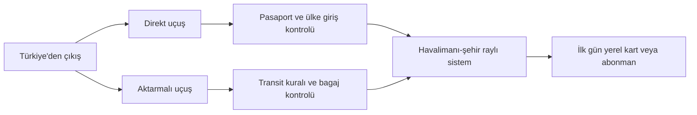
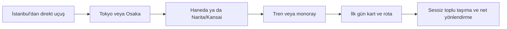

# Türkiye’den Çıkış Varsayımıyla On Ülke İçin Otuz Kısa Rehber Yazısı

## Yönetici özeti

Bu dosya, Türkiye’den ayrılacak genel yetişkin okur için hazırlanmış, on ülke hakkında otuz kısa ve okunabilir rehber yazısından oluşur. En temel tablo şu: Almanya, Fransa, Hollanda, Belçika, Avusturya ve İsviçre için umuma mahsus pasaport sahiplerinin kısa süreli seyahatte vize alması gerekir; Birleşik Krallık, ABD ve Kanada Türk pasaportlarına daha sıkı ve ayrı ulusal vize rejimleri uygular; Japonya ise turizm ve iş ziyareti için Türk vatandaşlarına 90 güne kadar vizesiz kısa kalış imkânı tanır, ancak uzun süreli kalış ve çalışma için önceden uygun vize gerekir. Büyük farkların ikinci ayağı bütçedir: Almanya, Belçika ve Avusturya görece daha yönetilebilir; Hollanda ve Birleşik Krallık kirada daha sert; İsviçre en pahalı kümede; ABD ve Kanada’da ise şehir ve sağlık sigortası farkı bütçeyi dramatik biçimde değiştirir. citeturn10search0turn12search4turn18search4turn24search0turn27search8turn27search9turn40view0turn14search0turn16search0turn35view0

Ulaşım planlamasında da ortak desenler var. En hızlı çözüm çoğu ülkede İstanbul çıkışlı direkt uçuş; en hesaplı seçenek ise çoğu zaman Sabiha Gökçen çıkışlı düşük maliyetli taşıyıcılar veya sezon dışı biletler oluyor, fakat bu avantaj bagaj, ikinci havalimanı kullanımı ve şehir merkezine transfer masrafıyla kolayca eriyebiliyor. Avrupa’da havalimanından şehre raylı sistem genellikle en temiz çözüm; Almanya’daki Deutschlandticket, Londra’daki Travelcard mantığı, Viyana’da aylık/uzun süreli kartlar, Toronto’daki PRESTO/TTC düzeni ve Tokyo’daki commuter pass sistemi günlük hayatı belirgin ölçüde kolaylaştırıyor. Bütçe aralıkları bu raporda “tek yetişkin için mütevazı başlangıç düzeni” varsayımıyla verildi; lüks yaşam, özel araç, çocuk bakımı ve yoğun sosyal harcama dâhil edilmedi. Türk topluluğu sütununda ise güvenilir kaynak mahalle altı ayrıntı sunmadığında metropol veya ilçe ekseni kullanıldı. citeturn40view1turn13search1turn13search16turn11search7turn25search0turn25search5turn28search2turn28search6turn38search0turn38search1

## İçindekiler

- [Almanya](#almanya)
  - [Almanya için giriş ve ulaşım notları](#almanya-giris)
  - [Almanya’da gündelik hayat ve bütçe](#almanya-butce)
  - [Almanya’da kültür ve sosyal akış](#almanya-kultur)
- [Fransa](#fransa)
  - [Fransa için giriş ve ulaşım notları](#fransa-giris)
  - [Fransa’da gündelik hayat ve bütçe](#fransa-butce)
  - [Fransa’da kültür ve sosyal akış](#fransa-kultur)
- [Hollanda](#hollanda)
  - [Hollanda için giriş ve ulaşım notları](#hollanda-giris)
  - [Hollanda’da gündelik hayat ve bütçe](#hollanda-butce)
  - [Hollanda’da kültür ve sosyal akış](#hollanda-kultur)
- [Belçika](#belcika)
  - [Belçika için giriş ve ulaşım notları](#belcika-giris)
  - [Belçika’da gündelik hayat ve bütçe](#belcika-butce)
  - [Belçika’da kültür ve sosyal akış](#belcika-kultur)
- [Avusturya](#avusturya)
  - [Avusturya için giriş ve ulaşım notları](#avusturya-giris)
  - [Avusturya’da gündelik hayat ve bütçe](#avusturya-butce)
  - [Avusturya’da kültür ve sosyal akış](#avusturya-kultur)
- [Birleşik Krallık](#birlesik-krallik)
  - [Birleşik Krallık için giriş ve ulaşım notları](#bk-giris)
  - [Birleşik Krallık’ta gündelik hayat ve bütçe](#bk-butce)
  - [Birleşik Krallık’ta kültür ve sosyal akış](#bk-kultur)
- [İsviçre](#isvicre)
  - [İsviçre için giriş ve ulaşım notları](#isvicre-giris)
  - [İsviçre’de gündelik hayat ve bütçe](#isvicre-butce)
  - [İsviçre’de kültür ve sosyal akış](#isvicre-kultur)
- [Amerika Birleşik Devletleri](#abd)
  - [ABD için giriş ve ulaşım notları](#abd-giris)
  - [ABD’de gündelik hayat ve bütçe](#abd-butce)
  - [ABD’de kültür ve sosyal akış](#abd-kultur)
- [Kanada](#kanada)
  - [Kanada için giriş ve ulaşım notları](#kanada-giris)
  - [Kanada’da gündelik hayat ve bütçe](#kanada-butce)
  - [Kanada’da kültür ve sosyal akış](#kanada-kultur)
- [Japonya](#japonya)
  - [Japonya için giriş ve ulaşım notları](#japonya-giris)
  - [Japonya’da gündelik hayat ve bütçe](#japonya-butce)
  - [Japonya’da kültür ve sosyal akış](#japonya-kultur)

## Orta Avrupa ekseni

Avrupa için en pratik mantık çoğu zaman budur: direkt uçuş hız kazandırır, aktarmalı uçuş bazen bilette ucuz görünür ama transit ve bagaj stresi ekler; şehir merkezine raylı erişim ise gerçek toplam maliyeti düşürür. Aşağıdaki ülke yazıları bu şemayı kendi bağlamına göre açıyor. citeturn38search0turn37search12turn31search1turn31search2turn5search2turn6search2turn7search6turn11search18

### Almanya

| Vize durumu | Başlıca giriş kapıları | Yaklaşık aylık bütçe | Türk topluluğu odağı |
|---|---|---:|---|
| Umuma mahsus pasaporta Schengen vizesi gerekir | Berlin BER, Frankfurt, Münih, Düsseldorf | €1.000–1.700 | Berlin, Köln, Ruhr hattı, Hamburg |

*Not: Vize statüsü T.C. Dışişleri verisine; bütçe aralığı DAAD yaşam maliyeti ve zorunlu kalemlere; havalimanı/ulaşım bilgisi resmi havalimanı ve DB kaynaklarına; topluluk odağı ise YTB’nin Almanya Türk Diasporası çalışmasına dayanır. citeturn10search0turn40view0turn40view1turn31search1turn31search2turn41search0*

#### Almanya için giriş ve ulaşım notları

Almanya’ya giderken “en hızlı yol” cevabı çoğu durumda basit: İstanbul’dan direkt uçuş. Berlin, Frankfurt, Münih ve birçok Alman şehri Türkiye’den doğrudan bağlanıyor; özellikle İstanbul çıkışlı seferlerde seçenek bol. Daha hesaplı bilet arayanlar için Sabiha Gökçen ve Pegasus hattı sık sık öne çıkıyor; Pegasus’un Almanya ağı Adana–Düsseldorf, Ankara–Frankfurt ve İstanbul–Hamburg gibi direkt örnekler de veriyor. Ama burada küçük bir tuzak var: ucuz görünen bileti ayrı bagaj, havaalanı seçimi ve şehir merkezine ulaşım masrafıyla birlikte düşünmezseniz toplam maliyet hızla şişer. citeturn38search3turn37search4turn38search0turn37search12

İnişten sonra Almanya’nın büyük avantajı raylı sistemdir. BER’de S-Bahn ve bölgesel trenlerle merkeze hızlı geçiş mümkün; Münih Havalimanı’ndan S1 ve S8 hatları yaklaşık 40 dakikada merkez istasyona bağlanır. Daha uzun kalacaksanız, Almanya içindeki günlük hareketlilik için Deutschlandticket çok güçlü bir araçtır: aylık 63 avro karşılığında ülke çapında yerel toplu taşımada ve bölgesel trenlerde geçerlidir, ama ICE/IC/EC gibi uzun mesafe trenlerinde geçmez. O yüzden örneğin Berlin’den Köln’e “tek biletle hızlı tren” beklemeyin; şehir içi ve bölgesel ağ için düşünün. İyi çalışan pratik kombinasyon şudur: ilk gün havaalanından şehir merkezine ayrı bilet, ikinci günden itibaren Deutschlandticket. citeturn31search1turn31search9turn31search2turn40view1

Bana sorarsanız Almanya yolculuğunda en çok fark yaratan üç küçük alışkanlık var. Birincisi, uluslararası uçuş için havalimanına gerçekten erken gidin; Türk Hava Yolları uluslararası uçuşlarda erken geliş önerisini açık biçimde veriyor. İkincisi, Schengen vize dosyanız onaylı olsa bile, ilk girişte konaklama ve dönüş planını düzenli tutun. Üçüncüsü, ilk akşam için “otelime nasıl geçerim” konusunu uçağa binmeden çözün; özellikle geç saatte inişlerde bölgesel tren, S-Bahn ve son durak arası fark moral bozabiliyor. Beraberinde bir örnek: Berlin’e ilk kez giden biri için BER–merkez S-Bahn hattı, taksiye göre hem daha ucuz hem daha anlaşılır bir açılış olur. citeturn37search12turn31search5turn31search17turn40view1

#### Almanya’da gündelik hayat ve bütçe

Almanya’da asıl mesele uçak bileti değil, kira. DAAD verisine göre yaşam gideri çoğu şehirde ayda 900–1.200 avro bandında; 2023 sosyal anketinde ortalama öğrenci gideri 876 avro görünürken, vize başvurusu için aylık 992 avro finansal yeterlilik isteniyor. Bu rakamlar tek başına “herkes rahat yaşar” anlamına gelmiyor; çünkü aynı kaynak, bütçenin en büyük kaleminin açık biçimde kira olduğunu söylüyor. Büyük şehirlerde paylaşımlı oda ile stüdyo arasında yüzlerce avro oynayabiliyor. O yüzden yeni gelen birinin ilk hedefi, merkezi ve şık bir ev değil, sözleşmesi şeffaf, depozitosu anlaşılır ve toplu taşımaya bağlı bir başlangıç konutu bulmak olmalı. citeturn40view0

Sağlık tarafında Almanya çok net: sağlık sigortası zorunlu. Make it in Germany portalı bunu açıkça belirtiyor ve sistemin yasal/statutory ile özel/private olarak iki kola ayrıldığını anlatıyor. Çalışanların çoğu yasal sigorta sisteminde; doktor ziyareti ve ilaç çoğu durumda doğrudan sigorta üzerinden ilerliyor. Yeni taşınan biri için iyi senaryo şu olabilir: Köln’de paylaşımlı bir oda, market alışverişi ağırlıklı beslenme, Deutschlandticket ve makul bir telefon paketiyle “başlangıç düzeni” kurmak. Berlin’de ya da Münih’te aynı düzey konforu daha pahalıya kurmanız ise sürpriz olmaz. Türk topluluğu açısından da yalnız hissetme ihtimali düşüktür; YTB’nin Almanya Türk Diasporası Atlası, ülkedeki Türk varlığının toplumsal ve kurumsal derinliğini özellikle vurgular. citeturn40view2turn40view0turn40view1turn41search0

Gıda ve gündelik harcamada hayat Avrupa’nın daha pahalı şehirleri kadar sert değildir, ama “ucuz Almanya” klişesi de artık eski. Market, toplu taşıma, internet ve temel sağlık kalemlerini sıkı yöneten biri için Almanya hâlâ düzenli bir başlangıç ülkesi olabilir; spontane dışarıda yeme, merkezi tek başına ev ve sık şehirler arası tren kullanımı ise bütçeyi çok hızla yukarı çeker. Kısacası Almanya’da ay sonunu başarıyla görmek çoğu zaman maaştan çok kira stratejisiyle ilgilidir. citeturn40view0turn40view2

#### Almanya’da kültür ve sosyal akış

Almanya’da ilk bakışta hissedilen şey, düzenin görünür olmasıdır. Resmî entegrasyon ve yaşam kaynakları Almanya’yı çeşitlilik, özgürlük, demokrasi ve “togetherness” kavramlarıyla anlatıyor; aynı kaynaklarda dil öğrenmenin yerleşmenin anahtarı olduğu özellikle vurgulanıyor. Bu ikisinin günlük karşılığı şu: İnsanlar sizden kusursuz Almanca beklemeyebilir, ama randevu saatine sadık kalmanızı, apartman ve kamu düzeni kurallarını ciddiye almanızı bekler. Türkçe hayatın güçlü olduğu bölgelerde bile birkaç temel Almanca kalıp bilmek işlerin tonunu hemen değiştirir. citeturn32search4turn32search12turn32search0

Almanya’yı anlamanın daha derin katmanında “Erinnerungskultur”, yani hatırlama kültürü var. Make it in Germany bunu, özellikle Nasyonal Sosyalizm ve İkinci Dünya Savaşı nedeniyle toplumun geçmişiyle kurduğu güçlü ilişki olarak açıklıyor. Bu yüzden müze, anma mekânı, okul etkinliği ve kamusal dilde tarih meselesi oldukça ciddidir. Yeni gelen biri için bu bazen ağır bir resmiyet gibi görünebilir; ama aslında neden bazı konuların çok hassas ele alındığını anlamayı kolaylaştırır. Türklere tanıdık gelecek taraf ise güçlü dernek yaşamı ve mahalle ölçeğinde kurulan dayanışmadır. YTB’nin atlası da bunu sadece nüfusla değil, eğitimden spora uzanan kurumsal görünürlükle anlatır. citeturn32search8turn32search0turn41search0

Sosyal tarafta en güvenli formül şudur: ilk temasta kısa ve net olun, söz verdiyseniz tutun, ortak zaman planını belirsiz bırakmayın. Daha sonra ilişki derinleşince kapılar şaşırtıcı biçimde açılır. Almanya “ilk anda mesafeli, sonra sağlam” ilişki türünün klasik örneklerinden biridir; bu yüzden sabır, dil ve düzenli görünmek burada tahmin edilenden daha büyük sosyal sermayedir. citeturn32search0turn32search12turn41search17

### Fransa

| Vize durumu | Başlıca giriş kapıları | Yaklaşık aylık bütçe | Türk topluluğu odağı |
|---|---|---:|---|
| Umuma mahsus pasaporta Schengen vizesi gerekir | Paris CDG/Orly, Lyon, Nice, Marsilya | €900–1.800 | Paris/Île-de-France, Strazburg, Lyon |

*Not: Vize ve uzun kalış temeli resmî Fransız idari kaynaklarına; bütçe aralığı Campus France tahminlerine; şehir içi ulaşım İle-de-France Mobilités ve Paris Aéroports verilerine; topluluk odağı YTB’nin Fransa’daki 60. yıl etkinlik güzergâhına dayanır. citeturn10search0turn32search13turn4search0turn4search2turn5search2turn41search1turn41search16*

#### Fransa için giriş ve ulaşım notları

Fransa’ya giderken ilk karar aslında “Paris mi, Paris dışı mı?” sorusudur. En hızlı ve zahmetsiz ilk temas çoğu zaman Paris üzerinden kurulur; çünkü Charles de Gaulle ve Orly hem uçuş ağı hem de bağlantı seçenekleri bakımından en güçlü kapılar. Paris Aéroports kaynakları, CDG’den şehre tren bağlantısının ana omurga olduğunu açıkça gösteriyor. Eğer amaç birkaç gün turizmse, Paris’e direkt inip oradan ülke içine trenle dağılmak çoğu yolcu için en akıcı senaryo. Eğer son hedefiniz Lyon, Strasbourg ya da Nice ise, doğrudan o şehre uçmak bazen saat kazandırır; ama bilet fiyatı ve frekans dengesi çoğu dönemde Paris lehine çalışır. citeturn5search2turn37search1turn37search14

Vize tarafında kısa kalış için Schengen kuralı geçerli; daha uzun konaklama için ilgili Fransız vizesi ve oturum çerçevesi ayrı yürür. Fransa’nın kamu portalları ve service-public sistemi, üç aydan uzun kalışların kısa turist mantığıyla düşünülmemesi gerektiğini netleştiriyor. Bilet avında şu pratik kural işe yarar: Türkiye’den en hızlı hat çoğu zaman direkt İstanbul–Paris; en hesaplı alternatif ise sezon dışı tarih, Sabiha çıkışı veya aktarmalı seçeneklerin birlikte karşılaştırılmasıdır. Sadece şunu unutmayın: Paris’e ucuz bilet alıp şehir merkezine pahalı transfer ve yüksek bagaj ekleyerek toplamı bozmak çok kolaydır. citeturn32search13turn10search0turn38search0turn38search1

Şehir içi düzende ise Fransa, özellikle Paris’te, önceden kart ve rota planlayan yolcuyu ödüllendirir. İle-de-France Mobilités’in sisteminde Navigo mantığını ilk günden çözerseniz havaalanı–merkez–günlük ulaşım zinciri çok rahatlar. Kısa bir örnek: Paris’e yeni inen, iki valizli bir yolcu için taksi psikolojik olarak kolay görünür; ama metro/RER bağlantısı ve uygun kart planı ikinci günden itibaren bütçeyi ciddi biçimde rahatlatır. Fransa’da “ulaşım dili”ni çözmek, gündelik stresin yarısını çözer. citeturn4search2turn5search2

#### Fransa’da gündelik hayat ve bütçe

Fransa’da yaşam maliyeti ülke ortalamasıyla değil, şehir seçimiyle okunmalı. Campus France, aylık masrafın kente göre ciddi değiştiğini, Paris’in daha pahalı, büyük şehirlerin ve öğrenci merkezlerinin daha dengeli olduğunu vurguluyor. Bu yüzden “Fransa pahalı mı?” sorusunun iyi cevabı şudur: Paris’te evet, özellikle kirada; Strasbourg, Lyon, Lille ya da Toulouse gibi şehirlerde ise çok daha yönetilebilir olabilir. Tek kişi için en gerçekçi başlangıç bütçesi, merkezi olmayan bir oda ya da stüdyo, market ağırlıklı beslenme ve toplu taşıma kullanımıyla kuruluyor. citeturn4search0turn4search2

Sağlık tarafında Fransa’da kamu sistemiyle temas önemli bir eşik. Ameli ve service-public kaynakları, özellikle uzun süreli yerleşimlerde PUMa ve ilgili sosyal güvenlik çerçevesinin önemini gösteriyor. Kısa süreli turist içinse mesele daha basit: seyahat sağlık sigortasız gelmeyin. Uzun kalış planlayan biri içinse sağlık sistemi dosyasını, kira kontratı ve banka hesabı kadar erken düşünmek mantıklı olur. Türk topluluğu açısından Paris/Île-de-France hattı görünür bir merkez; ama YTB’nin 60. yıl etkinliklerinin Strasbourg ve Lyon üzerinden de yürümesi, topluluğun Fransa’ya üç şehirli bir ritimle yayıldığını güzel özetliyor. citeturn5search1turn32search1turn41search1turn41search16

Gıda ve gündelik hayat dozunda yaşanırsa Fransa bütçeyi tamamen boğan bir ülke değildir. Fakat “her gün dışarıda kahve ve öğle yemeği, merkezi küçük stüdyo, hafta sonu hızlı kaçamak” kombinasyonu birkaç hafta içinde hesabı Fransa lehine değil, Fransa aleyhine çevirir. Daha dengeli plan şu: kira hattını koru, toplu taşımayı öğren, uzun öğün kültüründen keyif al ama bunu turist yoğun noktalarda değil mahalle ölçeğinde yaşa. citeturn4search0turn4search2turn33search1

#### Fransa’da kültür ve sosyal akış

Fransa’da sosyal hayatın kalbinde yemek var. Explore France açık biçimde, Fransız kültüründe gastronominin ve uzun sofraların güçlü yerini anlatıyor; bu sadece ne yendiğiyle değil, yemeğin etrafında kurulmuş sosyal zamanla ilgili. O yüzden Fransa’da hızlı bir sandviç kültürü elbette var, ama asıl ritim özellikle akşam yemeğinde “oturup anlamlı vakit geçirme” üzerinden akıyor. Yeni gelen bir Türk okur için bunun tanıdık tarafı çok: ilişki çoğu zaman masada derinleşiyor. citeturn33search1

Kültürel farkın daha az romantik tarafı ise dil ve resmiyet. İlk temaslarda selam, hitap ve küçük nezaket kalıpları önemsenir. Fransızca bilmeden yaşamak mümkündür ama akıcı hissetmek zordur. Resmî işlem tarafında service-public ve benzeri portallar son derece yapılandırılmıştır; bu da gündelik hayata “kuralı öğren, sonra rahat et” biçiminde yansır. Topluluk hayatı bakımından Paris bölgesi büyük merkez olsa da Strasbourg ve Lyon hattı, Türk varlığının Fransa’da daha dengeli ve tarihsel biçimde dağıldığını hatırlatır. citeturn32search13turn41search1turn41search16

Festival tarafında Fransa tek bir kimlik sunmaz. Resmî turizm takvimleri Loire’dan Bordeaux’ya, şehir kültüründen bölgesel etkinliklere uzanan çok katmanlı bir takvim gösteriyor. Bu da şu demek: Fransa’yı sadece Paris diye okursanız ülkenin yarısını kaçırırsınız. Bence en iyi tavır, Paris’te sistemi çözmek ama Fransa’yı bir süre sonra başka şehirlerde yaşamaya cesaret etmek. Gerçek Fransa çoğu zaman ikinci şehirde açılıyor. citeturn33search4turn33search1

### Hollanda

| Vize durumu | Başlıca giriş kapıları | Yaklaşık aylık bütçe | Türk topluluğu odağı |
|---|---|---:|---|
| Umuma mahsus pasaporta Schengen vizesi gerekir | Amsterdam Schiphol, Eindhoven, Rotterdam The Hague | €1.100–1.900 | Randstad ekseni: Amsterdam, Rotterdam, Lahey, Utrecht |

*Not: Vize için T.C. Dışişleri ve resmî Hollanda sistemleri; bütçe için Study in NL; sağlık sigortası için Hollanda hükümeti; ulaşım için NS ve Schiphol/airline verileri; diaspora odağı için YTB’nin Hollanda Türk Diasporası Atlası kullanıldı. Randstad ifadesi, atlasın ülke geneline odaklanan çerçevesinden türetilmiş metropol ölçekli bir özet niteliğindedir. citeturn10search0turn6search0turn6search1turn6search2turn38search2turn38search5turn41search4turn41search15*

#### Hollanda için giriş ve ulaşım notları

Hollanda’ya giderken en temiz senaryo Amsterdam Schiphol’dür. NS’nin resmî hatları, Schiphol–Amsterdam merkez bağlantısını raylı sistem üzerinden son derece kolaylaştırıyor; bu yüzden ilk kez giden biri için “havaalanından şehre nasıl çıkarım” stresi Hollanda’da nispeten düşüktür. Türkiye’den direkt ve pratik hat arayanlar için Amsterdam zaten doğal merkez; Pegasus’un Amsterdam sayfası da İstanbul’dan özellikle Sabiha çıkışının fiyat açısından avantaj yaratabildiğini açıkça söylüyor. Yani hız istiyorsanız direkt uçuş, fiyat kovalıyorsanız SAW ve düşük sezon kombinasyonu iyi bir ilk filtre. citeturn6search2turn38search2turn38search5

Burada asıl püf nokta şu: Hollanda küçük görünüyor ama havaalanı seçimi toplam deneyimi değiştirir. Schiphol en akıcı çözümdür; Eindhoven veya çevredeki diğer havaalanları bazen daha ucuz görünür, fakat şehir merkezine ya da hedef kente ek ulaşım gerekir. Eğer işiniz Amsterdam’da değil de Rotterdam, Utrecht ya da Lahey’deyse, yalnız uçak biletine değil “kapıdan kapıya süreye” bakın. Hollanda’da toplu taşıma iyi işlediği için bazen biraz daha pahalı görünen ana hat uçuşu, toplamda daha ucuz ve daha az yorucu çıkabilir. citeturn38search5turn6search2

Uzun kalış planlıyorsanız kısa turist mantığını biraz erken bırakmanız gerekir. Hollanda’da gündelik hayatın akması için yerel ulaşım kart mantığını, belediye kaydı ritmini ve sağlık sigortası yükümlülüğünü erkenden öğrenmek büyük fark yaratır. Kısa geziye gelen içinse formül basit: Schiphol’de treni bulun, merkezde yürüyerek çözebileceğiniz kadar iş çıkarın, ilk gün gereksiz taksi masrafından kaçının. citeturn6search1turn32search6turn6search2

#### Hollanda’da gündelik hayat ve bütçe

Hollanda küçük ama ucuz değil. Study in NL kaynakları, aylık yaşam maliyetini öğrenciler için bile hatırı sayılır bir aralıkta veriyor; kirada özellikle Amsterdam ve çevresi belirleyici. Bu yüzden tek yetişkin için başlangıç bütçesi hesaplarken en dürüst yaklaşım, evi merkezin biraz dışına koymak ve ulaşımı sisteme emanet etmek. Amsterdam’ın merkezinde tek başına düzen kurmakla Utrecht’te ya da Rotterdam’ın bazı bölgelerinde paylaşım bazlı düzen kurmak arasında çok belirgin fark olabilir. citeturn6search0

Sağlık sigortası Hollanda’da teknik bir ayrıntı değil, sistemin merkez parçası. Hollanda hükümeti, ülkede yaşayan veya çalışan birçok kişi için sağlık sigortasının zorunlu olduğunu açık biçimde belirtiyor. Bu nedenle uzun süreli taşınma planında “önce ev, sonra kalanlar” değil; “ev, kayıt, sigorta” üçlüsünü birlikte düşünmek lazım. Topluluk açısından Türk varlığı ülkeye yayılmış görünse de daha görünür günlük hayat çoğunlukla Randstad ekseninde hissedilir. YTB’nin yayımladığı Hollanda Türk Diasporası Atlası ülke ölçeğinde tam da bu derinliği görünür kılmayı amaçlıyor. citeturn6search1turn41search4turn41search15

Harcama tarafında Hollanda’nın ilginç yanı şu: Ulaşım ve sistem düzeni size zaman kazandırır ama kira bunu geri alır. Marketten alışveriş yapan, bisiklet/toplu taşıma dengesini kuran, merkez takıntısına girmeyen biri için ülke yaşanabilir kalır. Ama kısa sürede “biraz daha merkezi olayım, haftada birkaç kez dışarıda yiyeyim, tek başıma kalayım” dediğiniz anda denklem keskinleşir. Hollanda’da bütçeyi yöneten kalem neredeyse her zaman metrekaresidir. citeturn6search0turn6search2

#### Hollanda’da kültür ve sosyal akış

Hollanda’yı rahat yaşatan şey, sistemin ne beklediğini oldukça net söylemesidir. Hükümetin civic integration çerçevesi, ülkede uzun süre yaşayacak kişilerin dili, kültürü ve bağımsız gündelik işleyişi öğrenmesini merkezde tutuyor. Bu da günlük hayata şu şekilde yansıyor: insanlardan “uyumlu ama pasif” olmanız değil, kendi işinizi bilen, açık konuşan ve randevu/sözleşme dilini anlayan biri olmanız bekleniyor. Türkçe çevre bulmak mümkündür; ama yalnız onunla yaşamak, Hollanda’nın sunduğu kolaylığın yarısını kaçırmak olur. citeturn32search6turn32search2turn41search4

Sosyal normlar bakımından ülke çoğu Türk okura ilk anda “fazla doğrudan” gelebilir. Bunu kabalık diye değil, iletişim kültürü diye okumak daha doğru olur. Mesele çoğu zaman kişisel değil, işlevseldir. Toplu taşımada, belediye işleminde, kira görüşmesinde ve iş yazışmasında bu doğrudanlık hayatı hızlandırır. İyi tarafı şu: siz de net olduğunuz zaman çok karşılık bulursunuz. Ülkeye yeni gelen birinin en iyi yatırımı, üç şeydir: birkaç temel Hollandaca ifade, bisiklet/yağmur gerçekliğiyle barışmak ve resmî e-postadan kaçmamayı öğrenmek. citeturn32search6turn6search2

Topluluk hayatı ise Hollanda’da sessiz ama derindir. YTB’nin Hollanda atlası tam da bu hikâyeyi, sadece göç tarihi olarak değil, gündelik kurumlaşma olarak anlatır. O yüzden Hollanda’da Türk topluluğu çoğu zaman tek bir “mahalle”den çok, birbirine bağlı kent halkaları halinde çalışır. Bir Türk okur için bu şu anlama gelir: memleket hissi bulmak zor değil, ama onu bulduktan sonra ülkenin geri kalanını da keşfetmek gerekir. citeturn41search4turn41search15

### Belçika

| Vize durumu | Başlıca giriş kapıları | Yaklaşık aylık bütçe | Türk topluluğu odağı |
|---|---|---:|---|
| Umuma mahsus pasaporta Schengen vizesi gerekir | Brüksel Havalimanı, Charleroi | €1.000–1.600 | Brüksel çevresi ve şehir ölçekli yayılım |

*Not: Belçika için topluluk verisi güvenilir resmî kaynaklarda çoğu zaman mahalle altı ayrıntı vermediği için şehir/metropol düzeyinde tutuldu. Vize, bütçe, sağlık ve ulaşım bilgileri resmî kamu ve eğitim kaynaklarından derlendi. citeturn10search0turn7search11turn7search6turn9search2turn8search0turn10search3*

#### Belçika için giriş ve ulaşım notları

Belçika’ya ilk kez gidiyorsanız en güvenli giriş kapısı Brüksel Havalimanı’dır. Resmî havalimanı sayfaları, tren ve otobüs bağlantısının ana omurgayı oluşturduğunu net gösteriyor. Türkiye’den direkt ve hızlı giriş düşünüldüğünde İstanbul–Brüksel hattı en akıcı çözüm; Türk Hava Yolları da Brüksel’e günlük İstanbul seferi olduğunu ve uçuşun yaklaşık üç buçuk saat sürdüğünü belirtiyor. Ucuz bilet kollayanlar için ikincil havaalanı ya da düşük maliyetli havayolu seçenekleri anlamlı olabilir; ama Brüksel dışındaki havaalanlarında şehir merkezine veya son hedefe ek transfer maliyetini mutlaka hesaba katın. citeturn37search3turn37search10turn7search6turn7search12

Belçika küçük göründüğü için yolculuk bazen olduğundan kolay sanılıyor. Oysa burada da “uçak bileti ayrı, kapıdan kapıya maliyet ayrı” kuralı çalışır. Brüksel Havalimanı’ndan trene atlayıp merkeze inmek, çoğu zaman taksiye göre daha dengeli bir ilk gün senaryosu. Eğer hedefiniz Brüksel dışında Gent, Anvers veya Liège ise, havalimanındaki raylı bağlantıların kalitesi işinize yarar. Benim pratik önerim şu olurdu: Brüksel’e ilk gelişte tren bağlantısını kullanın, ikinci günden sonra ülke içi hareketi de aynı mantıkla kurun. Belçika’nın ölçeği, iyi planlayana ciddi zaman kazandırır. citeturn7search6turn7search12

Vize tarafı Schengen mantığındadır; uzun süreli taşınma için turist rejimiyle düşünmemek gerekir. Kısa kalışlar için düzenli dosya, açık konaklama planı ve dönüş niyeti göstermek burada da temel kuraldır. Çok kısa ziyaretlerde Brüksel, ülkeyi “tatmak” için yeterince merkezi; daha uzun kalışta ise tek şehre sıkışmak gerekmiyor. citeturn10search0

#### Belçika’da gündelik hayat ve bütçe

Belçika, Batı Avrupa standardına göre görece dengeli görünen ülkelerden biri. Study in Belgium kaynakları, Fransızca konuşulan bölgede student/newcomer ölçeğinde yaşam maliyetini yaklaşık 1.000–1.200 avro bandında veriyor. Bu, tek başına “rahat yaşarsın” demek değil; ama Hollanda ya da İsviçre şokunu da yaşamazsınız. Kira yine ana kalemdir, fakat Brüksel dışına doğru hareket ettikçe denge biraz iyileşir. Başlangıç için en mantıklı model, iyi bağlı bir bölgede paylaşım ya da küçük daire, market ağırlıklı mutfak ve toplu taşıma kullanımını erkenden oturtmaktır. citeturn7search11turn7search8

Sağlık sistemi tarafında Belçika’nın temel mantığı sağlık sigortası fonları üzerinden işler. Social Security Belgium’nin yabancılar için genel rehberi, Belçika’da yaşamaya veya çalışmaya geldiğinizde bir sağlık sigortası fonuna katılmanız gerektiğini açıkça söylüyor; belgium.be de zorunlu sağlık sigortasının geri ödeme mantığı ve resmî ücret yapısını açıklıyor. Bu şu demek: Belçika’da bütçe hesabı yaparken sadece kira ve market değil, sisteme nasıl dahil olacağınızı da düşünmelisiniz. Kısa süreli ziyaretçiyseniz seyahat sağlık sigortası burada da temel emniyet yastığıdır. citeturn9search2turn9search3turn8search0

Türk topluluğu açısından Belçika’da “tek bir mahalle” yerine, şehir odaklı bir ağ düşünmek daha doğru. YTB’nin 60. yıl çerçevesi, Belçika’yı Türk diasporasının kurucu ülkelerinden biri olarak işaretliyor. Bu, pratikte Türkçe konuşabileceğiniz bakkal, kafe, dernek ve aile ağının özellikle Brüksel ekseninde görünür olması anlamına gelir. Yeni gelen için iyi haber şu: sistem resmi olabilir, ama yalnız kalmak zorunda değilsiniz. citeturn10search3turn7search16

#### Belçika’da kültür ve sosyal akış

Belçika’nın kültürel ritmini anlamanın en kolay yolu şu: ülke küçüktür ama tek katmanlı değildir. Dil, bölge ve şehir dinamiği günlük hissi değiştirir. Brüksel’in resmî ziyaret portalı bile mağaza saatlerinden Pazar ritmine kadar şehir yaşamının oldukça mahalle-temelli aktığını gösteriyor. Yani Belçika’da “tek ulusal tempo”dan çok, yerel ritim vardır. Bazı mahalleler hafta içi canlı, bazıları Pazar sakin, bazıları ise göçmen işletmeleri sayesinde daha esnektir. citeturn33search3turn7search6

Türk okur için Belçika’nın rahat yanı, resmî ciddiyet ile gündelik sıcaklığın birlikte bulunabilmesidir. Kamu işleminde dosya netliği beklersiniz; ama gündelik hayatta küçük esnaf, kahve molası ve çokdillilik sizi daha hızlı içine alabilir. Özellikle Brüksel’de bir günde Fransızca, Flamanca, İngilizce ve Türkçe duymanız şaşırtıcı olmaz. Bu da ilk baştaki yabancılık hissini yumuşatır. citeturn33search3turn10search3

Sosyal ilişki kurarken en iyi tavır, dil farkını problem değil zemin olarak görmek. Brüksel’de İngilizce çoğu işinizi çözer, ama birkaç Fransızca veya Felemenkçe selam bile tonu değiştirir. Göç kökenli toplulukların görünürlüğü de şunu kolaylaştırır: Belçika’da “yerli gibi görünmeden de yerleşmek” mümkündür. Kibar, dakik ve net olun; gerisi yavaşça geliyor. citeturn33search3turn10search3

### Avusturya

| Vize durumu | Başlıca giriş kapıları | Yaklaşık aylık bütçe | Türk topluluğu odağı |
|---|---|---:|---|
| Umuma mahsus pasaporta Schengen vizesi gerekir | Viyana, Salzburg, Innsbruck | €1.000–1.700 | Viyana çevresi, şehir ölçekli diaspora ağı |

*Not: Topluluk verisi şehir/metropol düzeyinde özetlendi. Vize, mali yeterlilik, havaalanı erişimi ve sağlık şartları resmî Avusturya kaynaklarına dayanır. citeturn10search0turn10search1turn11search18turn11search5turn11search10turn10search3turn10search6*

#### Avusturya için giriş ve ulaşım notları

Avusturya’ya giderken en pratik şehir açık ara Viyana. Pegasus’un Viyana sayfası, Sabiha çıkışlı direkt uçuşların bütçe tarafında sıkça öne çıktığını açık biçimde söylüyor; bu da Türkiye’den çıkan yolcu için klasik dengeyi yeniden kuruyor: en hızlı çözüm direkt uçuş, en hesaplı çözüm ise çoğu zaman erken rezervasyonlu düşük maliyetli bilet. İstanbul çıkışlı Viyana hattı sadece turistik yolculuk için değil, ilk yerleşim açısından da rahatlatıcı; çünkü şehir merkezine erişim çok iyi çalışıyor. citeturn38search7turn38search13

Viyana Havalimanı’nın büyük konforu, pahalı ve hızlı ile ucuz ve yeterli seçenekleri aynı anda sunması. CAT hattı Wien Mitte’ye 16 dakikada non-stop gidiyor; ama havaalanı sayfası S-Bahn’ın daha hesaplı çözüm olduğunu, ekspres trenle şehir merkezine yaklaşık 25 dakikada erişilebildiğini de gösteriyor. İlk defa giden biri için şu soru önemli: zaman mı para mı? Eğer gece geç saat, az bagaj ve ilk gün stresiniz yüksekse hızlı hat mantıklı olabilir; ama birkaç valizle taşınmıyor ve bütçe sayıyorsanız S-Bahn çoğu yolcu için daha rasyonel. citeturn11search18turn11search6turn11search0

Uzun kalış planında küçük ama kritik uyarı: Avusturya, özellikle ikamet süreçlerinde sağlık sigortası şartını ciddiye alır. O yüzden uçak ve ev arayışına gömülürken sigorta ve resmî kayıt dosyasını sona bırakmayın. Kısa şehir ziyareti içinse Viyana çok kullanıcı dostu bir giriş kapısıdır; havaalanından şehre geçiş gerçekten kolaydır. citeturn11search5turn10search1

#### Avusturya’da gündelik hayat ve bütçe

Avusturya bütçe açısından “Avrupa ortalamasının biraz üstü ama İsviçre değil” diye okunabilir. OeAD, 2026 itibarıyla öğrenciler ve bazı oturum başvuruları için aylık yeterlilik rakamlarını açıkça veriyor; 24 yaş altı ve üstü ayrımı gösteriyor, ayrıca kira belirli bir eşiği aşarsa ek kanıt gerektiğini belirtiyor. Bu veri tek başına tam yaşam maliyeti değildir ama son derece iyi bir taban işaretidir: Viyana’da kira ve sigorta işin tonunu belirler. Tek kişi için mütevazı bir kurulumda Viyana hâlâ yönetilebilir olabilir; ancak merkez takıntısı bütçeyi hızlı yükseltir. citeturn10search1turn10search8

Ulaşım tarafında Viyana büyük avantaj sağlar. Wiener Linien’in çok sayıda kısa ve uzun süreli kartı var; 2026 fare yapısı da güncellendi. Yani şehirde evinizin konumu merkezden biraz dışarıdaysa bile toplu taşımayla hayat gayet akabilir. Bu, kirayı bir nebze daha esnek düşünmenizi sağlar. Basit örnek: merkezde pahalı stüdyo yerine metroya bağlı dış halkada daha mantıklı bir ev, çoğu yeni gelen için daha sürdürülebilir olur. citeturn11search7turn11search10turn11search16

Sağlık cephesinde Avusturya’nın mesajı açık: ikamet ve kalış yapısına göre kapsamlı sağlık sigortası beklenir. YTB’nin 60. yıl çerçevesi de Avusturya’daki Türk diasporasının köklülüğünü yeniden hatırlatıyor; bu özellikle Viyana’da gündelik hayatın ilk haftalarında sosyal tampon görevi görebilir. Yani Avusturya’da bütçeyi tek başına fiyatlar değil, düzenli sistem kurup kurmadığınız belirler. citeturn11search5turn10search3turn10search6

#### Avusturya’da kültür ve sosyal akış

Avusturya’da yaşamın hissi, Almanca konuşulan komşu coğrafyayla akraba ama aynı değil. Kurum kültürü düzenli, kamusal dil nispeten resmi ve süreçler belge sever; buna karşılık şehir yaşamında özellikle Viyana, şaşırtıcı bir gündelik rahatlık da sunar. Burada yeni gelen biri için en iyi tavır, “şehir zarif ama sistem ciddidir” cümlesini akılda tutmak. Yani kahve içme ritmini sevebilirsiniz, ama kira kontratı ve sigorta işinde gevşek davranamazsınız. citeturn32search3turn11search5

Türk topluluğu bakımından Avusturya’nın psikolojik avantajı büyüktür. YTB’nin 60. yıl vurgusu, Avusturya’daki Türk diasporasının artık geçici işçilik hikâyesi değil, kuşaklı bir toplumsal yapı olduğunu gösterir. Bu, yeni gelen için şu anlama gelir: sıfırdan kültürel destek ağı kurmanız şart değil. Fakat sadece bu ağ içinde kalmak, özellikle dil ve iş hayatında hareket alanını daraltabilir. citeturn10search3turn10search6

Sosyal normlarda güvenli çizgi nettir: nazik olun, randevu ve saatlere sadık kalın, apartman ve mahalle sessizliği gibi kuralları hafife almayın. Avusturya size hızlıca kucak açmasa da istikrarlı davranışa iyi karşılık verir. Birkaç hafta sonra fark edersiniz: burada güven, sıcak başlangıçtan çok, tutarlı davranışla kazanılıyor. citeturn32search3turn10search6

## Britanya ve Alpler

### Birleşik Krallık

| Vize durumu | Başlıca giriş kapıları | Yaklaşık aylık bütçe | Türk topluluğu odağı |
|---|---|---:|---|
| Türk pasaportlarına vize gerekir; transit de ayrıca kontrol edilmelidir | Heathrow, Gatwick, Manchester, Birmingham | £1.200–2.300 | Londra Green Lanes/Haringey-Enfield başta olmak üzere büyük şehirler |

*Not: Vize, ücret ve sağlık kuralları GOV.UK ve NHS kaynaklarından; ulaşım Heathrow/Gatwick ve TfL’den; topluluk odağı Haringey Council ve diaspora kurumlarından derlendi. citeturn12search6turn12search4turn14search13turn14search2turn13search0turn13search2turn13search16turn14search3*

#### Birleşik Krallık için giriş ve ulaşım notları

Birleşik Krallık dosyası Avrupa içindeki en farklı dosyalardan biri, çünkü Schengen mantığı burada yok. T.C. Dışişleri açıkça, Türk vatandaşlarının Birleşik Krallık’a giderken vizeye tabi olduğunu; BK üzerinden aktarmalı gidişlerde de transit vize riskinin bulunduğunu hatırlatıyor. O yüzden Londra’yı “Avrupa içi kolay aktarma noktası” gibi düşünmek hata olabilir. Eğer amacınız kısa ziyaretse, vize tipini çok erken netleştirin; çünkü bilet avına geçmeden önce hukuki kapıyı bilmek burada gerçekten şart. citeturn12search6turn12search4turn34search13

Uçuş tarafında en hızlı çözüm yine direkt İstanbul–Londra hattı. Türk Hava Yolları Heathrow ve Gatwick’e, ayrıca Manchester ve Birmingham’a direkt uçuş verdiğini söylüyor; İngiltere uçuş süresi de ortalama 4 saat 20 dakika. Londra’ya indiğinizde ise havalimanı seçimi deneyimi belirler: Heathrow Express Paddington’a 15 dakikada giderken, Gatwick Express Victoria’ya yaklaşık 30 dakikada ulaşıyor. “Ucuz bilet” ile “şehir merkezine en hızlı giriş” neredeyse hiçbir zaman aynı paket değil. O yüzden örneğin ucuz Gatwick bileti aldıysanız, merkeze gidişi de toplam maliyete katın. citeturn36search2turn13search0turn13search2turn13search3turn13search11

Londra’da ikinci anahtar, kredi kartı ve toplu taşıma mantığını ilk günden çözmek. TfL, aylık Travelcard’ın sık yolculuk edenler için mantıklı olduğunu açık biçimde belirtirken, mevcut ücret tabloları da aylık maliyeti saydam gösteriyor. Kısa kalışta pay-as-you-go ve haftalık tavan mantığı yeterli olabilir; daha uzun planda Travelcard düşünmeye değer. Basit tavsiye: ilk gün havaalanından merkeze doğrudan raylı sistem, ikinci gün ise hangi bölgelerde gezdiğinize bakarak kart stratejisi. Londra’da plansız ulaşım, şehrin pahalı yüzünü gereksiz erken gösterir. citeturn13search1turn13search13turn13search16turn13search7

#### Birleşik Krallık’ta gündelik hayat ve bütçe

Birleşik Krallık’ta bütçe konuşurken Londra’yı diğer şehirlerle aynı cümleye koymak yanıltıcı olur. GOV.UK’nun öğrenci finansal yeterlilik sayfası bile farkı çok net koyuyor: Londra için aylık £1.529, Londra dışı için £1.171. Bu rakamlar “asgari gösterge” niteliğinde; gündelik yetişkin yaşamında özellikle kira kalemi bu seviyelerin üstüne çıkabilir. Yine de tek cümlelik özet şu: Londra bir ülke, geri kalanı başka bir ülke gibi bütçe hissettirir. Manchester, Birmingham, Leeds ya da Glasgow gibi şehirlerde daha dengeli düzen kurmak çoğu kişi için daha sürdürülebilir olabilir. citeturn14search0

Sağlık konusu da karıştırılmamalı. NHS kaynakları, yurt dışından gelen ziyaretçilerin hangi hizmetlerde ücret ödeyebileceğini açıklıyor; GOV.UK ise uzun süreli bazı başvurularda immigration health surcharge sistemini anlatıyor. Yani turistseniz “NHS nasıl olsa var” rahatlığı doğru değil; uzun süreli vizedeyseniz de “vergimle zaten ödedim” mantığı ancak ilgili statü çerçevesinde çalışıyor. Kısa ziyaretçi için seyahat sigortası hâlâ akıllıca; uzun kalıcı için de vize ve IHS maliyeti bütçe planına dâhil edilmeli. citeturn14search2turn14search10turn14search5turn14search1

Türk topluluğu tarafında Londra hâlâ başat kapı. Haringey Council’in sayfası, Green Lanes üzerindeki Turkish Cypriot Community Association’ı somut biçimde gösteriyor; bu bölge uzun süredir Türkçe gündelik hayatın görünür merkezlerinden biri. Yeni gelen biri için bunun anlamı şu: ilk haftalarda tanıdık ses, gıda ve topluluk erişimi bulmak zor değil. Fakat kira baskısı yüzünden çoğu kişi zamanla merkezin dışına, daha yönetilebilir bölgelere kayıyor. İngiltere’de bütçe ile topluluğa yakınlık arasında sürekli bir pazarlık vardır. citeturn14search3turn36search2

#### Birleşik Krallık’ta kültür ve sosyal akış

Britanya’nın en iyi yanı şu: “tek bir kültür” gibi pazarlanmasına rağmen aslında güçlü bir bölgesel çoğulluk taşıyor. VisitBritain takvimi, ülkenin yıllık ritmini edebiyat festivalinden müzik etkinliğine, yerel kutlamadan tuhaf geleneklere kadar çok renkli bir çerçevede anlatıyor. Bu nedenle Londra’da yaşamakla Manchester, Cardiff, Glasgow ya da Belfast’ta yaşamak arasında yalnız kira değil, sosyal ton da değişir. citeturn34search4turn34search16turn34search20

Gündelik ilişkide güvenli çizgi yine tanıdık: sıraya saygı, kişisel alan, kısa ama nazik konuşma. Çok resmî görünmeden kibar olmak burada iyi çalışır. Türk okura en tanıdık gelen alanlardan biri ise mahalle-topluluk hissi; Green Lanes bunun çok görünür örneği. Fakat İngiltere’de “topluluğa yakın olayım” derken kendinizi sadece kendi çevrenizle sınırlamamak önemli. Çünkü ülkede iş dili, bürokrasi ve sosyal hareketlilik esasen İngilizce ve yerel ağlar üzerinden ilerler. citeturn14search3turn34search0

Birleşik Krallık’ın sosyal iklimi, ilk anda sıcak görünmese de erişilebilirdir. Esas anahtar, abartısız olmak. Çok büyük jestler yerine tutarlılık, zamanı gözetmek ve yazılı iletişimi düzgün sürdürmek daha fazla kapı açar. Türk okur için güzel haber şu: mizah, çay ve gündelik yakınlık fırsatı burada gerçekten vardır; sadece bizim alıştığımızdan biraz daha dolaylı şekilde gelir. citeturn34search0turn34search4

### İsviçre

| Vize durumu | Başlıca giriş kapıları | Yaklaşık aylık bütçe | Türk topluluğu odağı |
|---|---|---:|---|
| Umuma mahsus pasaporta Schengen vizesi gerekir | Zürih, Cenevre, Basel | CHF 1.700–2.800 | Zürih ekseni başta olmak üzere büyük kentler |

*Not: İsviçre’de topluluk verisi büyük ölçüde metropol düzeyinde ifade edildi. Bütçe ve kira için ETH, sağlık için ch.ch, ulaşım için Zürih Havalimanı ve SBB, diaspora görünürlüğü için YTB ve resmî/kurumsal kaynaklar kullanıldı. citeturn10search0turn16search0turn16search13turn15search1turn15search18turn16search3turn36search3turn17search1*

#### İsviçre için giriş ve ulaşım notları

İsviçre’ye Türkiye’den gitmenin en pratik formülü, mümkünse direkt Zürih hattıdır. Türk Hava Yolları İsviçre’de Zürih, Basel ve Cenevre’ye direkt uçtuğunu ve uçuş süresinin ortalama yaklaşık üç saat civarında olduğunu belirtiyor. İlk geliş için Zürih’in avantajı, havalimanının raylı sistemle olağanüstü sıkı bağlanmış olması. Zürih Havalimanı ve SBB istasyon verileri, havaalanından Zürih HB’ye çok sık tren bağlantısı bulunduğunu gösteriyor; bu yüzden “şehir merkezine nasıl inerim?” sorusu burada büyük kriz değildir. citeturn36search3turn36search7turn15search2turn16search3turn16search9

İsviçre’de ucuz bilet kovalamak mümkündür ama asıl dikkat etmeniz gereken şey, bilet değil varış sonrası maliyettir. Çünkü havaalanından şehre giriş kolay olsa da ülkenin genel fiyat düzeyi yüksektir. Bu nedenle “biraz daha pahalı ama direkt gideyim” kararı burada daha mantıklıdır; yorucu bir aktarma sonrası zaten pahalı bir ülkede kaybedeceğiniz zaman ve enerji de maliyettir. Eğer Basel veya Cenevre sizin gerçek hedefinizse direkt o kapıya gitmek iyidir; ama ilk defa gelip sistem öğrenmek istiyorsanız Zürih çok öğretici bir başlangıç olur. citeturn36search3turn16search15

Kısa kalışta en iyi hamle, raylı sistemi ilk andan kullanmak. Uzun kalışta ise varış haftasını “ev, belediye işlemi, sağlık sigortası” üçlüsüne ayırmak gerekir. İsviçre bazen dışarıdan sakin görünür; aslında hızlı değil, düzenli işler. Bu nüansı ne kadar erken kabul ederseniz o kadar iyi. citeturn17search3turn15search1turn15search18

#### İsviçre’de gündelik hayat ve bütçe

İsviçre için dürüst cümle şu: iyi çalışır, pahalıdır. ETH Zürih’in yaşam maliyeti rehberi, tek kişi için aylık giderlerin yüksekliğini açık biçimde veriyor; oda kiraları ve sağlık sigortası bütçenin temel sürükleyicisi. ETH’nin başka bir sayfası, Zürih’te aylık resmi/fiili yaşam maliyetinin yaklaşık CHF 1.750 düzeyinde düşünülmesi gerektiğini belirtirken, konaklama için oda kiralarının dahi 800–1.000 CHF bandına çıkabildiğini söylüyor. Bu nedenle İsviçre’de “az dışarı çıkarım, idare ederim” hesabı, kiraya çarpınca hızla bozulabilir. citeturn16search0turn16search13turn16search16turn16search4

Sağlık tarafında sistem çok net ve çok önemlidir. ch.ch portalı, İsviçre’ye yeni taşınanların üç ay içinde sağlık sigortası yaptırması gerektiğini açıkça belirtiyor; ayrıca sigortanın zorunlu ama özel şirketler üzerinden yürüdüğünü vurguluyor. Bu, Türkiye’den gelen biri için ilk başta tuhaf gelebilir: sağlık kamusal erişim mantığıyla var ama prim tarafı özel piyasadan geçiyor. Dolayısıyla İsviçre’de bütçe yaparken kira + sağlık formülünü birlikte hesaplamazsanız tablo eksik kalır. citeturn15search1turn15search6turn15search18

Türk topluluğu, özellikle Zürih ekseninde kurumsal olarak görünür. YTB’nin İsviçre Türk Toplumu ile yaptığı temaslar bunu açık biçimde gösteriyor. Bu, yeni gelen biri için ciddi psikolojik destek olabilir; ama yine de İsviçre’deki yüksek yaşam maliyeti gerçeğini yumuşatmaz. Basitçe söyleyeyim: İsviçre bütçeyi bozan ülke değil; bütçeyi ciddiye almanızı zorunlu kılan ülke. citeturn17search1turn17search5turn17search9

#### İsviçre’de kültür ve sosyal akış

İsviçre’yi anlamanın ilk kuralı, onu tek bir dil ve tek bir toplumsal ritimle okumamaktır. Resmî portal ch.ch bile ülkeyi konfederasyon, kanton ve belediye düzeylerinde kurgulayan bir yapı sunar. Bu, günlük hayata şöyle iner: aynı ülkede yaşıyor olsanız da Zürih, Cenevre ve Lugano’nun hissi aynı değildir. Yeni gelen biri için bu bazen kafa karıştırıcı olabilir, ama aslında sistemin esnek gücü buradan gelir. citeturn15search8turn33search2

Sosyal normlarda İsviçre çoğu kişiye ölçülü gelir. Gürültüsüz kamu alanı, temiz düzen, saat ve sözleşme ciddiyeti kuvvetlidir. Göçmenlerin kaydı ve yerleşimi de belediye/kanton mantığıyla yürüdüğü için, “genel bir İsviçre kuralı” kadar yerel uygulama da önem kazanır. Zürih Kantonu’nun yeni gelenler sayfası, kayıt ve oturum başvurusunda belediye temasını açık biçimde öne çıkarır. Yani burada sosyal hayatı anlamak biraz da idari yapıyı anlamaktır. citeturn17search3turn33search2

Türk okur açısından İsviçre’nin iyi tarafı, dernek ve topluluk hayatının görünür olması; zor tarafı ise mesafeli hissedebilen günlük sosyal tondur. Burada ilişki çoğu zaman yavaş açılır ama güvenli açılır. Kısa formül şu: sakin olun, planlı olun, sesinizi değil güvenilirliğinizi yükseltin. Ülke buna iyi karşılık verir. citeturn17search1turn17search5turn17search3

## Kuzey Amerika kapıları

### Amerika Birleşik Devletleri

| Vize durumu | Başlıca giriş kapıları | Yaklaşık aylık bütçe | Türk topluluğu odağı |
|---|---|---:|---|
| Tüm Türk pasaportları için vize gerekir | New York JFK/EWR, Chicago, Washington, Miami, Los Angeles, San Francisco | $2.000–4.500+ | New York–New Jersey, Washington DC metrosu, Chicago |

*Not: ABD için resmî tek bir ülke çapı “aylık yaşam maliyeti” yoktur; federal kaynaklar, yaşam giderinin okul ve şehir bazında hesaplandığını özellikle söyler. Bu tabloda verilen aralık, bu nedenle şehir ve sigorta farklarını yansıtan yaklaşık bir gösterge olarak okunmalıdır. citeturn18search4turn19search16turn20search6turn18search2turn18search3turn23search17turn23search0turn23search1turn23search3*

#### ABD için giriş ve ulaşım notları

ABD dosyasında ilk gerçek şu: vize ayrı bir safhadır ve “bilet buldum, sonra bakarım” ülkesi değildir. T.C. Dışişleri, Türk vatandaşlarının ABD’ye seyahat öncesinde vize almaları gerektiğini açıkça belirtiyor; ABD reciprocity sisteminde de vize kategorileri ve ücret/geçerlilik yapısı ayrı ayrı listeleniyor. Bu yüzden ABD yolculuğu planında uçuş araştırması, ancak göçmen olmayan uygun vize rotası netleştikten sonra anlamlıdır. citeturn18search4turn18search9

Uçuş tarafında Türkiye’den en hızlı model çoğu zaman İstanbul çıkışlı direkt hat. Türk Hava Yolları, ABD’de çok sayıda şehre direkt operasyon verdiğini söylüyor; New York, Newark, Washington DC, Chicago, Miami, Los Angeles, San Francisco, Seattle ve daha fazlası listeye dâhil. İlk kez giden biri için New York çok öğretici bir giriş kapısıdır; çünkü hem JFK hem Newark resmi ve güçlü toplu taşıma bağlantılarına sahip. JFK’de AirTrain üzerinden MTA ağına, Newark’ta AirTrain üzerinden NJ Transit/Amtrak hattına bağlanabiliyorsunuz. Ancak bu ülkede “havaalanından şehir merkezine tren var” demek “her şey ucuz” demek değildir; sadece taksiye mecbur değilsiniz demektir. citeturn19search16turn19search1turn19search2turn19search5turn19search18

İlk gün için en iyi tavsiye şu olur: ABD’ye gelişte iniş yaptığınız şehrin ulaşım sistemini önceden okuyun ve ilk gece kalacağınız yere toplu taşımayla mı, shuttle ile mi, uygulama tabanlı araçla mı gideceğinizi kararlaştırın. Örneğin New York’ta OMNY/MTA sistemi sık kullanılan ve makul bir başlangıçtır; ama gece geç saatte valizle ve ilk defa şehre geliyorsanız karmaşıklık maliyeti de vardır. Bu ülkede zaman ve konfor bazen gerçek para kadar önemlidir. citeturn19search3turn19search7turn19search15turn19search27

#### ABD’de gündelik hayat ve bütçe

ABD’nin bütçe meselesindeki en dürüst cümlesi şudur: tek bir ABD bütçesi yok. EducationUSA ve DHS kaynakları, yaşam giderlerinin kurumdan kuruma ve şehirden şehre büyük ölçüde değiştiğini; okulların Form I-20 üzerinde kendi tahmini yaşam giderlerini ayrı ayrı gösterdiğini vurguluyor. EducationUSA ayrıca güney ve orta batının banliyö/rural bölgelerinin daha düşük maliyetli olabildiğini, büyük metropollerde yaşam ve barınmanın belirgin şekilde yükseldiğini söylüyor. Kısacası Boston, Manhattan ve San Francisco ile Texas banliyösü aynı ülke olsa da aynı bütçe değil. citeturn20search6turn20search10turn18search2turn18search6

Sağlık başlığı burada Avrupa’daki gibi “sonra bakarız” alanı değil. Healthcare.gov, yasal statüye sahip göçmenlerin Marketplace kapsamına erişebileceğini anlatıyor; Study in the States ise F-1/M-1 öğrencilerin sağlık sigortasını kendi sorumluluğunda almaları gerektiğini açıkça hatırlatıyor. Başka bir deyişle ABD’de sağlık, kira kadar stratejik bir kalemdir. Kısa ziyaretçi için özel seyahat sigortası akıllıca; uzun kalışta ise işveren planı, üniversite planı veya Marketplace seçenekleri bütçeyi baştan şekillendirir. citeturn18search3turn18search7turn39search4turn39search1

Türk topluluğu açısından ABD tek merkezli değil, ağ yapılıdır. ATAA ülke çapında 50’den fazla yerel bölümü temsil ettiğini söylüyor; New York, Washington DC ve Chicago’daki Türk kültür kurumları da topluluğun odaklarını görünür kılıyor. Bu, yeni gelen biri için çok kıymetli: Türkçe destek ve dayanışma ağı bulmak mümkün. Ama bütçe gerçekliği şunu da söyler: topluluğa çok yakın olmak ile kira baskısı arasında her zaman bir denge pazarlığı vardır. citeturn23search17turn23search0turn23search1turn23search3

#### ABD’de kültür ve sosyal akış

ABD’yi tek bir kültür gibi okumak çoğu zaman hata olur. Federal resmî kaynaklar bile eğitim, sağlık ve yaşam maliyeti anlatırken yer bazlı farklılığı sürekli vurguluyor. Bu, gündelik sosyal hayata da aynen iner: New York’un hızı, Washington DC’nin kurumsallığı, Chicago’nun mahalle hayatı ve Texas’ın gündeliği aynı değildir. Bu yüzden ABD’de “Amerikalılar şöyledir” cümlesi çoğu zaman eksik kalır. Daha doğru cümle, “şehir ve çevreye göre ton değişir” olur. citeturn20search6turn20search10

Türk okur için rahatlatıcı olan taraf, topluluk kurumlarının güçlü olması. New York, DC ve Chicago’daki kültür merkezleri sadece etkinlik değil, bir tür yumuşak iniş alanı sağlar. İlk bayramınızı, ilk topluluk yemeğinizi ya da ilk iş bağlantınızı bu ağlar üzerinden kurmanız şaşırtıcı olmaz. Fakat burada da aynı uyarıyı yapmak gerekir: topluluğa yaslanmak iyidir, sadece ona yaslanmak hareket alanını daraltabilir. Çünkü ABD’de iş, eğitim ve kamu ilişkileri büyük ölçüde resmi yazışma, network ve bireysel inisiyatif üzerinden akar. citeturn23search0turn23search1turn23search3turn23search17

Sosyal normlarda ise kendinizi olduğunuz gibi ama düzenli anlatmak kazandırır. Kısa ve net e-posta, zamanında gelmek, randevu teyidi ve açık iletişim iyi çalışır. Çok şehirli, çok tempolu ve çok katmanlı bir ülke olduğu için “abartılı uyum” yerine “işleyen iletişim” daha değerlidir. ABD’de insanlar sizi bir kalıba sığdırmaktan çok, işlerinizi nasıl yürüttüğünüze bakar. citeturn20search14turn23search17

### Kanada

| Vize durumu | Başlıca giriş kapıları | Yaklaşık aylık bütçe | Türk topluluğu odağı |
|---|---|---:|---|
| Türk pasaportlarına vize gerekir | Toronto Pearson, Montréal, Vancouver | C$1.900–3.500 | Toronto, Montreal, Vancouver başta olmak üzere büyük kentler |

*Not: Kanada için yaşam gideri aralığı, IRCC’nin yıllık kanıt tutarları, ulaşım ve newcomer kaynaklarıyla birlikte mütevazı tek-yetişkin başlangıç düzeni için yorumlanmıştır. Topluluk odağı, Kanada hükümetinin Türkiye ilişkileri sayfasında verdiği diaspora dağılımına dayanır. citeturn24search0turn35view0turn24search2turn25search0turn25search5turn26search1*

#### Kanada için giriş ve ulaşım notları

Kanada’ya giderken ilk ayırıcı unsur yine vizedir. T.C. Dışişleri, Türk vatandaşlarının Kanada’ya vizeye tabi olduğunu net biçimde belirtiyor. Uçuş tarafında ise Türkiye’den en akıcı hat İstanbul merkezli direkt operasyonlar; Türk Hava Yolları Toronto, Montreal ve Vancouver’a direkt veya bağlantılı uçuş verdiğini açıkça söylüyor. İlk kez gelen biri için Toronto çoğu zaman en pratik giriş kapısı olur; yalnız ülkenin büyüklüğü nedeniyle “ülkeye girdim, her yere yakınım” duygusuna kapılmamak gerekir. Kanada, Avrupa mantığıyla ülke içi hareket kurulan bir yer değil. citeturn24search0turn36search0turn36search4

Toronto Pearson’ın belki de en kullanıcı dostu yanı, UP Express ile Union Station’a doğrudan bağlanması. Resmî kaynak, trenin yaklaşık 25 dakikada şehir merkezine gittiğini ve düzenli aralıklarla çalıştığını söylüyor. Bu, ilk gece Toronto merkezinde kalacak biri için büyük konfor. Öte yandan şehrin içinde TTC ücret ve kart mantığını öğrenmek gerekir; 2026 itibarıyla aylık sistemde değişim/fare capping dönüşümü de yolda. Kısacası Kanada’da ilk günün ideal akışı şudur: Pearson’dan UP Express, sonra yerel kart mantığı. Taksi konfor sağlayabilir ama ilk günden bütçe açabilir. citeturn25search0turn25search4turn25search5turn25search1

Uzun kalış planlıyorsanız, uçuş kadar hazırlamanız gereken şey finansal kanıttır. IRCC sayfası, yaşam gideri için yıllık minimum tutarları artık çok açık şekilde listeliyor; tek kişi için bu rakam 2025 sonrasındaki başvurularda C$22.895 düzeyinde. Bu sayı “gerçek hayat tam olarak budur” demek değil; ama Kanada’nın sizden ne kadar hazırlık beklediğini çok net gösteriyor. citeturn35view0

#### Kanada’da gündelik hayat ve bütçe

Kanada bütçesinde en iyi başlangıç noktası, federal göçmenlik idaresinin sorduğu para miktarıdır. IRCC, tek kişi için ilk yıl yaşam gideri kanıtını açıkça veriyor ve bunun eğitim ücreti ile ulaşım dışında olduğunu da özellikle söylüyor. Aylığa böldüğünüzde bu zaten yaklaşık 1.900 Kanada doları eder; yani “Kanada’ya çok az para ile idare ederim” yaklaşımı resmi eşik bakımından bile gerçekçi değildir. Toronto ve Vancouver gibi şehirlerde bunun üstüne çıkmanız çok normaldir; Montreal ve bazı iç bölgelerde daha dengeli modeller kurulabilir. citeturn35view0

Sağlık cephesinde Kanada’nın avantajı, kamu finansmanlı evrensel sistem; ama bu her yeni gelenin anında ve otomatik kapsamda olduğu anlamına gelmez. Canada.ca, yeni gelenlerin eyalet veya bölge üzerinden sağlık kartı başvurusu yapması gerektiğini ve bazı yerlerde kapsama başlamadan önce bekleme süresi olabileceğini söylüyor. Bu nedenle Kanada’ya taşınırken “nasıl olsa sağlık ücretsiz” diye düşünmek değil, “hangi eyalette, ne zaman, hangi kartla?” diye sormak gerekir. İlk aylar için özel sigorta yedeği düşünmek kötü fikir değildir. citeturn24search2turn24search5

Türk diasporası bakımından Kanada’nın resmî dış ilişkiler sayfası çok işe yarar bir özet sunuyor: Türk topluluğunun çoğunluğu Toronto, Montreal, Vancouver, Ottawa, Hamilton, Calgary ve Edmonton’da yoğunlaşıyor. Bu şu anlama geliyor: Kanada’da “tek bir Türk merkezi” yok; ama büyük şehirlerde tanıdık gündelik çevre bulmak mümkündür. Özellikle ilk dönem için bu sosyal yastık, bütçe kadar değerli olabilir. citeturn26search1turn26search0

#### Kanada’da kültür ve sosyal akış

Kanada’da ilk hissedilen şey, çok kültürlülüğün teori değil pratik oluşudur. Resmî newcomer hizmetleri bu ülkeyi, iş, konut, sağlık, dil ve yerleşme desteğini birlikte sunan bir göç ülkesi olarak anlatıyor. Bu sadece kamu dili değil; günlük hayatta da başka aksan duymak, farklı mutfakların yan yana bulunması ve göçmen geçmişinin görünür olması olağan. Türk okur için bu rahatlatıcıdır; “farklı görünmek” tek başına sorun yaratmaz. citeturn25search7turn24search8

Ama Kanada’nın sosyal rahatlığı, plansızlığa tolerans olduğu anlamına gelmez. Özellikle kış iklimi kuvvetli şehirlerde gündelik hayat ciddi hazırlık ister; konut, ulaşım ve sağlık kartı meselelerini “orada bakarız” diye bırakmak yorucu olabilir. Bu ülkede nazik iletişim, sıra kültürü, yazılı netlik ve hafif resmiyet iyi çalışır. İyi haber şu: insanlar genellikle yardımcı olmaya açıktır; kötü haber şu: sistemi sizin yerinize kimse kurmaz. citeturn25search3turn24search5turn25search19

Topluluk hayatı da burada önemli bir köprü. Kanada hükümetinin diaspora dağılımı verisiyle Türk-Kanada derneklerinin görünürlüğü birlikte okunduğunda, özellikle Toronto, Montreal ve Vancouver’da kültürel bağ kurmanın kolay olduğu görülüyor. En iyi Kanada senaryosu bence şu: Türk ağını başlangıç yastığı olarak kullan, ama İngilizce/French ve yerel kurum ilişkilerini hızla kur. Kanada buna çok iyi cevap verir. citeturn26search1turn26search0

## Japonya

Japonya’ya Türkiye’den gidişte en büyük kolaylık, kısa turistik/iş ziyaretinde vizesiz giriş ile Tokyo/Osaka’ya direkt uçuş kombinasyonudur; en büyük hata ise uzun kalış kurallarını da kısa ziyaret kadar basit sanmaktır. Aşağıdaki üç yazı bu farkı özetliyor. citeturn27search8turn27search9turn36search1turn28search0turn28search1

### Japonya

| Vize durumu | Başlıca giriş kapıları | Yaklaşık aylık bütçe | Türk topluluğu odağı |
|---|---|---:|---|
| Turizm/iş için 90 güne kadar vizesiz kısa kalış; uzun süreli kalışta uygun vize gerekir | Tokyo (Narita/Haneda), Osaka | ¥120.000–220.000 | Tokyo ve üniversite kentleri; tek bir “Türk mahallesi” yapısı baskın değil |

*Not: Japonya için kısa kalış vize muafiyeti makine okunur pasaport şartına bağlıdır; uzun süreli kalışta önceden vize gerekir. Bütçe JASSO’nun yaşam gideri verilerine, sağlık ve sosyal normlar MHLW/JNTO/MOFA kaynaklarına dayanır. citeturn27search8turn27search9turn36search1turn28search3turn29search0turn34search3turn30search5*

#### Japonya için giriş ve ulaşım notları

Japonya dosyasında ilk sevindirici madde şu: Türkiye ile Japonya arasındaki vize muafiyeti anlaşması nedeniyle turizm ve iş ziyareti amacıyla giden Türk vatandaşları üç aya kadar vizesiz kısa kalış yapabiliyor. Ama bu rahatlığın ikinci satırı çok önemli: uzun süreli ikamet ve çalışma için Türkiye’den ayrılmadan önce amaca uygun vize almak gerekir. Ayrıca Japonya Dışişleri, makine okunur pasaport notunu da özellikle hatırlatıyor. Yani “Japonya vizesiz” cümlesi ancak kısa ve uygun statülü ziyaret için doğru. citeturn27search8turn27search9

Uçuş tarafında Türkiye’den büyük avantaj, İstanbul’dan Tokyo ve Osaka’ya direkt uçuş olması. Türk Hava Yolları bunu açıkça söylüyor ve uçuş süresini ortalama yaklaşık 11 saat düzeyinde veriyor. Tokyo’ya inişte havaalanı seçimi deneyimi biraz değiştirir: Narita için resmi havalimanı sayfaları Narita Express ve düşük maliyetli otobüs seçeneklerini; Haneda içinse Tokyo Monorail ile hızlı şehir erişimini gösteriyor. Haneda, merkezi Tokyo için pratik hissettirir; Narita ise uzun uçuş sonrası biraz daha uzakta ama son derece düzenli bir giriş sunar. citeturn36search1turn28search0turn28search4turn28search1turn28search9

Japonya’da ilk günü iyi geçirmek için tek altın kuralım var: hiçbir şeyi “orada bakarım” diye bırakmayın. Hangi terminale ineceğiniz, hangi tren hattını kullanacağınız, son tren saatleri ve ilk konaklama rotası elinizde olsun. Japonya inanılmaz düzenlidir; ama bu düzen, hazırlıklı yolcuyu sever. Hazırlıksızsanız sistemin kendisi bile üzerinize fazla kusursuz gelebilir. citeturn28search8turn28search17turn34search7

#### Japonya’da gündelik hayat ve bütçe

Japonya, özellikle Tokyo için kulağa geldiği kadar pahalı ama yönetilebilir bir ülkedir. JASSO’nun 2023 verisine dayanan 2026 kılavuzu, özel bütçeyle okuyan uluslararası öğrenciler için aylık yaşam giderini ulusal ortalamada ¥105.000, Tokyo’da ise ¥130.000 olarak veriyor; bu rakamlar öğrenim ve araştırma gideri hariç. Yani tek yetişkin için temel hayatın tabanı net biçimde görünür: Tokyo, ülke ortalamasının üstündedir; ama Avrupa’nın bazı büyük kentlerindeki kira krizi kadar da tek yönlü değildir. Eğer ev işini makul kurarsanız, günlük düzen şaşırtıcı biçimde akıcı olabilir. citeturn28search3

Ulaşım ve sağlık iki kilit kalem. Tokyo Metro commuter pass sistemi, belirli rota üzerinde sınırsız kullanım sunduğu için düzenli işe ya da okula giden biri için hayat kurtarır. Sağlık cephesinde ise MHLW belgeleri ve yerel belediye İngilizce sayfaları, üç aydan uzun kalan uygun yabancıların ulusal sağlık sigortası sistemine dâhil olabildiğini; sağlık harcamalarında genellikle yüzde 10–30 arası ortak ödeme çerçevesi bulunduğunu gösteriyor. Bu, Türkiye’den yeni gelen biri için çok önemlidir: Japonya’da sağlık erişimi güçlüdür, ama sistemin içine düzgün girmeniz gerekir. citeturn28search2turn28search6turn29search0turn29search9turn27search7

Türk topluluğu tarafında Japonya, Almanya ya da İngiltere gibi “belirgin Türk mahallesi” ülkesinden çok, örgütlü ama dağınık bir ağ ülkesidir. JASSO’nun etkinliklerinde görünen Turkish Students’ Association in Japan bunun güzel örneğidir. Yani Tokyo’da, üniversite şehirlerinde ve öğrenci çevrelerinde tanıdık ağ bulabilirsiniz; ama ana stratejiniz topluluk yoğunluğuna değil, sistem düzenine dayanmalı. Japonya’da bütçe ve huzur çoğu zaman sessiz düzenin içine ne kadar erken girdiğinizle ilgilidir. citeturn30search5turn30search8turn29search10

#### Japonya’da kültür ve sosyal akış

Japonya’da sosyal normlar, ülkeyi kolaylaştıran değil ülkenin kendisi olan şeydir. JNTO, temel nezaketin selamlaşma biçiminden ayakkabı çıkarma pratiğine, kamusal alanda sessizlikten toplu taşımadaki davranış kodlarına kadar deneyimi doğrudan etkilediğini açık biçimde anlatıyor. En basit versiyonu şu: Japonya’da yüksek ses, dağınık hareket ve başkasının alanını bilmeden işgal etmek kötü görünür; gözlemleyip uyum sağlamak ise çok iyi karşılık bulur. citeturn34search3turn34search7turn34search15turn34search19

Bu kültürel düzen korkutucu değil, rahatlatıcı da olabilir. Çünkü kuralları öğrendikçe şehir sizi taşır. Sessiz tren, net yönlendirme, temiz kamusal alan ve öngörülebilir hizmet, gündelik hayatın sürtünmesini azaltır. Bir Türk okur için zorlayıcı olabilecek tek taraf, spontane ve yüksek enerjili sosyalliğin kamusal alanda bizdeki kadar görünür olmamasıdır. Ama yakın ilişki kurulduğunda bu mesafe çoğu zaman saygı ve dikkat olarak geri döner. citeturn34search3turn34search7

Topluluk yaşamı bakımından Japonya’nın ilginç yanı, Türk varlığının daha çok öğrenci ve profesyonel ağlar üzerinden görünür olmasıdır. Bu yüzden “mahalleye gidip kendi çevremi bulurum” yerine “kulüp, dernek, üniversite ve etkinlik ağlarını keşfederim” yaklaşımı daha doğru sonuç verir. Japonya’da huzurlu yerleşmenin kısa formülü bence şu: yavaşla, gözlemle, kurala kırılma değil ritim gibi bak. Ülke size o zaman açılıyor. citeturn30search5turn29search10turn34search15

## Açık sorular ve sınırlar

Bu raporda en sağlam başlıklar vize/entry rejimi, havalimanı-şehir bağlantıları, resmî mali yeterlilik eşikleri, sağlık sistemine giriş mantığı ve resmî toplu taşıma ürünleridir. Bunlar ağırlıkla resmî devlet, havalimanı, demiryolu ve eğitim kuruluşlarının güncel sayfalarına dayandırıldı. Buna karşılık üç alanda bilinçli ihtiyat kullanıldı: birincisi, “en ucuz rota” ifadesi çünkü gerçek bilet fiyatı gün ve kampanyaya göre değişir; ikincisi, “Türk mahalleleri” başlığı çünkü birçok ülkede güvenilir resmî kaynak mahalle altı ayrıntı vermez, bu yüzden bazı satırlarda metropol/şehir ekseni kullanıldı; üçüncüsü, özellikle ABD ve kısmen Kanada için “ortalama aylık bütçe” çünkü resmî kaynaklar yaşam giderini okul/şehir/eyalet bazında ayrı ayrı hesaplar ve ülke çapında tek rakam vermez. citeturn38search1turn41search8turn20search6turn35view0

Bu nedenle tablo ve yazılardaki bütçe rakamları “tek yetişkin için mütevazı başlangıç düzeni” olarak okunmalı; aile yaşamı, araç sahipliği, çocuk bakımı, özel sağlık paketleri, lüks merkez konut, yoğun dışarıda yeme ve çok sık şehirler arası seyahat bütçeyi yukarı çeker. Aynı şekilde kültür ve sosyal norm yazıları, resmî kültür ve entegrasyon kaynaklarıyla desteklenen yüksek güvenli gözlemler sunsa da ülke içi şehir, sınıf, yaş ve göçmenlik durumu farkları nedeniyle her bireyin deneyimi değişebilir. citeturn40view0turn14search0turn16search0turn28search3turn32search6turn34search3