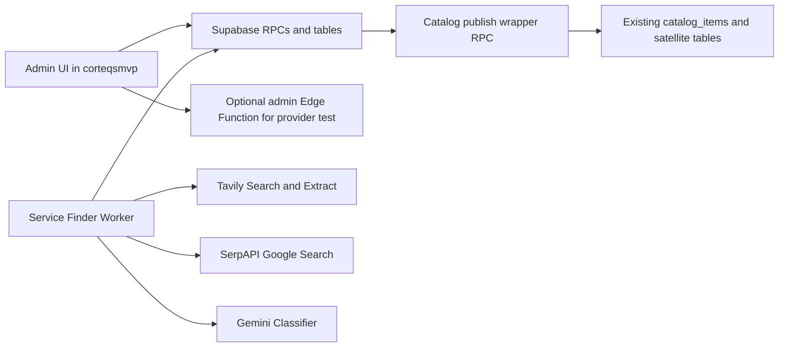
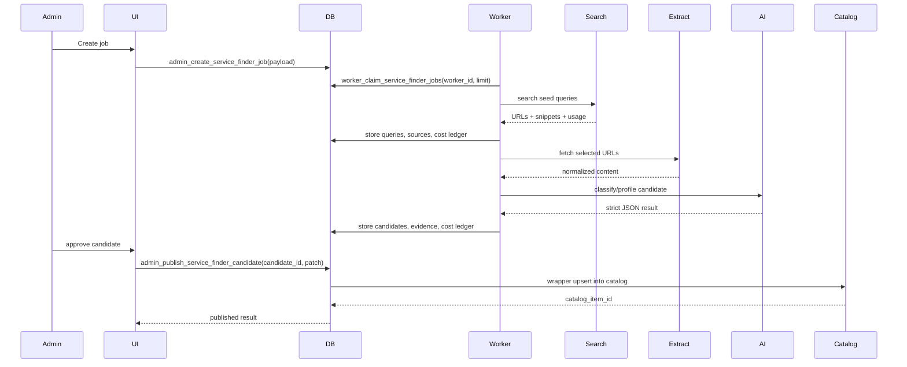
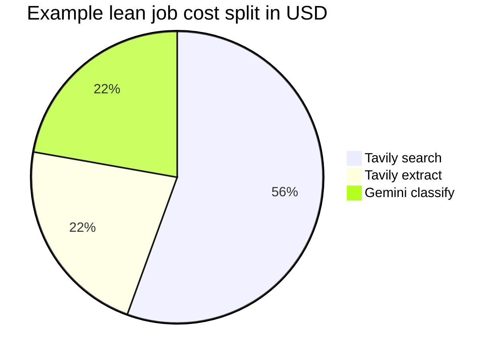

# CorteQS Service Finder E2E implementation document for `ubterzioglu/corteqsmvp`

## Executive summary

This implementation should stay in the **same repository** as `ubterzioglu/corteqsmvp`, but it should be added as a **self-contained module plus a separately deployable worker**. That gives Claude Code direct access to the existing admin shell, catalog data model, CSV import logic, Gemini precedent, deployment assets, and project conventions, while still allowing the crawler/AI pipeline to scale independently from the main Vite app. The repo already has an admin route tree, admin navigation metadata, catalog/admin data APIs, a CSV importer aimed at directory-style records, a Gemini-backed Supabase Edge Function, and Docker/Coolify deployment assets, so the Service Finder should extend those rather than bypass them. citeturn18view4turn18view5turn18view6turn17view3turn32view0turn17view8turn34view0

Yes, **API/provider options can be made admin-editable**, but with one hard rule: **raw secrets stay out of the browser**. The admin panel should edit non-secret provider settings stored in Postgres, such as provider enablement, priority, model choice, search depth, result limits, soft/hard budgets, and default query templates. Actual API keys should remain in Coolify/Supabase secrets and be referenced indirectly through a `secret_ref` field. That design is aligned with the repo’s current security posture: admin access is auth-gated, new write paths are expected to use security-definer RPCs, and server-only secrets are already documented as non-`VITE_` variables. citeturn25view5turn15view6turn34view0turn16view6turn16view7

Yes, the module can be made **fully usable from the admin panel**, including **live cost tracking**. The cleanest implementation is: admin UI starts jobs and reviews candidates; a worker claims jobs from a DB-backed queue; provider calls write a granular cost ledger row after every search, extract, or classify step; the admin UI polls or subscribes to job/cost updates and enforces budget hard-stops at the job level. The repo already uses Supabase as the central system of record and documents Realtime as part of the stack, so live budget visibility belongs in Postgres, not in an external billing sidecar. citeturn15view6turn15view8turn17view8

Claude Code should also treat the repo as having **some stale or conflicting documentation**. Two important examples: the architecture doc says the stack uses `react-router-dom 6`, while `package.json` currently declares `react-router-dom` `^7.17.0`; and the catalog rebuild docs say the old `*_details` tables were dropped, while the current CSV importer still writes `advisor_details`, `business_details`, and `organization_details`. So the implementation should trust **runtime/build truth first** (`package.json`, current imports, current DB types, live migrations), and treat some narrative docs as intent rather than as perfectly current source of truth. citeturn15view6turn41view1turn26view7turn26view8turn33view0

The strategic recommendation is therefore:

| Decision | Recommendation | Why |
|---|---|---|
| Repo placement | Same repo | Tight coupling to admin shell, catalog, migrations, and existing import flow. citeturn18view4turn25view5turn34view0 |
| Worker placement | Same repo, separate deploy target | Keeps implementation cohesive while allowing independent scaling/restarts. citeturn34view0turn16view3 |
| Admin configurability | Yes, for non-secret settings | Safe and operationally flexible. citeturn25view5turn16view6 |
| Secret management | Coolify/Supabase secrets only | Consistent with current server-only secret handling. citeturn34view0turn16view7 |
| Cost tracking | DB ledger + live admin views | Enables budgets, hard stops, and auditability. citeturn15view6turn17view8 |
| Default classifier | Gemini 2.5 Flash-Lite | Cheapest current Gemini text-classification option among the relevant models. citeturn28view1turn28view2 |

## Current repo baseline and constraints

The repo is already a substantial **React + Vite + Supabase** application, with documented use of security-definer RPCs, RLS, Auth, Realtime, and multiple Edge Functions. The project guidance for new features is to follow the **muhasebe** module pattern: put data access in `src/lib/*-api.ts`, use React Query at the UI boundary, and keep route trees modular. The single Supabase browser client lives in `src/integrations/supabase/client.ts`, and that file is described as Lovable-generated and risky to modify directly. citeturn15view6turn25view1turn25view2turn25view5turn25view6

The current repo already contains a practical precursor to this module: a CSV importer and a role map specifically aimed at directory/catalog entries. The import script accepts a role key, source label, defaults, and a CSV path; the checked-in npm scripts already include a preset for **Dortmund Turkish-speaking doctors** using `Healthcare_Doctor`, default city/country/region, and a custom source label. The role map also already defines `Healthcare_Doctor` as an advisor category with default languages `["tr","de"]`, and the importer normalizes contacts, location, services, tags, and attributes into catalog-linked tables. That means the Service Finder should **produce the same normalized shape** as the importer rather than inventing a parallel target schema. citeturn14view0turn14view1turn19view0turn19view2turn32view1turn32view0turn40view0

The existing admin shell is also already structured for modular extension. `/admin` is mounted through `src/pages/admin/routes.tsx`, and the project explicitly says that new admin routes must also be added to `ADMIN_ROUTE_PATTERNS`, with the navigation registry used as a further source of truth for discoverability and tests. There is already a pattern of module-level route trees such as `pages/admin/muhasebe/routes.tsx`. This is the right precedent for a Service Finder module. citeturn18view4turn18view5turn18view6turn18view8turn18view0

The catalog side of the repo is mature enough to make the Service Finder worthwhile. The rebuild docs describe `catalog_items`, `catalog_item_roles`, `catalog_item_attribute_values`, `catalog_item_claims`, `catalog_item_managers`, and satellite tables for media, contacts, links, locations, services, languages, categories, reviews, reports, and tags. The admin catalog code also shows live use of `catalog_items`, roles, and admin RPCs such as `admin_search_profiles` and `admin_list_unified_records`. The Service Finder should plug into this catalog system, not a new public-directory schema. citeturn26view7turn26view8turn17view0turn17view1turn17view3turn17view4

There are also a few constraints Claude Code must respect:

| Constraint | Practical meaning | Source |
|---|---|---|
| Root documentation is intentionally limited | Put new implementation docs under `docs/`, not the repo root. | citeturn34view0turn34view1 |
| Type generation is currently out of sync | Any new migration must be followed by `supabase gen types`. | citeturn25view0 |
| The front-end stack is real-world loose TypeScript | New code should still be written as if strict typing were enabled. | citeturn25view3turn25view6 |
| Turkish text normalization matters | Admin filtering/searching of “Türkçe”, “İstanbul”, etc. should use the project’s Turkish normalization helpers. | citeturn25view4 |
| Existing narrative docs can be stale | Trust `package.json`, current imports, and generated DB types over prose when they differ. | citeturn15view6turn41view1turn26view7turn33view0 |

Recommended read order for Claude Code before changing anything:

| File | Why Claude Code should read it first |
|---|---|
| `CLAUDE.md` | Project conventions, auth rules, module pattern, generated-file caveats. citeturn25view1turn25view3turn25view5 |
| `AGENT_CONTEXT.md` | Current canonical schema and migration history snapshots. citeturn26view7turn26view8 |
| `ARCHITECTURE.md` | High-level stack and route conventions, with some lagging details. citeturn15view6turn15view7 |
| `package.json` | Build truth: scripts, test commands, dependencies, and the existing Dortmund doctor import alias. citeturn40view0turn41view3 |
| `src/pages/admin/routes.tsx` | Where the new admin subtree must be mounted. citeturn18view4turn18view5 |
| `src/lib/admin-shell/admin-route-meta.ts` | Required route snapshot registry. citeturn18view0 |
| `src/lib/admin-shell/admin-navigation-registry.ts` | Where the admin menu and command-search discoverability live. citeturn18view2turn18view3 |
| `src/lib/admin-catalog.ts` | Existing admin data-access style and catalog primitives. citeturn17view0turn17view1turn17view3 |
| `scripts/import-profiles-csv.mjs` and `scripts/catalog-role-importer.mjs` | Current normalized import target shape and catalog upsert behavior. citeturn32view2turn32view0turn33view0 |
| `scripts/catalog-role-import-map.json` | Existing profession taxonomy and the doctor baseline. citeturn19view0turn19view7 |
| `supabase/functions/find-matches/index.ts` | Existing Gemini/server-side AI precedent. citeturn13view1turn17view8 |
| `server.mjs`, `Dockerfile`, `nixpacks.toml`, `.env.example` | Current deployment/runtime/env conventions. citeturn16view0turn16view1turn16view2turn16view6 |

## Target architecture

The recommended shape is a **repo-local “module + worker” architecture**:

- the admin UI lives inside the existing Vite app,
- Supabase stores jobs, sources, candidates, costs, and events,
- a separate worker process claims jobs from Postgres and calls external providers,
- approved records publish into the existing catalog through a **single wrapper publish RPC**,
- budgets are enforced centrally in the database and surfaced live in the admin UI. citeturn15view6turn25view5turn17view8turn32view0



The job flow should look like this:



### Repo placements

The repo should remain single-source, but the worker should be deployable independently. The cleanest placement is this:

| Path | Action | Purpose |
|---|---|---|
| `src/pages/admin/service-finder/routes.tsx` | new | Module route tree for `/admin/service-finder/*` |
| `src/pages/admin/service-finder/ServiceFinderDashboardPage.tsx` | new | Job list, create job, budget cards |
| `src/pages/admin/service-finder/ServiceFinderJobDetailPage.tsx` | new | Queries, sources, candidates, costs, events |
| `src/pages/admin/service-finder/ServiceFinderProvidersPage.tsx` | new | Provider settings and budget controls |
| `src/pages/admin/service-finder/ServiceFinderTemplatesPage.tsx` | new | Profession/query template editor |
| `src/components/admin/service-finder/*` | new | Tables, drawers, forms, cost widgets |
| `src/lib/service-finder-api.ts` | new | Supabase reads/mutations in the muhasebe-style API layer |
| `src/lib/service-finder-schemas.ts` | new | Zod request/response schemas |
| `src/lib/service-finder-format.ts` | new | Cost, confidence, and status formatting |
| `src/lib/service-finder-cost.ts` | new | Cost estimation and hard-stop helpers |
| `src/hooks/use-service-finder.ts` | new | React Query hooks |
| `src/pages/admin/routes.tsx` | modify | Import and mount `serviceFinderRoutes` |
| `src/lib/admin-shell/admin-route-meta.ts` | modify | Add route patterns |
| `src/lib/admin-shell/admin-navigation-registry.ts` | modify | Add nav entry and aliases |
| `supabase/migrations/20260612110000_create_service_finder_module.sql` | new | Core schema |
| `supabase/migrations/20260612113000_create_service_finder_rpcs.sql` | new | Security-definer RPCs |
| `supabase/functions/service-finder-admin/index.ts` | new | Optional secret-touching admin HTTP actions |
| `workers/service-finder/package.json` | new | Worker package |
| `workers/service-finder/src/index.ts` | new | Main worker process |
| `workers/service-finder/src/providers/*.ts` | new | Tavily / SerpAPI / Gemini adapters |
| `workers/service-finder/src/prompts.ts` | new | Classifier prompt + schema |
| `workers/service-finder/src/worker-loop.ts` | new | Claim/execute/heartbeat logic |
| `workers/service-finder/src/costs.ts` | new | Billing math |
| `docs/plans/service-finder/2026-06-12-e2e.md` | new | Internal implementation companion doc |

Those placements match the repo’s current guidance: new live docs belong under `docs/`, new feature code should follow the `src/lib/*-api.ts` plus React Query pattern, and admin modules should integrate with the existing route tree and navigation registry. citeturn34view0turn34view1turn25view1turn25view5turn18view0turn18view2turn18view4

### Recommended admin routes

Use these admin URLs:

| Route | Purpose |
|---|---|
| `/admin/service-finder` | dashboard / recent jobs / quick create |
| `/admin/service-finder/jobs` | paginated jobs list |
| `/admin/service-finder/jobs/:jobId` | job detail |
| `/admin/service-finder/providers` | provider configs and budgets |
| `/admin/service-finder/templates` | profession templates |
| `/admin/service-finder/costs` | cost ledger aggregates |

Mount them as a module-level subtree, exactly the way the repo already handles `muhasebeRoutes`, and register them in both `admin-route-meta.ts` and `admin-navigation-registry.ts`. citeturn18view8turn18view0turn18view2

## Schema, queue model, and migrations

The queue should be implemented as a **queue-in-table** pattern on `service_finder_jobs`, not with a separate managed queue service. That keeps the stack aligned with the repo’s current Supabase-centric architecture and avoids adding extra moving parts before the feature proves itself. The worker can safely claim rows using `FOR UPDATE SKIP LOCKED` inside a security-definer RPC. That is the simplest reliable approach for an admin-only back-office module in this codebase. citeturn15view6turn25view5

### Core migration file

Use a migration named:

```sql
-- supabase/migrations/20260612110000_create_service_finder_module.sql
```

Use the following **full CREATE TABLE statements** as the canonical starting point:

```sql
create table if not exists public.service_finder_provider_configs (
  id uuid primary key default gen_random_uuid(),
  provider_key text not null unique,
  provider_kind text not null check (provider_kind in ('search', 'extract', 'classify')),
  display_name text not null,
  is_enabled boolean not null default true,
  priority integer not null default 100,
  default_model text,
  base_url text,
  request_defaults jsonb not null default '{}'::jsonb,
  rate_limit_per_min integer,
  default_soft_cap_usd numeric(12,4),
  default_hard_cap_usd numeric(12,4),
  daily_cap_usd numeric(12,4),
  monthly_cap_usd numeric(12,4),
  secret_ref text not null,
  created_at timestamptz not null default now(),
  updated_at timestamptz not null default now(),
  updated_by_user_id uuid
);

create table if not exists public.service_finder_profession_templates (
  id uuid primary key default gen_random_uuid(),
  template_key text not null unique,
  label text not null,
  role_key text not null,
  item_type text not null,
  category_slug text,
  language_terms text[] not null default array['Türk', 'Türkçe', 'Turkish speaking', 'Türkisch'],
  location_terms text[] not null default '{}'::text[],
  must_include_terms text[] not null default '{}'::text[],
  must_exclude_terms text[] not null default '{}'::text[],
  query_templates jsonb not null default '[]'::jsonb,
  extraction_hints jsonb not null default '{}'::jsonb,
  default_max_queries integer not null default 12,
  default_max_source_urls integer not null default 40,
  default_max_extract_urls integer not null default 25,
  is_active boolean not null default true,
  created_at timestamptz not null default now(),
  updated_at timestamptz not null default now()
);

create table if not exists public.service_finder_jobs (
  id uuid primary key default gen_random_uuid(),
  title text not null,
  status text not null default 'queued'
    check (status in ('queued', 'running', 'review', 'completed', 'failed', 'cancelled', 'budget_stopped')),
  priority integer not null default 100,
  created_by_user_id uuid not null,
  template_id uuid references public.service_finder_profession_templates(id) on delete set null,
  search_provider_id uuid references public.service_finder_provider_configs(id) on delete set null,
  extract_provider_id uuid references public.service_finder_provider_configs(id) on delete set null,
  classifier_provider_id uuid references public.service_finder_provider_configs(id) on delete set null,
  role_key text not null,
  item_type text not null,
  category_slug text,
  location_label text not null,
  country_code text,
  region text,
  city text,
  language_code text not null default 'tr',
  freeform_topic text,
  must_include_terms text[] not null default '{}'::text[],
  must_exclude_terms text[] not null default '{}'::text[],
  seed_queries jsonb not null default '[]'::jsonb,
  max_queries integer not null default 12,
  max_source_urls integer not null default 40,
  max_extract_urls integer not null default 25,
  max_candidates integer not null default 100,
  soft_cap_usd numeric(12,4) not null default 3.0000,
  hard_cap_usd numeric(12,4) not null default 5.0000,
  cost_total_usd numeric(12,4) not null default 0.0000,
  search_requests integer not null default 0,
  extract_requests integer not null default 0,
  classify_requests integer not null default 0,
  catalog_publish_mode text not null default 'manual_review'
    check (catalog_publish_mode in ('manual_review', 'approve_then_publish', 'direct_publish_disabled')),
  result_summary jsonb not null default '{}'::jsonb,
  progress jsonb not null default '{}'::jsonb,
  attempts integer not null default 0,
  last_error_code text,
  last_error_message text,
  run_after timestamptz not null default now(),
  locked_by text,
  lease_expires_at timestamptz,
  started_at timestamptz,
  finished_at timestamptz,
  cancelled_at timestamptz,
  created_at timestamptz not null default now(),
  updated_at timestamptz not null default now()
);

create table if not exists public.service_finder_job_queries (
  id uuid primary key default gen_random_uuid(),
  job_id uuid not null references public.service_finder_jobs(id) on delete cascade,
  stage text not null check (stage in ('seed', 'expansion', 'retry')),
  provider_key text not null,
  query_text text not null,
  request_payload jsonb not null default '{}'::jsonb,
  response_payload jsonb not null default '{}'::jsonb,
  external_request_id text,
  usage_units numeric(12,4) not null default 0,
  estimated_cost_usd numeric(12,4) not null default 0.0000,
  result_count integer not null default 0,
  status text not null default 'pending'
    check (status in ('pending', 'succeeded', 'failed', 'skipped')),
  created_at timestamptz not null default now(),
  executed_at timestamptz,
  unique (job_id, stage, query_text)
);

create table if not exists public.service_finder_job_sources (
  id uuid primary key default gen_random_uuid(),
  job_id uuid not null references public.service_finder_jobs(id) on delete cascade,
  discovery_query_id uuid references public.service_finder_job_queries(id) on delete set null,
  provider_key text not null,
  source_url text not null,
  normalized_url text not null,
  source_domain text not null,
  source_title text,
  source_snippet text,
  source_language text,
  crawl_allowed boolean,
  robots_evaluated_at timestamptz,
  fetch_status text not null default 'discovered'
    check (fetch_status in ('discovered', 'queued', 'fetched', 'blocked_robots', 'failed', 'duplicate', 'irrelevant')),
  http_status integer,
  content_hash text,
  extracted_text text,
  extracted_markdown text,
  raw_metadata jsonb not null default '{}'::jsonb,
  created_at timestamptz not null default now(),
  fetched_at timestamptz,
  unique (job_id, normalized_url)
);

create table if not exists public.service_finder_candidates (
  id uuid primary key default gen_random_uuid(),
  job_id uuid not null references public.service_finder_jobs(id) on delete cascade,
  primary_source_id uuid references public.service_finder_job_sources(id) on delete set null,
  canonical_name text not null,
  profession_label text,
  organization_name text,
  role_key text not null,
  item_type text not null,
  category_slug text,
  country_code text,
  region text,
  city text,
  address_line text,
  languages text[] not null default '{}'::text[],
  services text[] not null default '{}'::text[],
  contacts jsonb not null default '[]'::jsonb,
  website_url text,
  appointment_url text,
  source_urls jsonb not null default '[]'::jsonb,
  evidence jsonb not null default '[]'::jsonb,
  normalized_payload jsonb not null default '{}'::jsonb,
  catalog_projection jsonb not null default '{}'::jsonb,
  duplicate_key text not null,
  confidence_score numeric(5,2) not null default 0.00,
  classifier_model text,
  review_status text not null default 'pending'
    check (review_status in ('pending', 'approved', 'rejected', 'needs_edit', 'published')),
  review_notes text,
  reviewed_by_user_id uuid,
  reviewed_at timestamptz,
  catalog_item_id uuid,
  published_at timestamptz,
  cost_total_usd numeric(12,4) not null default 0.0000,
  created_at timestamptz not null default now(),
  updated_at timestamptz not null default now(),
  unique (job_id, duplicate_key)
);

create table if not exists public.service_finder_job_events (
  id bigserial primary key,
  job_id uuid not null references public.service_finder_jobs(id) on delete cascade,
  candidate_id uuid references public.service_finder_candidates(id) on delete cascade,
  event_type text not null,
  event_level text not null default 'info'
    check (event_level in ('debug', 'info', 'warn', 'error')),
  message text not null,
  event_payload jsonb not null default '{}'::jsonb,
  created_at timestamptz not null default now()
);

create table if not exists public.service_finder_cost_ledger (
  id bigserial primary key,
  job_id uuid not null references public.service_finder_jobs(id) on delete cascade,
  query_id uuid references public.service_finder_job_queries(id) on delete set null,
  source_id uuid references public.service_finder_job_sources(id) on delete set null,
  candidate_id uuid references public.service_finder_candidates(id) on delete set null,
  provider_config_id uuid references public.service_finder_provider_configs(id) on delete set null,
  provider_key text not null,
  event_type text not null
    check (event_type in ('search', 'extract', 'classify', 'grounding', 'manual_adjustment')),
  billing_unit text not null,
  quantity numeric(12,4) not null,
  unit_cost_usd numeric(12,6) not null,
  amount_usd numeric(12,4) not null,
  currency text not null default 'USD',
  model_name text,
  request_meta jsonb not null default '{}'::jsonb,
  created_at timestamptz not null default now()
);
```

Add indexes immediately after the tables:

```sql
create index if not exists idx_sf_jobs_queue
  on public.service_finder_jobs (status, run_after, lease_expires_at, priority desc);

create index if not exists idx_sf_jobs_created_at
  on public.service_finder_jobs (created_at desc);

create index if not exists idx_sf_sources_job_fetch
  on public.service_finder_job_sources (job_id, fetch_status, source_domain);

create index if not exists idx_sf_candidates_job_review
  on public.service_finder_candidates (job_id, review_status, confidence_score desc);

create index if not exists idx_sf_cost_ledger_job_created
  on public.service_finder_cost_ledger (job_id, created_at desc);

create index if not exists idx_sf_events_job_created
  on public.service_finder_job_events (job_id, created_at desc);
```

### RLS and RPC model

These tables should be **RLS-enabled** with **admin read access only**, and the UI should mutate through security-definer RPCs rather than raw inserts from the browser. That matches the repo’s documented philosophy for admin writes. citeturn15view6turn25view5

Recommended RPC set:

| RPC | Purpose | Called by |
|---|---|---|
| `admin_create_service_finder_job(p_payload jsonb)` | validate template/provider/budget input and insert a queued job | admin UI |
| `admin_cancel_service_finder_job(p_job_id uuid)` | cancel queued/running job | admin UI |
| `admin_retry_service_finder_job(p_job_id uuid)` | clone or requeue failed job | admin UI |
| `admin_get_service_finder_job(p_job_id uuid)` | return detail JSON with queries, sources, candidates, costs, events | admin UI |
| `admin_list_service_finder_jobs(...)` | paginated list/filtering | admin UI |
| `admin_upsert_service_finder_provider(p_provider_id uuid, p_patch jsonb)` | update non-secret provider config | admin UI |
| `admin_upsert_service_finder_template(p_template_id uuid, p_patch jsonb)` | update profession template | admin UI |
| `admin_publish_service_finder_candidate(p_candidate_id uuid, p_patch jsonb)` | publish approved candidate into canonical catalog | admin UI |
| `worker_claim_service_finder_jobs(p_worker_id text, p_limit int)` | lease jobs with `FOR UPDATE SKIP LOCKED` | worker |
| `worker_heartbeat_service_finder_job(p_job_id uuid, p_worker_id text, p_progress jsonb)` | extend lease and update progress | worker |
| `worker_append_service_finder_event(...)` | append event rows | worker |
| `worker_record_service_finder_cost(p_payload jsonb)` | insert ledger row and atomically bump job totals | worker |
| `worker_complete_service_finder_job(...)` | finalize job | worker |
| `worker_fail_service_finder_job(...)` | fail or schedule retry | worker |

### Catalog publish strategy

Do **not** let the worker write directly into the catalog satellite tables. Instead, implement a single wrapper RPC such as `admin_publish_service_finder_candidate` that takes the candidate’s `catalog_projection` JSON, validates it, and then calls the canonical catalog-write path that is current on the branch. This is necessary because the repo shows a real inconsistency: the rebuild docs say the legacy `*_details` pattern is gone, but the importer script still writes `advisor_details`, `business_details`, and `organization_details`. The wrapper RPC is the safest seam because it isolates that ambiguity to one place. citeturn26view7turn26view8turn33view0

## Contracts, worker logic, and prompts

### TypeScript interfaces

Follow the repo’s preferred pattern: explicit public types, a dedicated API file, and React Query at the UI edge. citeturn25view1turn25view3turn25view6

```ts
export type ServiceFinderJobStatus =
  | "queued"
  | "running"
  | "review"
  | "completed"
  | "failed"
  | "cancelled"
  | "budget_stopped";

export interface ServiceFinderJobCreateInput {
  title: string;
  templateId?: string;
  roleKey: string;
  itemType: string;
  categorySlug?: string;
  locationLabel: string;
  countryCode?: string;
  region?: string;
  city?: string;
  languageCode: "tr" | "de" | "en";
  freeformTopic?: string;
  mustIncludeTerms: string[];
  mustExcludeTerms: string[];
  seedQueries?: string[];
  maxQueries?: number;
  maxSourceUrls?: number;
  maxExtractUrls?: number;
  maxCandidates?: number;
  softCapUsd?: number;
  hardCapUsd?: number;
  searchProviderId?: string;
  extractProviderId?: string;
  classifierProviderId?: string;
}

export interface ServiceFinderProviderConfig {
  id: string;
  providerKey: "tavily" | "serpapi" | "gemini";
  providerKind: "search" | "extract" | "classify";
  displayName: string;
  isEnabled: boolean;
  priority: number;
  defaultModel?: string;
  requestDefaults: Record<string, unknown>;
  rateLimitPerMin?: number;
  defaultSoftCapUsd?: number;
  defaultHardCapUsd?: number;
  dailyCapUsd?: number;
  monthlyCapUsd?: number;
  secretRef: string;
}

export interface ServiceFinderCandidate {
  id: string;
  jobId: string;
  canonicalName: string;
  professionLabel?: string;
  organizationName?: string;
  roleKey: string;
  itemType: string;
  categorySlug?: string;
  city?: string;
  countryCode?: string;
  languages: string[];
  services: string[];
  contacts: Array<{
    type: "phone" | "email" | "website" | "appointment_url";
    value: string;
    label?: string;
    isPrimary?: boolean;
  }>;
  websiteUrl?: string;
  appointmentUrl?: string;
  confidenceScore: number;
  reviewStatus: "pending" | "approved" | "rejected" | "needs_edit" | "published";
  normalizedPayload: Record<string, unknown>;
  catalogProjection: Record<string, unknown>;
  evidence: Array<Record<string, unknown>>;
  catalogItemId?: string;
}

export interface ServiceFinderCostEvent {
  jobId: string;
  providerConfigId?: string;
  providerKey: "tavily" | "serpapi" | "gemini";
  eventType: "search" | "extract" | "classify" | "grounding" | "manual_adjustment";
  billingUnit: string;
  quantity: number;
  unitCostUsd: number;
  amountUsd: number;
  modelName?: string;
  requestMeta?: Record<string, unknown>;
}
```

### Provider interfaces

The provider abstraction should separate **search**, **extract**, and **classify** so the module can swap providers without changing job logic. Tavily officially exposes `/search`, `/extract`, and `/research`; SerpAPI’s Google Search API exposes location and localization controls such as `location`, `gl`, `hl`, and `google_domain`; Gemini supports structured output with `application/json` and a response schema. citeturn38view0turn38view4turn35search2turn37view0turn37view1turn37view2turn39search0turn39search8

```ts
export interface SearchProvider {
  readonly key: "tavily" | "serpapi";
  search(input: {
    query: string;
    locationLabel?: string;
    countryCode?: string;
    languageCode?: string;
    maxResults: number;
    options?: Record<string, unknown>;
  }): Promise<{
    requestId?: string;
    results: Array<{
      url: string;
      title?: string;
      snippet?: string;
      domain: string;
      language?: string;
      raw?: Record<string, unknown>;
    }>;
    usage?: { units: number; estimatedCostUsd: number };
  }>;
}

export interface ExtractProvider {
  readonly key: "tavily";
  extract(input: {
    urls: string[];
    query?: string;
    depth: "basic" | "advanced";
    options?: Record<string, unknown>;
  }): Promise<{
    docs: Array<{
      url: string;
      title?: string;
      text?: string;
      markdown?: string;
      metadata?: Record<string, unknown>;
    }>;
    usage?: { units: number; estimatedCostUsd: number };
  }>;
}

export interface ClassifierProvider {
  readonly key: "gemini";
  classify(input: {
    job: Record<string, unknown>;
    source: Record<string, unknown>;
    extractedText: string;
  }): Promise<{
    parsed: Record<string, unknown>;
    usage?: {
      inputTokens: number;
      outputTokens: number;
      estimatedCostUsd: number;
      model: string;
    };
  }>;
}
```

### Client-facing mutation contracts

Even if you implement these as RPC calls rather than REST routes, keep the JSON shapes stable.

#### Create job

```json
POST createJob
{
  "title": "Dortmund Turkish-speaking doctors",
  "templateId": "optional-uuid",
  "roleKey": "Healthcare_Doctor",
  "itemType": "advisor",
  "categorySlug": "advisor-healthcare-doctor",
  "locationLabel": "Dortmund, Nordrhein-Westfalen, Germany",
  "countryCode": "DE",
  "region": "Nordrhein-Westfalen",
  "city": "Dortmund",
  "languageCode": "tr",
  "mustIncludeTerms": ["Türk", "Türkçe", "Turkish speaking"],
  "mustExcludeTerms": ["forum", "reddit", "job"],
  "softCapUsd": 1.5,
  "hardCapUsd": 3.0
}
```

```json
200
{
  "jobId": "uuid",
  "status": "queued",
  "softCapUsd": 1.5,
  "hardCapUsd": 3.0
}
```

#### Get job detail

```json
GET getJobDetail
{
  "jobId": "uuid"
}
```

```json
200
{
  "job": {
    "id": "uuid",
    "status": "running",
    "costTotalUsd": 0.31,
    "progress": {
      "queriesCompleted": 6,
      "sourcesFetched": 14,
      "candidatesCreated": 12
    }
  },
  "queries": [],
  "sources": [],
  "candidates": [],
  "costs": [],
  "events": []
}
```

#### Publish candidate

```json
POST publishCandidate
{
  "candidateId": "uuid",
  "patch": {
    "canonicalName": "Dr. Example",
    "services": ["Kardiyoloji"],
    "contacts": [
      { "type": "phone", "value": "+49..." }
    ]
  }
}
```

```json
200
{
  "candidateId": "uuid",
  "catalogItemId": "uuid",
  "reviewStatus": "published"
}
```

### Worker pseudocode

The worker should be conservative, budget-aware, and idempotent.

```ts
while (true) {
  const jobs = await rpc.worker_claim_service_finder_jobs(workerId, 2);

  if (jobs.length === 0) {
    await sleep(POLL_MS);
    continue;
  }

  for (const job of jobs) {
    try {
      await heartbeat(job, { stage: "claimed" });

      const queries = buildQueries(job);
      for (const q of queries) {
        if (await exceedsHardStop(job.id)) throw new BudgetExceededError();

        const searchProvider = getSearchProvider(job.searchProviderId);
        const searchRes = await searchProvider.search(q);
        await persistQueryResult(job.id, q, searchRes);
        await recordCost(job.id, searchRes.usage);

        const candidateUrls = selectAndDeduplicateUrls(searchRes.results, job.maxSourceUrls);
        await persistDiscoveredSources(job.id, candidateUrls);
      }

      const sources = await loadPendingSources(job.id, job.maxExtractUrls);
      for (const source of sources) {
        if (await exceedsHardStop(job.id)) throw new BudgetExceededError();
        if (!await isRobotsAllowed(source.url)) {
          await markSourceBlocked(job.id, source.id);
          continue;
        }

        const extractProvider = getExtractProvider(job.extractProviderId);
        const extractRes = await extractProvider.extract({
          urls: [source.url],
          query: job.freeformTopic ?? job.title,
          depth: "basic"
        });

        await persistExtractedSource(job.id, source.id, extractRes);
        await recordCost(job.id, extractRes.usage);
      }

      const extractedSources = await loadUnclassifiedSources(job.id);
      for (const source of extractedSources) {
        if (await exceedsHardStop(job.id)) throw new BudgetExceededError();

        const classifier = getClassifier(job.classifierProviderId);
        const cls = await classifier.classify({
          job,
          source,
          extractedText: source.extractedText
        });

        const validated = CandidateSchema.parse(cls.parsed);
        const duplicateKey = makeDuplicateKey(validated);
        await upsertCandidate(job.id, source.id, duplicateKey, validated);
        await recordCost(job.id, cls.usage);
      }

      await finalizeJob(job.id, { status: "review" });
    } catch (err) {
      const retryable = isRetryable(err);
      await failOrRetryJob(job.id, err, retryable);
    }
  }
}
```

Recommended error classes:

| Error | Retry? | Behavior |
|---|---|---|
| `BudgetExceededError` | no | mark `budget_stopped`, append event |
| `RobotsBlockedError` | no | mark source `blocked_robots`, continue |
| `ProviderRateLimitError` | yes | exponential backoff, bump `run_after` |
| `ProviderTemporaryError` | yes | retry with jitter |
| `ValidationError` | no | append error event, candidate/source marked failed |
| `AuthOrConfigError` | no | fail job immediately and alert admin |
| `LeaseLostError` | no | stop processing; another worker reclaimed job |

### Classifier prompt and strict JSON schema

The repo already uses Gemini server-side in `find-matches`, and Gemini’s current API supports structured JSON output via `application/json` plus a schema. For this module, use **schema-validated JSON output** and still pass the result through Zod validation before persistence. citeturn17view8turn17view9turn39search0turn39search8

Prompt template:

```txt
SYSTEM:
You are a high-precision directory normalizer for Turkish/Turkish-speaking service discovery.
Return JSON only. Do not include markdown, prose, or explanations.
If the page is not a real service provider profile, return:
{
  "is_match": false,
  "match_reason": "...",
  "confidence_score": 0,
  "canonical_name": null,
  "organization_name": null,
  "profession_label": null,
  "role_key": null,
  "item_type": null,
  "category_slug": null,
  "city": null,
  "country_code": null,
  "languages": [],
  "services": [],
  "contacts": [],
  "website_url": null,
  "appointment_url": null,
  "evidence_quotes": []
}

USER:
Job context:
- role_key: {{role_key}}
- item_type: {{item_type}}
- category_slug: {{category_slug}}
- target location: {{location_label}}
- include terms: {{must_include_terms}}
- exclude terms: {{must_exclude_terms}}

Page metadata:
- url: {{url}}
- title: {{title}}
- snippet: {{snippet}}

Extracted content:
{{extracted_text}}

Rules:
- Prefer explicit evidence over inference.
- Do not invent phone, email, language, or address.
- If Turkish service is not explicit, but Turkish language support is strongly implied, set confidence below 70.
- For languages, use ISO-like short codes where possible: tr, de, en.
- Contacts must be typed objects.
- Evidence quotes must be short verbatim excerpts from the page.
- If multiple practitioners appear on one page, return the best matching single candidate only.
```

Recommended response schema:

```json
{
  "type": "object",
  "additionalProperties": false,
  "required": [
    "is_match",
    "match_reason",
    "confidence_score",
    "canonical_name",
    "organization_name",
    "profession_label",
    "role_key",
    "item_type",
    "category_slug",
    "city",
    "country_code",
    "languages",
    "services",
    "contacts",
    "website_url",
    "appointment_url",
    "evidence_quotes"
  ],
  "properties": {
    "is_match": { "type": "boolean" },
    "match_reason": { "type": "string" },
    "confidence_score": { "type": "number", "minimum": 0, "maximum": 100 },
    "canonical_name": { "type": ["string", "null"] },
    "organization_name": { "type": ["string", "null"] },
    "profession_label": { "type": ["string", "null"] },
    "role_key": { "type": ["string", "null"] },
    "item_type": { "type": ["string", "null"] },
    "category_slug": { "type": ["string", "null"] },
    "city": { "type": ["string", "null"] },
    "country_code": { "type": ["string", "null"] },
    "languages": { "type": "array", "items": { "type": "string" } },
    "services": { "type": "array", "items": { "type": "string" } },
    "contacts": {
      "type": "array",
      "items": {
        "type": "object",
        "additionalProperties": false,
        "required": ["type", "value"],
        "properties": {
          "type": {
            "type": "string",
            "enum": ["phone", "email", "website", "appointment_url"]
          },
          "value": { "type": "string" },
          "label": { "type": ["string", "null"] },
          "is_primary": { "type": ["boolean", "null"] }
        }
      }
    },
    "website_url": { "type": ["string", "null"] },
    "appointment_url": { "type": ["string", "null"] },
    "evidence_quotes": {
      "type": "array",
      "items": { "type": "string" },
      "maxItems": 6
    }
  }
}
```

## Costs, budgets, and admin experience

### Provider strategy

Use this default provider stack:

| Capability | Default | Why |
|---|---|---|
| Search discovery | Tavily | Search depth is controllable, usage credits are surfaced, and it is cost-effective for agentic search. citeturn38view4turn30view4turn30view5 |
| Precision geolocalized search fallback | SerpAPI | Strong Google-style locality controls via `location`, `gl`, `hl`, `google_domain`. citeturn37view0turn37view1turn37view2 |
| Content extraction | Tavily Extract | Native extract endpoint with explicit pricing by depth and successful URLs. citeturn35search2turn30view5 |
| Classification / normalization | Gemini 2.5 Flash-Lite | Lowest current listed Gemini cost of the relevant text models. citeturn28view1turn28view2 |
| Higher-quality fallback classifier | Gemini 2.5 Flash | More expensive, but already used in-repo and still relatively cheap. citeturn13view1turn28view2 |

### Current public pricing snapshot

#### Tavily

| Plan / unit | Public price | Derived note |
|---|---:|---|
| Free | 1,000 credits/month | good for local testing only. citeturn30view6 |
| Pay-as-you-go | $0.008 per credit | baseline production math. citeturn30view5 |
| Project | $30 / 4,000 credits | $0.0075 per credit. citeturn30view4 |
| Bootstrap | $100 / 15,000 credits | about $0.0067 per credit. This is a simple division on Tavily’s published plan table. citeturn30view4 |
| Startup | $220 / 38,000 credits | about $0.0058 per credit. This is a simple division on Tavily’s published plan table. citeturn30view4 |
| Growth | $500 / 100,000 credits | $0.005 per credit. citeturn30view4 |
| Search `basic` / `fast` / `ultra-fast` | 1 credit per request | controlled by `search_depth`. citeturn38view4 |
| Search `advanced` | 2 credits per request | higher relevance, higher latency and cost. citeturn38view4 |
| Extract `basic` | 1 credit per 5 successful URLs | about $0.0016 per URL at pay-as-you-go. This is an inference from Tavily’s published pricing. citeturn30view5 |
| Extract `advanced` | 2 credits per 5 successful URLs | about $0.0032 per URL at pay-as-you-go. This is an inference from Tavily’s published pricing. citeturn30view5 |

#### SerpAPI

| Plan | Monthly price | Included successful searches | Approx. cost per successful search |
|---|---:|---:|---:|
| Free | $0 | 250 | testing only. citeturn29view3 |
| Starter | $25 | 1,000 | $0.0250/search. This is a simple division on SerpAPI’s public plan table. citeturn29view0 |
| Developer | $75 | 5,000 | $0.0150/search. This is a simple division on SerpAPI’s public plan table. citeturn29view1 |
| Production | $150 | 15,000 | $0.0100/search. This is a simple division on SerpAPI’s public plan table. citeturn29view1 |
| Big Data | $275 | 30,000 | about $0.0092/search. This is a simple division on SerpAPI’s public plan table. citeturn29view4 |

SerpAPI also explicitly states that only **successful searches** count against monthly usage, and cached, errored, and failed searches do not. citeturn29view2

#### Gemini text models relevant to this module

| Model | Input price per 1M tokens | Output price per 1M tokens | Fit |
|---|---:|---:|---|
| Gemini 2.5 Flash-Lite Standard | $0.10 | $0.40 | cheapest strong default for classification. citeturn28view1 |
| Gemini 2.5 Flash Standard | $0.30 | $2.50 | higher-quality fallback. citeturn28view2 |
| Gemini 3.1 Flash-Lite Standard | $0.25 | $1.50 | viable, but more expensive than 2.5 Flash-Lite for this use-case. citeturn28view0 |

The repo currently uses `models/gemini-2.5-flash` inside `find-matches`, so moving the Service Finder classifier to **2.5 Flash-Lite by default** is a cost optimization, not a conceptual change. citeturn13view1turn17view8turn28view1

### Budget and hard-stop logic

Use **three guard rails**:

| Guard | Where stored | Action |
|---|---|---|
| Provider monthly cap | `service_finder_provider_configs.monthly_cap_usd` | provider auto-disabled for new jobs when exceeded |
| Job soft cap | `service_finder_jobs.soft_cap_usd` | UI warning + worker switches to cheaper mode |
| Job hard cap | `service_finder_jobs.hard_cap_usd` | immediate `budget_stopped` status |

Worker behavior at soft cap:
- drop from Tavily `advanced` to `basic`,
- stop SerpAPI fallback unless manually allowed,
- lower `max_results`,
- use Gemini 2.5 Flash-Lite only,
- stop after current candidate batch if already over 95% of hard cap.

Worker behavior at hard cap:
- no further provider calls,
- append ledger/event rows,
- mark job `budget_stopped`,
- leave current candidates in `pending`/`review` state for manual decision.

### Example cost estimates

These are **implementation estimates**, not published bundle prices.

#### Lean Tavily-first job

Assumptions:
- 10 Tavily `basic` searches,
- 20 Tavily `basic` URL extractions,
- 50 Gemini 2.5 Flash-Lite classifications at roughly 4k input + 600 output tokens each.

Estimated cost:
- Tavily search: 10 × $0.008 = **$0.080**
- Tavily extract: 20 successful URLs = 4 credits = **$0.032**
- Gemini 2.5 Flash-Lite:  
  50 × ((4,000 / 1,000,000 × $0.10) + (600 / 1,000,000 × $0.40))  
  ≈ 50 × ($0.0004 + $0.00024)  
  ≈ **$0.032**
- Total ≈ **$0.144**. citeturn30view5turn28view1

#### Higher-recall job

Assumptions:
- 10 Tavily `advanced` searches,
- 20 Tavily `advanced` extractions,
- 50 Gemini 2.5 Flash classifications at roughly 4k input + 600 output tokens each.

Estimated cost:
- Tavily search: 10 × $0.016 = **$0.160**
- Tavily extract: 20 successful URLs = 8 credits = **$0.064**
- Gemini 2.5 Flash:  
  50 × ((4,000 / 1,000,000 × $0.30) + (600 / 1,000,000 × $2.50))  
  ≈ 50 × ($0.0012 + $0.0015)  
  ≈ **$0.135**
- Total ≈ **$0.359**. citeturn30view5turn28view2

Example cost split:



### Admin UI wireframes

#### Dashboard

```txt
┌────────────────────────────────────────────────────────────────────┐
│ Service Finder                                                    │
│ [Create Job] [Providers] [Templates] [Costs]                     │
├────────────────────────────────────────────────────────────────────┤
│ Monthly Spend   Active Jobs   Budget Stops   Publish Queue        │
│ $42.18          3             1              17                   │
├────────────────────────────────────────────────────────────────────┤
│ Quick Create                                                       
│ Profession [Doktor ▼]  Location [Dortmund________]  Language [tr] │
│ Soft cap [$1.50] Hard cap [$3.00]  [Queue Job]                    │
├────────────────────────────────────────────────────────────────────┤
│ Recent Jobs                                                       │
│ Dortmund Turkish-speaking doctors    running    $0.31    12 cand. │
│ Berlin Turkish tax advisors          review     $0.18     8 cand. │
└────────────────────────────────────────────────────────────────────┘
```

#### Job detail

```txt
┌────────────────────────────────────────────────────────────────────┐
│ Job: Dortmund Turkish-speaking doctors                            │
│ Status: running  Cost: $0.31 / $3.00  Queries: 6  Sources: 14     │
├────────────────────────────────────────────────────────────────────┤
│ Tabs: [Overview] [Queries] [Sources] [Candidates] [Costs] [Events]│
├────────────────────────────────────────────────────────────────────┤
│ Left: candidates table                                            │
│ Right: evidence drawer + normalized projection preview            │
└────────────────────────────────────────────────────────────────────┘
```

#### Provider settings

```txt
┌────────────────────────────────────────────────────────────────────┐
│ Providers                                                         │
├────────────────────────────────────────────────────────────────────┤
│ Tavily  [enabled] depth=basic max_results=8 monthly cap=$100      │
│ SerpAPI [fallback] gl=de hl=de google_domain=google.de cap=$75    │
│ Gemini  [enabled] model=gemini-2.5-flash-lite cap=$50             │
│ Secrets: masked; managed outside browser                          │
└────────────────────────────────────────────────────────────────────┘
```

Component list:
- `ServiceFinderJobCreateForm`
- `ServiceFinderJobsTable`
- `ServiceFinderJobStatusBadge`
- `ServiceFinderBudgetMeter`
- `ServiceFinderQueryTable`
- `ServiceFinderSourceTable`
- `ServiceFinderCandidateTable`
- `ServiceFinderCandidateDrawer`
- `ServiceFinderProviderSettingsForm`
- `ServiceFinderTemplateEditor`
- `ServiceFinderCostTimeline`
- `ServiceFinderCostBreakdownCard`

## Delivery, operations, and instructions for Claude Code

### Security and legal notes

The module must respect **robots.txt** and must not treat robots blocking as optional. Google’s documentation states that automated crawlers consult `robots.txt` before crawling, the file must live at the site root, and robots.txt is about crawl control rather than secrecy. The worker should therefore evaluate the root-file rules for each source host before extraction and persist `crawl_allowed` / `blocked_robots` decisions in `service_finder_job_sources`. citeturn43view0turn43view2turn43view1

From a GDPR perspective, this module should be treated as **personal-data processing** whenever it stores identifiable practitioners, emails, phone numbers, or sole-trader pages. The operational consequences are straightforward: define a lawful basis before rollout, collect only the fields needed for the directory purpose, store them no longer than necessary, keep an audit trail for changes and publication decisions, and avoid scraping or inferring special-category data such as health status, ethnicity, religion, or political views unless there is a separately validated legal basis. GDPR Articles 5 and 6 explicitly require lawfulness, fairness, transparency, data minimization, storage limitation, and a lawful basis for processing. citeturn42view2turn42view0turn42view1

Practical legal rules for implementation:
- record the **source URL** and **timestamp** for every candidate;
- store only business-relevant public contact fields;
- do not store full-page HTML unless absolutely necessary for debugging;
- redact or drop sensitive stray content found on practitioner pages;
- provide an admin action to mark a candidate as removed and exclude it from future discovery;
- set a scheduled cleanup window for unapproved candidates and raw extracts.

This is not legal advice, but it is the minimum safe operating posture for an EU-facing admin system. citeturn42view0turn42view1turn42view3

### Environment variables

Use the existing env style and extend it minimally. The repo already uses `VITE_SUPABASE_*`, `SUPABASE_SERVICE_ROLE_KEY`, `GEMINI_API_KEY`, and `RAG_API_SECRET`, with server-only secrets kept out of the frontend. citeturn16view6turn16view7turn34view0

Recommended additions:

| Variable | Service | Purpose |
|---|---|---|
| `TAVILY_API_KEY` | worker | Tavily Search/Extract |
| `SERPAPI_API_KEY` | worker | SerpAPI Google Search |
| `GEMINI_API_KEY` | worker + edge functions | Gemini classification, reusing existing naming. citeturn16view6turn17view9 |
| `SERVICE_FINDER_WORKER_ID` | worker | stable worker identity |
| `SERVICE_FINDER_POLL_MS` | worker | queue polling interval |
| `SERVICE_FINDER_HEARTBEAT_MS` | worker | lease extension interval |
| `SERVICE_FINDER_DEFAULT_SOFT_CAP_USD` | worker/admin | default budget |
| `SERVICE_FINDER_DEFAULT_HARD_CAP_USD` | worker/admin | default budget |
| `SERVICE_FINDER_ENABLE_SERPAPI_FALLBACK` | worker | fallback toggle |
| `SERVICE_FINDER_ADMIN_FN_SECRET` | edge function | optional internal admin HTTP guard |

### CI/CD and Coolify deployment

The repo already supports Coolify via Docker/Nixpacks, builds with `npm run build`, starts with `node server.mjs`, injects runtime env via `/env-config.js`, and includes `npm run verify:release`. Keep that flow for the main app. Deploy the worker as a **second Coolify application** from the **same repo**, with its own working directory and start command. citeturn34view0turn16view0turn16view3turn40view0

Recommended deployment layout:
- **App 1**: existing web/admin application
  - build: `npm ci && npm run build`
  - start: `npm run start`
- **App 2**: `workers/service-finder`
  - build: `npm ci && npm run build`
  - start: `npm run start`

If your Coolify setup cannot target a repo subdirectory cleanly, fallback to a small worker `Dockerfile` inside `workers/service-finder/`. Keep the code in the same repo either way.

CI gates should be:

1. `npm run verify:text`
2. `npm test`
3. `npm run build`
4. service-finder worker tests
5. Playwright smoke for admin create/review/publish flow
6. `supabase gen types` and a diff check that updated generated types are committed

The current repo already exposes `verify:text`, `test`, `test:e2e`, `build`, `start`, and `verify:release`, and documents that `supabase/types.ts` is currently a maintenance hotspot. citeturn40view0turn41view3turn25view0

### Testing plan

#### Unit tests
- query builder from template + location + profession + inclusion/exclusion terms
- duplicate-key builder
- cost estimator for Tavily, SerpAPI, Gemini
- hard-stop logic
- classifier result parser / Zod validator
- Turkish text normalization edge cases for filters like `Türkçe`, `İstanbul`, `Diş Hekimi`. citeturn25view4

#### Integration tests
- RPC `admin_create_service_finder_job`
- RPC `worker_claim_service_finder_jobs`
- worker lease/heartbeat/fail/retry behavior
- provider adapters with mocked HTTP
- `admin_publish_service_finder_candidate` publishing into catalog via current canonical path

#### End-to-end tests
- admin creates Dortmund doctor job
- worker moves job from `queued` to `running`
- candidates appear in review tab with evidence
- admin edits one candidate and publishes
- published candidate receives `catalog_item_id`
- hard cap triggers `budget_stopped`
- provider settings edit changes subsequent job behavior

The repo is already set up for Vitest and Playwright, so reuse those tools instead of introducing another test framework. citeturn41view3turn41view4

### Rollout and rollback runbook

#### Rollout
- deploy schema and RPCs first, UI hidden behind nav omission or a DB-enabled flag;
- deploy worker with provider secrets configured, but no job templates active;
- seed one template for `Healthcare_Doctor` using the existing Dortmund-oriented semantics from the role map and npm script baseline;
- run one internal canary job;
- validate cost ledger math, robots blocking, candidate review, and publish path;
- only then expose `/admin/service-finder` in the navigation registry. citeturn19view0turn40view0turn18view2

#### Rollback
- disable all providers in `service_finder_provider_configs`;
- stop worker process;
- keep admin UI read-only for postmortem review;
- if publish wrapper caused issues, repoint or disable `admin_publish_service_finder_candidate`;
- do **not** drop the new tables immediately; preserve jobs/cost/events for diagnosis;
- if necessary, remove the nav route and leave schema in place until a later cleanup window.

### Acceptance criteria

The implementation is complete when all of the following are true:

| Requirement | Acceptance criterion |
|---|---|
| Same-repo integration | Code lives inside `corteqsmvp` and builds with the existing app plus a worker deploy target |
| Admin usability | An admin can create, inspect, cancel, retry, and review jobs entirely from `/admin/service-finder/*` |
| Query flexibility | Location, profession, language/topic terms, and provider settings are configurable without code edits |
| Provider configurability | Admin can enable/disable providers and edit non-secret request defaults and budgets |
| Cost visibility | Every provider call creates a cost ledger row and job total updates visibly in the UI |
| Hard-stop control | Jobs stop automatically when the hard cap is exceeded |
| Publish flow | Approved candidates can be published into the canonical catalog and receive a catalog item id |
| Legal controls | Sources blocked by robots are not fetched; raw candidate retention is bounded |
| Testability | Unit, integration, and e2e tests cover the core flows |
| Operability | Coolify deployment instructions work for both web and worker services |

### Sample test scenarios with estimated spend

| Scenario | Expected result | Rough spend |
|---|---|---:|
| Dortmund Turkish-speaking doctors, Tavily basic + Gemini 2.5 Flash-Lite | 5–20 review candidates, likely under budget | about $0.14/job under the assumption set above. citeturn30view5turn28view1 |
| Berlin Turkish tax advisors, same stack | similar cost band, depends on source quality | about $0.14–$0.20/job as an inference |
| Munich lawyers with SerpAPI fallback enabled | better geo precision, higher search spend | expect +$0.10 to $0.20 compared with Tavily-first, depending on search count. This is an inference from SerpAPI plan math. citeturn29view1turn29view4 |
| Hard cap = $0.20 on a wide geography query | job stops before completion and records `budget_stopped` | capped by design |
| robots-blocked clinic website | source marked `blocked_robots`, no extraction cost | near zero after discovery |
| malformed classifier response | validation error, source stays failed, job continues | negligible extra cost besides that model call |

### Instructions for Claude Code

Claude Code should proceed in phases and must **report after each phase** in a stable format.

#### Files Claude Code must read before coding
- `CLAUDE.md`
- `AGENT_CONTEXT.md`
- `ARCHITECTURE.md`
- `package.json`
- `src/pages/admin/routes.tsx`
- `src/lib/admin-shell/admin-route-meta.ts`
- `src/lib/admin-shell/admin-navigation-registry.ts`
- `src/lib/admin-catalog.ts`
- `scripts/import-profiles-csv.mjs`
- `scripts/catalog-role-importer.mjs`
- `scripts/catalog-role-import-map.json`
- `supabase/functions/find-matches/index.ts`
- `server.mjs`
- `.env.example` citeturn25view1turn26view7turn18view4turn18view0turn18view2turn32view2turn32view0turn19view0turn17view8turn16view6

#### Coding rules
- Do not modify `src/integrations/supabase/client.ts` unless absolutely necessary. citeturn25view1turn25view2
- Follow the `src/lib/*-api.ts` + React Query pattern. citeturn25view1turn25view5
- Add admin routes in all required places: route tree, route meta, navigation registry. citeturn18view0turn18view2turn18view4
- Regenerate Supabase types after migrations. citeturn25view0
- Keep Turkish-facing strings compatible with the repo’s text-normalization helpers. citeturn25view4
- Treat catalog publish-path internals as **potentially inconsistent** until validated against the generated DB types and migration state. citeturn26view7turn33view0

#### Phases
| Phase | Deliverable |
|---|---|
| Schema phase | migrations, RPCs, RLS, generated types |
| Worker phase | provider adapters, queue claim loop, cost ledger writes |
| UI phase | admin routes, pages, forms, tables, review drawer |
| Publish phase | candidate review/edit/publish path into canonical catalog |
| Test phase | unit, integration, Playwright smoke |
| Deploy phase | Coolify worker instructions, env docs, rollout notes |

#### Required Claude Code output after each phase

```md
## Phase result

### Changed files
- path/to/file
- path/to/file

### Migrations added or changed
- supabase/migrations/...

### Commands run
- npm run verify:text
- npm test
- npm run build
- ...

### Build and test result
- PASS / FAIL
- brief detail

### Risks or ambiguities discovered
- ...
- ...

### Follow-up decisions made
- ...
- ...

### Ready for next phase
- yes / no
```

#### Final implementation handoff format Claude Code should produce

```md
# Service Finder implementation handoff

## Summary
## Changed files
## Migrations
## New environment variables
## Deploy steps
## Tests run and results
## Known risks
## Manual verification checklist
## Rollback checklist
```

The fastest path to useful value is to first industrialize what the repo already hints at: the **Dortmund doctor CSV prototype**, the **catalog importer shape**, the **Gemini server-side precedent**, and the **admin/module conventions**. The Service Finder should feel like a natural admin capability inside CorteQS, not like a separate crawler bolted on from the outside. citeturn40view0turn32view2turn32view0turn17view8turn18view8turn25view5