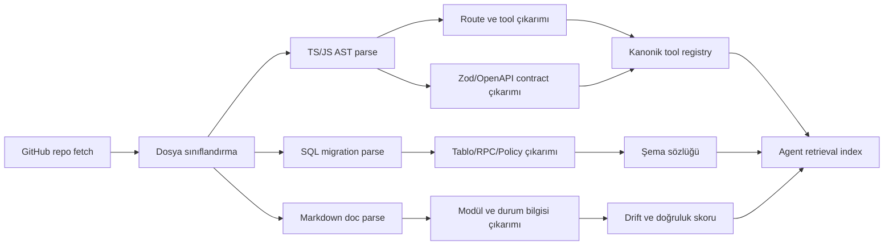
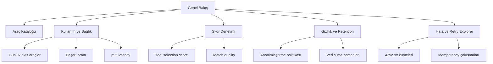
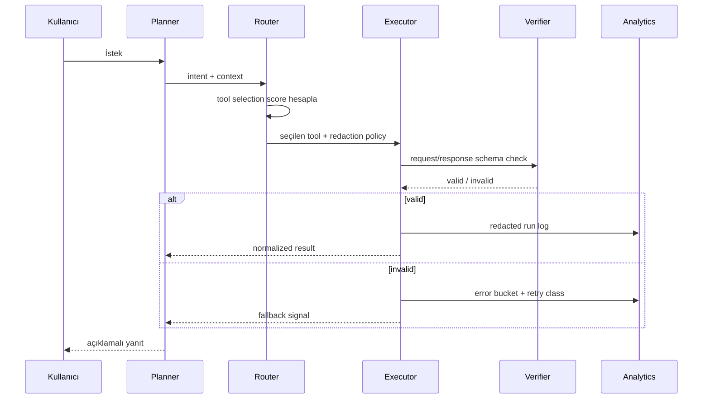

# CorteQS MVP İçin AI Ajan Dostu Uçtan Uca Sistem Tasarımı

## Yönetici özeti

Etkin connector envanteri bu oturumda **yalnızca GitHub**’dır; bu nedenle rapor önce `ubterzioglu/corteqsmvp` deposunun kamuya açık GitHub yüzeyine, ardından resmi ve birincil dış kaynaklara dayanır. Repo bugün basit bir “landing page + form toplama” kod tabanı olmaktan çıkmış; kök ağaç, README, `AGENT_CONTEXT.md` ve `ARCHITECTURE.md` birlikte okunduğunda bunun artık tek SPA içinde landing, lansman, anketler, muhasebe, dizin/katalog, profil, workspace, Cadde 3.0, Edge Function’lar, migration’lar ve ayrı bir Service Finder worker içeren daha geniş bir platform olduğu görülüyor. Repo ağacında `docs/`, `e2e/`, `scripts/`, `src/`, `supabase/` ve `workers/service-finder/` bulunuyor; repoda 430 commit ve 7 tag görünüyor. citeturn26view0turn7view5turn5view3turn48view0

En kritik bulgu, **ajan dostuluğunu en çok zayıflatan şeyin dokümantasyon ve sözleşme dağınıklığı** olmasıdır. README hâlâ “landing/forms/admin/lansman” odaklı ve `public.admin_users` üzerinden admin erişimini anlatırken, `AGENT_CONTEXT.md` aynı tabloların kaldırıldığını ve rol/yetki modelinin `auth.users`, `user_role_assignments`, `user_profile_attributes` ve ilgili AFS tablolarına taşındığını söylüyor. README kurulum akışı `public.admin_users` eklemeyi isterken, güncel bağlam belgesi bunun artık mevcut olmadığını açıkça belirtiyor. Aynı şekilde `package.json` `react-router-dom` için `^7.17.0` derken mimari belgeler 6/6.30 hattını anlatıyor; frontend paketinde `@supabase/supabase-js` `^2.101.1` iken Edge Function dosyaları `2.45.4` pinli import kullanıyor. Bu tür drift, bir ajan için “tek doğruluk kaynağı” yokluğu anlamına gelir ve yanlış tool seçimi, hatalı endpoint çağrıları ve güvenlik açıkları üretir. citeturn26view0turn7view5turn5view2turn47view0turn17view0turn18view0turn19view0turn19view1

Bu repo için en doğru yön, mevcut Supabase/Postgres + RLS + security-definer yaklaşımını koruyup onun üstüne **makinece okunabilir bir araç kataloğu**, **repo-ingestion bilgi grafı**, **kanonik API/contract katmanı**, **anonim kullanım ölçümü**, **çok ölçütlü tool selection skoru** ve **ajan yürütme denetim izi** inşa etmektir. PostgreSQL burada sistem kaydı ve denetlenebilirlik için en uygun seçenek; özellikle `jsonb`, GIN ve RLS, heterojen metadata ve güvenli çok kiracılı erişim için doğrudan uygundur. MongoDB ise ikincil bir projection/analytics store olarak faydalıdır; erişim desenine göre embedding/referencing seçimi ve TTL index’ler, ham olay verisini otomatik eskiltmek için kullanışlıdır. OpenAPI ise ajanların bir servisi kaynak kod okumadan anlayıp çağırabilmesi için standart, dil-bağımsız makinece okunur sözleşme sağlar. citeturn38view0turn40view3turn41view2turn41view4turn40view0

Kısa versiyonla önerim şudur: **önce repo’yu makinece anlaşılır hale getir, sonra ajanı bağla**. Bunun için ilk fazda dosya sınıflandırma ve sembol/endpoint çıkarımı, ikinci fazda tool registry ve analytics tabloları, üçüncü fazda OpenAPI sözleşmeleri ve ajan orkestrasyonu, dördüncü fazda anonim raporlama ve admin paneli gerekir. Özellikle `find-matches`, `submit-survey-response`, `send-submission-email`, `service-finder` worker ve Cadde RPC yüzeyi, AI-agent-friendly sistemin ilk “tool spine”ını oluşturabilir. Repo zaten RPC-only mutation, rate limit, RLS ve security-definer kalıplarına kısmen sahip olduğundan, sıfırdan başlamak yerine bu iskeleti kanonikleştirmek en yüksek getirili seçenektir. citeturn17view0turn18view0turn19view0turn20view0turn6view0turn6view1turn6view2

## Kapsam ve mevcut repo resmi

Repo yüzeyi iki ayrı katman gösteriyor. README’nin anlattığı “landing/forms/admin/lansman” ürünü hâlâ gerçek, çünkü public form akışı, `/admin`, `/lansman`, email Edge Function ve `server.mjs` üzerinden runtime env injection ile `/api/chat` RAG proxy açıkça belgelenmiş. Ancak `AGENT_CONTEXT.md` ve `ARCHITECTURE.md` bunun artık tek bir landing reposu değil, Türk diasporası odaklı daha büyük bir platform olduğunu, aynı SPA içinde landing, lansman, anketler, muhasebe, dizin/katalog, ticari sayfalar, workspace, profile, Cadde 3.0 ve çok sayıda admin ekranı bulunduğunu gösteriyor. Bu yüzden ajan tasarımı README’yi değil, **README + AGENT_CONTEXT + ARCHITECTURE + gerçek paket/fonksiyon dosyalarını birlikte** temel almalıdır. citeturn26view0turn7view5turn5view3

Kök repo ağacında `docs`, `e2e`, `scripts`, `src`, `supabase`, `workers/service-finder`, `server.mjs`, `Dockerfile`, `package.json`, `AGENT_CONTEXT.md`, `ARCHITECTURE.md`, `CLAUDE.md` ve `rapor.html` yer alıyor. `docs/README.md`, kökte yalnızca dört bakımlı dokümanın yaşadığını; geri kalan plan, karar, operasyon, arşiv ve modül belgelerinin `docs/` altına konsolide edildiğini söylüyor. Bu, ingestion aşamasında dokümantasyonun dağınık ama sınıflandırılmış olduğunu; dolayısıyla ajan için “hangi belge aktif, hangisi frozen archive” ayrımının metadata düzeyinde tutulması gerektiğini gösterir. citeturn26view0turn48view0

Aşağıdaki farklar, ilk günden “drift detector” gerektirdiğini gösteriyor:

| Drift alanı | Eski/alternatif anlatı | Güncel/çatışan anlatı | Etki |
|---|---|---|---|
| Admin yetkisi | README `public.admin_users` tablosunu admin erişimi için anlatıyor. citeturn26view0 | `AGENT_CONTEXT.md` artık `admin_users` tablosunun mevcut olmadığını, rol atamalarının `user_role_assignments` üzerinde olduğunu söylüyor. citeturn5view2 | Ajan yanlış tabloyu referanslayabilir; admin erişim üretimi bozulur. |
| Ürün kapsamı | README daha çok landing/form toplama ürünü gibi davranıyor. citeturn26view0 | `ARCHITECTURE.md` ürünün landing + directory + Cadde + surveys + muhasebe + workspace olduğunu söylüyor. citeturn5view3 | Tool inventory yalnız README’den türetilirse repo ciddi biçimde eksik modellenir. |
| Router sürümü | `package.json` `react-router-dom` `^7.17.0` diyor. citeturn47view0 | `AGENT_CONTEXT.md` teknik yığında 6.30 satırını söylüyor. citeturn7view5 | Ajan-generated kod veya route contract’lar yanlış versiyona göre üretilebilir. |
| Supabase JS sürümü | Frontend paketi `@supabase/supabase-js` `^2.101.1`. citeturn47view0 | Edge Function dosyaları `2.45.4` pinli esm import kullanıyor. citeturn17view0turn18view0turn19view0 | SDK davranış farkları ve type/compat drift oluşabilir. |
| Lansman admin endpoint’i | README hâlâ Edge Function deploy talimatı veriyor. citeturn26view0 | `lansman-admin` Edge Function 410 dönerek “Deprecated” diyor; artık doğrudan RLS-backed table access kullanılmalı. citeturn19view1 | Ajan eski edge endpoint’i çağırırsa çalışmayan akışa düşer. |

Bu tablo, ilk mimari kararın “repo bilgisini canlı koddan türetmek” olması gerektiğini açık eder. Yani ajan; README, mimari markdown’lar, `package.json`, `scripts`, `supabase/functions/*`, `supabase/migrations/*`, `src/lib/*-api.ts`, `pages/admin/*`, test dosyaları ve worker paketlerini birlikte okuyarak bir **kanonik tool registry** üretmelidir. OpenAPI’nin değer önerisi de tam budur: bir servisin yeteneklerini insan ve makine için, kaynak kod okumadan ve network trafiğini incelemeden anlaşılır kılmak. citeturn40view0turn47view0turn48view0turn12view0turn13view0

## Repo ingestion ve kanonik veri modeli

Ajan için ingestion katmanının amacı sadece “repo dosyalarını indekslemek” değil, **repo bilgisini tool düzeyine yükseltmek** olmalıdır. Bunun için parse önceliği şu sırayla verilmelidir: kök doğruluk kaynakları (`AGENT_CONTEXT.md`, `ARCHITECTURE.md`, `CLAUDE.md`, `README.md`, `rapor.html`), build/runtime dosyaları (`package.json`, `Dockerfile`, `server.mjs`, `nixpacks.toml`, `vite.config.ts`), tool yüzeyi (`src/App.tsx`, `src/pages/**`, `src/lib/*-api.ts`, `src/lib/cadde-*.ts`, `src/lib/muhasebe-*.ts`, `src/lib/admin/**`), veri katmanı (`supabase/functions/**`, `supabase/migrations/**`, `supabase/config.toml`), async/worker yüzeyi (`workers/service-finder/**`), operasyonel script’ler (`scripts/*.mjs`), sonra da testler (`src/*test*`, `e2e/**`). Bu öncelik, `docs/README.md`’nin “bakımlı kök dokümanlar”, `AGENT_CONTEXT.md`’nin dosya haritası ve repo ağacının gerçek yapısı ile uyumludur. citeturn48view0turn7view5turn26view0

İngestion sırasında dosya başına çıkarılması gereken metadata minimum şunlardır: `path`, `kind`, `module_family`, `route`, `rpc_name`, `http_method`, `zod_schema_presence`, `tables_read`, `tables_write`, `env_vars`, `dependencies`, `version_pin`, `rate_limit`, `security_model`, `doc_status`, `freshness_signal`, `conflict_group`. Örneğin `find-matches` fonksiyonundan POST yöntemi, Zod request şeması, `submissions`, `matches`, `edge_rate_limits` tabloları, Gemini modeli, allowed origins, payload limiti ve rate limit parametreleri çıkarılabilir; `submit-survey-response` fonksiyonundan soru tipleri, honeypot, IP hash, `surveys`, `survey_questions`, `survey_responses`, `survey_answers`, `edge_rate_limits` kullanım deseni çıkarılabilir; `send-submission-email` fonksiyonundan Resend bağımlılığı, `submissionId` girdisi, admin/confirmation email davranışı ve `notification_sent_at` idempotency paterni çıkarılabilir. citeturn17view0turn19view0turn18view0

Önerdiğim ETL zinciri aşağıdaki gibidir:



Bu ETL’nin kalıcı depolaması için PostgreSQL ana kayıt deposu olarak daha uygun olur. Bunun iki nedeni var. Birincisi, repo ve tool metadata’sının bir bölümü yapısal, bir bölümü yarı-yapısal olduğu için `jsonb` doğal bir ara form sağlar. İkincisi, `jsonb` için GIN index’ler anahtar ve anahtar/değer sorgularını verimli hâle getirir; PostgreSQL dokümantasyonu, `jsonb` üzerinde `?`, `?|`, `?&`, `@>`, `@?`, `@@` işleçleri için GIN kullanımını doğrudan önerir. RLS ise ajan ve admin rolleri arasında satır düzeyi ayrım yapmaya elverişlidir; bir tabloda RLS etkinse ve politika yoksa PostgreSQL varsayılan olarak deny-all davranır. Bu, ingestion materyalini çok rollü ajan-ekosistemde güvenle tutmak için doğrudan faydalıdır. citeturn40view3turn38view0

Aşağıdaki öneri, repo-kataloğu ve runtime-analytics’i ayrı şemalara bölerek hem izlenebilirlik hem de ürün verisini kirletmeme hedefini karşılar:

```sql
create schema if not exists ingest;
create schema if not exists ops;

create table ingest.repo_files (
  file_id           bigserial primary key,
  path              text not null unique,
  kind              text not null,          -- md, ts, tsx, sql, json, mjs, html
  module_family     text not null,          -- cadde, surveys, muhasebe, catalog, runtime, docs
  doc_status        text not null,          -- maintained, active, archive, unknown
  content_sha256    bytea not null,
  size_bytes        integer not null,
  language          text,
  parsed_at         timestamptz not null default now(),
  freshness_score   numeric(5,2),
  conflict_group    text,
  meta              jsonb not null default '{}'::jsonb
);

create index repo_files_module_idx on ingest.repo_files (module_family, doc_status);
create index repo_files_meta_gin on ingest.repo_files using gin (meta);

create table ingest.repo_symbols (
  symbol_id         bigserial primary key,
  file_id           bigint not null references ingest.repo_files(file_id) on delete cascade,
  symbol_type       text not null,          -- route, function, rpc, table_ref, env_var, script, component
  symbol_name       text not null,
  signature_text    text,
  line_start        integer,
  line_end          integer,
  confidence        numeric(5,2) not null,
  attrs             jsonb not null default '{}'::jsonb
);

create index repo_symbols_lookup_idx on ingest.repo_symbols (symbol_type, symbol_name);
create index repo_symbols_attrs_gin on ingest.repo_symbols using gin (attrs);

create table ingest.tools (
  tool_key          text primary key,       -- surveys.submit, edge.find_matches, cadde.feed
  tool_name         text not null,
  tool_family       text not null,          -- ui_module, edge_function, worker, script, rpc_bundle
  status            text not null,          -- active, deprecated, unknown
  entrypoint_path   text not null,
  interface_kind    text not null,          -- route, http, cli, internal_api
  input_schema      jsonb,
  output_schema     jsonb,
  dependencies      jsonb not null default '[]'::jsonb,
  config_requirements jsonb not null default '[]'::jsonb,
  version_label     text,
  evidence          jsonb not null default '[]'::jsonb
);

create index tools_family_status_idx on ingest.tools (tool_family, status);
create index tools_input_gin on ingest.tools using gin (input_schema);
create index tools_output_gin on ingest.tools using gin (output_schema);

create table ops.tool_runs (
  run_id            uuid primary key,
  tool_key          text not null references ingest.tools(tool_key),
  actor_type        text not null,          -- human, agent, scheduler
  actor_pseudo_id   text,
  idempotency_key   text,
  request_hash      bytea,
  started_at        timestamptz not null,
  finished_at       timestamptz,
  status            text not null,          -- ok, retry, failed, blocked
  http_status       integer,
  latency_ms        integer,
  error_code        text,
  privacy_level     text not null,          -- pii, pseudo, anon
  payload_redacted  jsonb,
  result_redacted   jsonb,
  tags              jsonb not null default '[]'::jsonb
);

create index tool_runs_tool_time_idx on ops.tool_runs (tool_key, started_at desc);
create unique index tool_runs_idempotency_idx
  on ops.tool_runs (tool_key, idempotency_key)
  where idempotency_key is not null;

create table ops.anon_daily_metrics (
  metric_date       date not null,
  tool_key          text not null references ingest.tools(tool_key),
  country_code      text,
  city_bucket       text,
  run_count         integer not null,
  success_count     integer not null,
  failure_count     integer not null,
  p50_latency_ms    integer,
  p95_latency_ms    integer,
  unique_users_hll  bytea,
  dp_epsilon        numeric(6,3),
  released_at       timestamptz not null default now(),
  primary key (metric_date, tool_key, country_code, city_bucket)
);
```

Yukarıdaki şema, repo bilgisi ile ajan çalıştırma telemetrisini ayırır; ayrıca `jsonb` + GIN kullanımı sayesinde yarı-yapısal sözleşmeler, config listeleri ve evidence setleri tek veri modelinde tutulabilir. PostgreSQL dokümantasyonu `jsonb` indexleme ve RLS davranışı için bu tip kullanımı doğrudan destekler. citeturn40view3turn38view0

MongoDB alternatifi, özellikle “agent retrieval projection” ve yüksek hacimli anonim olaylar için uygundur. MongoDB’nin resmi veri modelleme rehberi, veriyi erişim desenine göre yapılandırmayı, birlikte erişilen veriyi birlikte saklamayı ve ilişkiyi embedding ya da referencing ile modellemeyi önerir. Bu repo bağlamında `tools` belgesi içinde sık okunan `contracts`, `dependencies`, `examples` dizilerini embed etmek; büyük `run_events` akışını ayrı koleksiyonda tutup TTL index ile eskiltmek doğrudur. TTL index’ler tek alanlı indekslerdir ve MongoDB bunları log, event ve finite-lifetime session türü veriler için önerir. citeturn41view2turn41view4

```javascript
// MongoDB alternatif projection
{
  _id: "edge.find_matches",
  family: "edge_function",
  status: "active",
  entrypoint: "supabase/functions/find-matches/index.ts",
  interface: {
    method: "POST",
    path: "/functions/v1/find-matches"
  },
  contracts: {
    input: {
      sourceSubmissionId: "uuid?",
      offers_needs: "string(5..2000)",
      field: "string?",
      city: "string?",
      country: "string?",
      category: "string?",
      persist: "boolean?"
    },
    output: {
      matches: [{ id: "uuid", score: "0..100", reason: "string" }]
    }
  },
  dependencies: [
    "supabase",
    "zod",
    "gemini-2.5-flash",
    "submissions",
    "matches",
    "edge_rate_limits"
  ],
  evidence: ["turn17view0"]
}
```

## Araç envanteri ve veritabanı önerileri

Repo’daki “tool” kavramını yalnız CLI betikleriyle sınırlamak doğru olmaz. Bu depoda tool benzeri yürütülebilir yüzeyler dört grupta toplanıyor: kullanıcı modülleri, admin modülleri, HTTP/Edge Function yüzeyi ve worker/script yüzeyi. `AGENT_CONTEXT.md` route haritası, `ARCHITECTURE.md` modül sözleşmeleri, `package.json` script’leri, `supabase/functions` klasörü ve `workers/service-finder/package.json` birlikte okunduğunda aşağıdaki envanter çıkıyor. citeturn7view5turn5view3turn47view0turn12view0turn20view0

| Tool | Tür | Girdi | Çıktı | Temel bağımlılık / config | Not |
|---|---|---|---|---|---|
| Public submissions | UI modülü + DB yazımı | landing form alanları | `public.submissions` kaydı, admin review | Supabase, admin shell, email workflow | README bunu repo’nun temel yeteneği olarak anlatıyor. citeturn26view0 |
| Admin panel | UI modülü | auth session, filtreler | CSV export, status update, notes | Supabase Auth/RLS | Filtreleme, CSV export, status update ve notes destekleniyor. citeturn26view0 |
| Lansman registration | Standalone UI modülü | lansman kayıt formu | lansman kayıtları | shared admin shell, Supabase | `/lansman` ve `/admin/lansman` birlikte belgelenmiş. citeturn26view0turn7view5 |
| Surveys | UI modülü + Edge submit | survey slug, respondent, answers, honeypot meta | `survey_responses`, `survey_answers`, responseId | Supabase, honeypot, IP hash, rate limits | Public submit sözleşmesi koddan okunabiliyor. citeturn19view0turn7view5 |
| Muhasebe | Admin domain modülü | gelir/gider/nakit akışı girdileri | agregasyonlar, admin sayfaları | `src/lib/muhasebe-*`, Zod, React Query | AGENT_CONTEXT bunu referans pattern olarak işaretliyor. citeturn7view4 |
| Directory / Catalog | UI modülü | search/filter/catalog slug | profil ve katalog görünümü | `catalog-*`, `admin-catalog.ts` | Dizin/katalog aileleri ve admin data katmanı belgelenmiş. citeturn7view5turn5view2 |
| Profile editor | UI modülü | user/profile/catalog item inputs | profil güncelleme, Cadde panelleri | `member-profile-api`, `profile-*` | Aynı resolver ile public ve edit view-model kullanılıyor. citeturn7view5turn6view0 |
| Workspace / Command Center | Admin modülü | todo, resources, docs, meeting notes | merkezi dashboard | dashboard data layer | `/admin/workspace/*` ve Command Center girişleri belgelenmiş. citeturn7view5turn26view0 |
| Cadde feed | UI modülü + RPC bundle | actor context, geo filters, interests | ranking’li feed | `list_cadde_feed_v1`, `cadde-ranking.ts` | Keyset cursor, CKS bandları ve çoklu geo filter açıkça belgeli. citeturn6view0turn7view1 |
| Cadde Cafe | UI modülü + RPC bundle | create/join/approve/archive istekleri | süreli oda yönetimi | `can_join_cadde_cafe`, pg_cron | referral code sha256 hash ve süre sınırları var. citeturn6view0turn6view1 |
| Cadde Çarşı | UI modülü + RPC bundle | ilan yarat/güncelle/sil | pazar ilanları | `create/update/delete_carsi_item_v1` | 30 gün ömür ve ilan limiti belirtilmiş. citeturn6view0turn7view1 |
| Cadde Tanıtım | UI modülü + RPC bundle | kampanya oluşturma | sponsorlu görünürlük | promotion RPC’leri, abuse limiti | placement ve social insertion kuralları belgeli. citeturn6view0turn6view1 |
| Cadde moderasyon | Admin modülü + RPC bundle | report/moderate aksiyonları | hide/publish/ban/audit | `admin_moderate_cadde_entity_v1` | RPC-only mutation ve audit’li moderasyon var. citeturn6view1turn7view1 |
| Edge `send-submission-email` | HTTP tool | `submissionId` | admin mail + opsiyonel confirmation | Supabase, Zod, Resend, env vars | `notification_sent_at` idempotency benzeri guard kullanıyor. citeturn18view0 |
| Edge `submit-survey-response` | HTTP tool | `surveySlug`, respondent, answers, meta | `{ok, responseId}` | Supabase, IP hash, rate limits | Question type validation ve anti-bot mekanizması var. citeturn19view0 |
| Edge `find-matches` | HTTP tool | sourceSubmissionId, offers_needs, field/city/country/category, persist | top-5 eşleşme | Supabase, Zod, Gemini 2.5 Flash | Keyword prefilter + AI rerank + optional persist akışı var. citeturn17view0 |
| Edge `lansman-admin` | HTTP tool | POST | 410 deprecated response | Supabase | Eski akış; artık tool registry’de `deprecated` olmalı. citeturn19view1 |
| Service Finder worker | Worker | Postgres job claim | candidate ve cost ledger yazımı | Node >=20, Supabase, Zod | Pakette worker’ın amacı açıkça yazılı. citeturn20view0turn20view1 |
| CLI scripts | CLI araç seti | build/test/import/verify argümanları | sitemap, release verify, onboarding import/report, CSV import | Node, Vite, Playwright, Vitest | `package.json` script yüzeyi oldukça zengin ve agent-runbook için kritik. citeturn47view0 |

Bu envanterden çıkan mimari sonuç şu: ajan için tek bir “tool catalog” değil, **çok katmanlı tool catalog** gerekir. Kullanıcı modülleri çoğunlukla route ve internal API seviyesinde; Edge Function’lar ise doğrudan HTTP-callable tool’dur; scripts ve worker’lar ise scheduler/ops tool’larıdır. OpenAPI yalnız HTTP yüzeyi için değil, route ve CLI sözleşmelerinin de aynı modelde temsil edildiği üst seviye bir “Tool Description Object” ile genişletilmelidir. OpenAPI’nin makinece anlaşılır HTTP yetenek tanımı için sunduğu avantaj tam burada devreye girer. citeturn40view0turn40view1

Aşağıdaki tablo, her tool ailesi için önerdiğim veri modeli, retention ve anonimleştirme yaklaşımını özetler:

| Tool ailesi | Önerilen PostgreSQL model | MongoDB alternatifi | Retention | Anonimleştirme | Örnek admin sorusu |
|---|---|---|---|---|---|
| Submissions / Lansman | `intake_submissions`, `intake_contacts`, `intake_status_events` | `intake_submissions` + `status_history` embed | Ham PII 12–18 ay; agregat süresiz | email/phone HMAC, free text redaction | “Son 30 günde ülke bazında kaç başvuru geldi?” |
| Surveys | `survey_responses`, `survey_answers`, `survey_daily_metrics` | `survey_responses` + `answers` embed; `daily_metrics` ayrı | Ham cevap 12 ay, opt-in contact ayrı | IP hash salt+pepper, küçük kümeleri baskıla | “Yayınlanan anketlerde tamamlama oranı nedir?” |
| Find matches / matching | `match_jobs`, `match_candidates`, `match_results`, `match_feedback` | `match_job` belgesinde top-N sonuç embed | prompt/result 30–90 gün; skorlar daha uzun | kişi adı yerine pseudonymous IDs | “En yüksek dönüşüm hangi kategori/fielde?” |
| Service Finder worker | `service_jobs`, `service_candidates`, `service_cost_ledger`, `service_run_logs` | `jobs`, `runs`, `cost_ledger` | ham trace 30 gün; cost ledger 1 yıl | provider payload kırpma + token masking | “Job başına maliyet ve başarı oranı nedir?” |
| Cadde analytics | kaynak tablolar + türetilmiş `cadde_daily_metrics` | `cadde_daily_metrics` projection | ham event 30–90 gün; günlük agregat süresiz | user_id yerine user_pseudo_id, geo bucket | “Çarşı ilan canlı kalma süresi nedir?” |
| Muhasebe | mevcut muhasebe tabloları + `finance_metrics_daily` | önerilmez; Postgres ana kayıt olmalı | mevzuat/politika temelli | person-based drilldown yoksa anon aggregate | “Aylık gider kırılımı ve nakit akışı trendi?” |
| Email notifications | `notification_attempts`, `notification_templates`, `delivery_events` | `delivery_events` TTL koleksiyonu | event log 90 gün | recipient hash + template id | “Mail teslim oranı ve tekrar deneme oranı?” |
| Tool ops | `ops.tool_runs`, `ops.anon_daily_metrics`, `ops.error_buckets` | `tool_runs` TTL + daily aggregate | ham run 30–90 gün | user pseudo id, request hash | “Hangi tool en çok 429/5xx üretiyor?” |

Repo’daki mevcut veri ayak izleri de bu modele doğal bağlanıyor. `find-matches` zaten `submissions` okuyup `matches` yazıyor; `submit-survey-response` `surveys`, `survey_questions`, `survey_responses`, `survey_answers`, `edge_rate_limits` ile çalışıyor; `send-submission-email` `submissions.notification_sent_at` alanını güncelliyor; `lansman-admin` artık deprecated; `service-finder` worker ise Postgres job/candidate/cost ledger mantığıyla düşünülmüş. Yani entegrasyon stratejisi “yeni bir paralel ürün DB’si kurmak” değil, **kaynak veri tablolarını bırakıp ops/analytics katmanını ayrı şemada türetmek** olmalıdır. citeturn17view0turn19view0turn18view0turn20view0

Örnek admin istatistik sorguları şöyle olabilir:

```sql
-- Günlük tool başarı/başarısızlık
select
  date_trunc('day', started_at) as day,
  tool_key,
  count(*) as run_count,
  count(*) filter (where status = 'ok') as ok_count,
  count(*) filter (where status <> 'ok') as fail_count,
  percentile_cont(0.95) within group (order by latency_ms) as p95_latency_ms
from ops.tool_runs
where started_at >= now() - interval '30 day'
group by 1, 2
order by 1 desc, 2;

-- Survey tamamlama oranı
select
  s.slug,
  count(distinct r.id) as response_count,
  avg(case when a.answer_count >= q.required_count then 1.0 else 0.0 end) as completion_rate
from surveys s
join survey_responses r on r.survey_id = s.id
join lateral (
  select count(*) as answer_count
  from survey_answers sa
  where sa.response_id = r.id
) a on true
join lateral (
  select count(*) filter (where is_required) as required_count
  from survey_questions sq
  where sq.survey_id = s.id
) q on true
group by s.slug
order by response_count desc;

-- Matching kalite metriği
select
  category,
  avg(match_score) as avg_match_score,
  avg(case when accepted_at is not null then 1.0 else 0.0 end) as accept_rate
from match_results
group by category
order by avg_match_score desc;
```

MongoDB analitik pipeline alternatifi:

```javascript
db.tool_runs.aggregate([
  {
    $match: {
      startedAt: { $gte: ISODate("2026-05-25T00:00:00Z") }
    }
  },
  {
    $group: {
      _id: {
        day: { $dateTrunc: { date: "$startedAt", unit: "day" } },
        tool: "$toolKey"
      },
      runCount: { $sum: 1 },
      okCount: { $sum: { $cond: [{ $eq: ["$status", "ok"] }, 1, 0] } },
      failCount: { $sum: { $cond: [{ $ne: ["$status", "ok"] }, 1, 0] } }
    }
  },
  { $sort: { "_id.day": -1, "_id.tool": 1 } }
]);
```

## Skorlama, gizlilik ve yönetici deneyimi

Bu repo için tek bir skor yetmez; iki ayrı skor gerekir. İlki **tool selection score**, yani ajanın hangi aracı hangi sırayla çağıracağına karar veren skor. İkincisi **domain outcome score**, yani seçilen tool’un ürettiği aday/sonuç kalitesini puanlayan skor. `find-matches` fonksiyonunun halihazırda “keyword prefilter + AI rerank” kullandığını bildiğimiz için, çok ölçütlü bir routing skoru ile ikinci aşama eşleşme skoru birbirinden ayrılmalıdır. citeturn17view0

Önerdiğim routing skoru:

\[
S_{tool}=100\times(0.30I + 0.20C + 0.15P + 0.10F + 0.10L + 0.10D + 0.05A)
\]

Burada  
`I` = intent match,  
`C` = contract completeness,  
`P` = privacy compatibility,  
`F` = freshness/coverage,  
`L` = latency-cost suitability,  
`D` = determinism/observability,  
`A` = availability/health.

Min-max yerine 0–1 normalize edilmiş feature’lar kullanılmalıdır; çünkü farklı tool tiplerinde mutlak ölçüler farklıdır. Örneğin UI-route için latency uygunluğu ile worker için latency uygunluğu aynı ölçekten gelmez. Bu tür normalization katmanı, agent catalog içinde metadata olarak tutulmalıdır.

Örnek kullanıcı niyeti: **“Berlin’de benim alanımda mentor/eşleşme bul”**. Bu niyet için örnek routing skoru:

| Tool | I | C | P | F | L | D | A | Nihai skor |
|---|---:|---:|---:|---:|---:|---:|---:|---:|
| Directory / Catalog | 0.75 | 0.85 | 0.85 | 0.80 | 0.90 | 0.95 | 0.95 | **83.5** |
| Service Finder worker | 0.90 | 0.90 | 0.75 | 0.75 | 0.55 | 0.80 | 0.60 | **80.3** |
| Edge `find-matches` | 0.95 | 0.80 | 0.70 | 0.70 | 0.60 | 0.65 | 0.90 | **79.0** |
| Surveys | 0.20 | 0.95 | 0.90 | 0.70 | 0.85 | 0.95 | 0.95 | **67.5** |
| `send-submission-email` | 0.05 | 1.00 | 0.30 | 0.90 | 0.60 | 0.95 | 0.95 | **52.5** |

Bu örnekte ajan önce deterministik ve daha düşük riskli `Directory/Catalog` kaynağını, sonra gerektiğinde `Service Finder` veya `find-matches` çağrısını yapmalıdır. Bu, hem tool maliyetini hem de prompt injection yüzeyini azaltır. LLM uygulamalarında prompt injection’ın temel sorunu, sistem talimatları ile kullanıcı/veri girdisinin aynı doğal dil kanalında karıştırılmasıdır; OWASP, özellikle dış içerikten gelen dolaylı prompt injection riskini açıkça vurgular. Bu yüzden routing skorunda gizlilik ve determinizm ağırlıkları şarttır. citeturn40view7

İkinci skor, domain outcome skoru, örneğin eşleşme kalitesi için şöyle olabilir:

\[
S_{match}=100\times(0.40M_{semantic}+0.20M_{field}+0.15M_{geo}+0.10M_{category}+0.10M_{fresh}+0.05M_{profile})
\]

Örnek hesap:

- `semantic` = 0.92  
- `field` = 0.80  
- `geo` = 0.60  
- `category` = 0.70  
- `fresh` = 0.85  
- `profile` = 0.90

\[
S_{match}=100\times(0.40\times0.92 + 0.20\times0.80 + 0.15\times0.60 + 0.10\times0.70 + 0.10\times0.85 + 0.05\times0.90)=81.8
\]

Eşikler şu şekilde önerilir: 80+ doğrudan göster; 65–79 “orta güven” olarak göster ve nedeni yaz; 50–64 sadece ikinci listeye al; 50 altı gösterme. `find-matches` zaten 0–100 skor ve kısa gerekçe (`reason`) döndürüyor; bu yüzden mevcut yapıya uyumludur. citeturn17view0

Gizlilik tarafında sistem varsayılanı **privacy by design ve by default** olmalıdır. GDPR; pseudonymisation’ı, verinin ek bilgi olmaksızın belirli bir kişiye atfedilemeyeceği ve bu ek bilginin ayrı saklandığı bir işlem olarak tanımlar. Aynı düzenleme veri minimizasyonu, storage limitation, integrity/confidentiality ilkelerini ve Article 25 ile tasarımdan itibaren korumayı; Article 32 ile pseudonymisation, encryption, resilience ve düzenli testleri ister. Bu ilkeler KVKK uyum eşlemesi için de iyi bir teknik taban sağlar; ancak Türkiye’ye özgü hukuki yorum yine ayrı bir compliance çalışması gerektirir. citeturn43view0turn43view1turn43view2turn43view3turn43view4turn43view5

Bu nedenle önerdiğim anonimleştirme zinciri şöyledir:

- Doğrudan tanımlayıcılar: email, telefon, IP, referral code sahibi gibi alanlar; HMAC-SHA256 + pepper ile pseudonymize edilir. Pepper uygulama DB’sinde tutulmaz; gizli yönetim katmanında tutulur.
- Serbest metinler: LLM’e gitmeden önce PII scrubber’dan geçer; e-posta, telefon, URL, TC kimlik, adres kalıpları redakte edilir.
- Geo alanları: şehir bazında admin panelinde yalnız bucket halinde yayınlanır; görüntüleme için k-anonimlik eşiği önerim `k>=20`.
- Günlük anonim raporlar: yalnız agregat sayılar, oranlar ve yüzde değerleri içerir; küçük kümelerde suppression uygulanır.
- İsteğe bağlı differential privacy: dışa açılan halka açık dashboard’larda Laplace gürültüsü ile sayısal agregatlar korunabilir. Differential privacy, bireyin veritabanında olup olmamasından bağımsız benzer gizlilik güvencesi verme hedefiyle geliştirilmiş matematiksel bir çerçevedir. citeturn45search0turn44academia3

Örnek anonim rapor şeması:

```sql
create table ops.anonymized_tool_report (
  report_date          date not null,
  tool_key             text not null,
  country_code         text,
  city_bucket          text,
  runs_dp_count        integer not null,
  users_dp_count       integer,
  success_rate         numeric(5,2),
  p50_latency_ms       integer,
  p95_latency_ms       integer,
  error_rate           numeric(5,2),
  k_threshold          integer not null default 20,
  epsilon              numeric(6,3),
  notes                text,
  primary key (report_date, tool_key, country_code, city_bucket)
);
```

Admin paneli için view-only sayfalar şu bilgi mimarisine göre kurulmalıdır:



UI düzeyinde her sayfada üç ilke korunmalıdır. Birincisi, tablo + chart + açıklama üçlüsü birlikte görünmelidir; yalnız chart koymak denetlenebilirlik sağlamaz. İkincisi, drill-down yalnız pseudonymous düzeye kadar inmeli, ham PII’ye gitmemelidir. Üçüncüsü, erişilebilirlik varsayılan olmalıdır: WCAG 2.2 daha geniş erişilebilirlik kapsamasını, klavye erişimini, focus görünürlüğünü, focus obscured olmamasını, minimum target size’ı, hata tanımlama ve hata önerisini ve name-role-value uyumunu açıkça çerçeveler. Bu repo admin panelleri çok tablo ve dense UI içerdiği için özellikle 2.1 Keyboard, 2.4.7 Focus Visible, 2.4.11/12/13 focus kriterleri, 2.5.8 Target Size, 3.3.1–3.3.4 input assistance ve 4.1.2 Name, Role, Value kriterleri kritik olacaktır. citeturn29view0turn46view0turn46view1turn46view2

Önerilen ana komponent listesi: `ToolHealthCard`, `ToolUsageTrend`, `LatencyHistogram`, `RetentionPolicyPanel`, `ScoreBreakdownTable`, `MetricDefinitionDrawer`, `PrivacyRiskBadge`, `RunReplayPanel`, `ErrorBucketTable`, `AnonymizationPreview`, `ContractViewer`, `EvidenceLinksPanel`. Özellikle `MetricDefinitionDrawer`, adminin “bu sayı nereden geliyor?” sorusunu cevaplamalıdır; aksi halde ajan çıktıları güven üretmez. NIST Privacy Framework’ün vurguladığı gibi amaç yalnız güvenlik değil, kurum çapında yönetilebilir privacy riskidir. citeturn40view9

## Ajan orkestrasyonu ve API sözleşmeleri

Bu repo için ajan entegrasyonu “tek LLM + serbest prompt” modeliyle kurulursa kısa sürede kırılır. Doğru model, **planner + router + executor + verifier + reporter** zinciridir. Router, yukarıdaki tool selection score’u kullanır; executor yalnız kanonik sözleşmesi olan tool’ları çağırır; verifier ise hem şema doğrulaması hem de güvenlik politikası denetimi yapar. Bu mimari, repo içindeki RLS + security-definer mutasyon yaklaşımıyla da uyumludur; `ARCHITECTURE.md`, özellikle Cadde tarafında mutasyonların RPC-only olması gerektiğini ve kullanıcıya açık insert policy bulunmadığını açıkça söyler. citeturn6view0turn6view1

Önerilen ajan sistem prompt’u iskeleti:

```text
Sistem:
Sen CorteQS araç yönlendiricisisin.
Yalnız tool registry içinde "active" olan araçları kullan.
Önce deterministik ve düşük-riskli araçları tercih et.
PII içeren serbest metni model sağlayıcısına göndermeden önce redakte et.
HTTP çağrılarında idempotency-key kullan.
Şema doğrulaması başarısızsa kullanıcıya uydurma cevap verme; fallback veya açıklamalı hata dön.
Kayıt dışı tablo/endpoint/role varsayımı yapma.
```

Tool prompt şablonu:

```text
Amaç:
Kullanıcı niyeti için en uygun aracı seç.

Girdi:
- user_intent
- available_tools[]
- privacy_level
- latency_budget_ms
- need_for_freshness

Çıktı:
- ordered_tools[]
- why[]
- confidence
- required_redactions[]
```

Yürütme akışı:



HTTP sözleşmeleri OpenAPI ile yayımlanmalıdır; çünkü OAS, bir HTTP servisini kaynak koda erişmeden insanların ve bilgisayarların anlayabileceği standart biçimde tarif eder ve tooling’in `openapi` alanıyla spesifikasyon sürümünü yorumlayabilmesini sağlar. Bu repo için minimum iki katman gerekir: dış API sözleşmesi ve iç ajan sözleşmesi. citeturn40view0turn40view1

Aşağıda önerdiğim iç ajan sözleşmesi vardır:

```yaml
openapi: 3.1.0
info:
  title: CorteQS Agent Tool Gateway
  version: 0.1.0
paths:
  /agent/tools:
    get:
      summary: List active tools for the agent
      responses:
        "200":
          description: Active tool catalog
  /agent/execute/find-matches:
    post:
      summary: Execute match search using canonical contract
      operationId: executeFindMatches
      requestBody:
        required: true
        content:
          application/json:
            schema:
              type: object
              required: [offers_needs]
              properties:
                sourceSubmissionId:
                  type: string
                  format: uuid
                offers_needs:
                  type: string
                  minLength: 5
                  maxLength: 2000
                field:
                  type: string
                city:
                  type: string
                country:
                  type: string
                category:
                  type: string
                persist:
                  type: boolean
      responses:
        "200":
          description: Ranked matches
          content:
            application/json:
              schema:
                type: object
                properties:
                  matches:
                    type: array
                    items:
                      type: object
                      required: [id, score, reason]
                      properties:
                        id:
                          type: string
                          format: uuid
                        score:
                          type: number
                          minimum: 0
                          maximum: 100
                        reason:
                          type: string
        "400":
          description: Invalid payload
        "429":
          description: Too many requests
  /reports/usage-anon:
    get:
      summary: View-only anonymized usage metrics
      parameters:
        - in: query
          name: toolKey
          schema:
            type: string
        - in: query
          name: from
          schema:
            type: string
            format: date
        - in: query
          name: to
          schema:
            type: string
            format: date
      responses:
        "200":
          description: Aggregated metrics
```

Error handling ve retry politikası, repo’daki mevcut pratikleri genelleştirmelidir. `find-matches` ve `send-submission-email` zaten rate limit/HTTP hata kodu farkındalığına sahip. Bunun üstünde genel ilke şu olmalıdır: transient hatalarda retry; kalıcı/semantik hatalarda immediate fail; yalnız idempotent operasyonlarda otomatik retry; exponential backoff + jitter; retry limit; circuit breaker. Azure Retry Pattern, transient failures için görünmez retry’nin stabiliteyi artırdığını ama operation idempotent değilse istenmeyen yan etkiler doğurabileceğini söyler. Google Cloud da backoff’suz hızlı retry’nin cascading failure üretebileceğini, exponential backoff with jitter ve idempotency farkındalığını açıkça önerir. citeturn42view0turn42view1turn42view2turn42view3turn42view4

Güvenlik katmanında en az şu korumalar gereklidir:

- Tool allowlist ve status gate: `deprecated` veya `unknown` tool çağrılmaz. `lansman-admin` bunun ilk örneğidir. citeturn19view1
- Prompt/data separation: system prompt, user input ve uzaktan çekilmiş içerik farklı kanallar olarak işlenir. OWASP prompt injection rehberi bunu temel risk olarak tarif eder. citeturn40view7
- Redaction-before-LLM: serbest metin dış model sağlayıcısına gitmeden önce scrub edilir.
- Idempotency-key: mail, match persist ve state-mutating admin işlemleri için zorunludur.
- Policy-aware execution: mutasyon yalnız RPC-only veya yetkili endpoint üzerinden yapılır; doğrudan tablo yazımı yasaktır. Repo bunu Cadde için zaten norm haline getirmiş durumda. citeturn6view0turn6view1
- Contract verifier: Zod/OpenAPI uyuşmazlığı üretim hatası sayılır; silent coercion yapılmaz.

## Uygulama planı

Bu dönüşüm en iyi **fazlı ve evidans-temelli** gider. Repo hâlihazırda geniş, testli ama kısmen düzensiz bir kod tabanıdır; `ARCHITECTURE.md` 509+ Vitest testi olduğunu, Playwright konfigürasyonunun bulunduğunu ve tam lint’in eski hatalar nedeniyle başarısız döndüğünü belirtiyor. Bu, sıfırdan rewrite yerine kontrollü “contract-first hardening” yaklaşımını destekler. citeturn5view3

Aşağıdaki plan, yüksek getiri / düşük risk sırasıyla önerilir:

| Faz | Çıktı | Tahmini efor | Kapanış kriteri |
|---|---|---|---|
| Kanonikleştirme | repo ingestion, drift detector, tool registry | Orta | En az %90 tool yüzeyi kataloglanmış; conflicting docs işaretlenmiş |
| Sözleşme üretimi | OpenAPI + internal Tool Description Object | Orta | Edge Function’ların tamamı ve seçilen admin/modül API’leri sözleşmeli |
| Analytics ve anonim raporlama | `ops.*` tabloları, retention jobs, anonim dashboard | Orta | Günlük tool health ve privacy-safe usage görünür |
| Ajan router | tool selection score, executor, verifier | Orta-Yüksek | En az 5 aktif tool ile güvenli orchestration |
| UI/UX | admin analytics ve score audit ekranları | Orta | View-only admin panel WCAG 2.2 AA hedefini karşılıyor |
| Sertleştirme | retry/circuit breaker, injection guard, CI drift gate | Orta | Production readiness checklist geçmiş |

Adım adım iş listesi şu olmalıdır. Önce repo parser yazılır: markdown parser, AST parser, SQL parser, script parser. Sonra `ingest.repo_files`, `ingest.repo_symbols`, `ingest.tools` doldurulur. Ardından “tool registry compiler” yazılır; bu derleyici her PR’da çalışıp yeni/bozulmuş contract’ları raporlar. Sonra mevcut tool’lar için adapter katmanı yazılır: `find-matches`, `submit-survey-response`, `send-submission-email`, Cadde’nin seçili read-only RPC’leri, Service Finder worker health endpoints. Son olarak admin analytics ekranı ve agent gateway açılır. Repo zaten `verify:text`, `generate:sitemap`, `verify:release`, import script’leri, Vitest ve Playwright script’lerini içerdiği için bu işler mevcut CI yüzeyine doğal bağlanır. citeturn47view0turn26view0

Test stratejisi beş katmanlı olmalıdır. Parser golden test’leri, aynı dosyadan aynı sembol/contract çıktısının üretildiğini güvence eder. Contract test’leri, Zod ve OpenAPI arasında tutarlılık arar. Migration smoke test’leri, yeni şema sözlüklerinin var olan migration setiyle uyumunu kontrol eder. Orchestration test’leri, tool routing ve fallback kararlarını doğrular. Güvenlik test’leri ise prompt injection, non-idempotent retry, PII leak ve privilege escalation senaryolarını kapsar. Özellikle OWASP’ın tarif ettiği direct ve indirect prompt injection senaryoları için fixture seti hazırlanmalıdır. citeturn40view7

CI/CD tarafında önerim şudur: PR açıldığında `verify:text`, TypeScript typecheck, hedefli ESLint, Vitest smoke, contract compile, OpenAPI lint, migration diff, ingestion snapshot diff ve privacy redaction testleri çalışsın. Main branch deployundan önce `verify:release` benzeri release doğrulaması ve production config check zorunlu olsun. Full-repo lint’in şu anda eski backlog nedeniyle sürekli kırıldığı repo tarafından açıkça söylendiği için, ilk aşamada “targeted lint + changed-packages lint” modeli daha pratiktir; backlog temizlendikçe strict gate’e geçilir. citeturn5view3turn47view0

Son tavsiyem, bu repo için AI-agent-friendly dönüşümün başarı ölçütünü “LLM bağladık mı?” diye değil, şu dört soruyla tanımlamaktır:  
Bir: ajan hangi tool’un aktif/deprecated olduğunu makinece anlayabiliyor mu?  
İki: ajan kaynak kod okumadan güvenilir sözleşme üzerinden çağrı yapabiliyor mu?  
Üç: admin, ajan kararını ve tool sağlığını gizlilik ihlali olmadan denetleyebiliyor mu?  
Dört: doküman drift’i yeni PR’da otomatik yakalanıyor mu?  

Bu dört soruya “evet” denmediği sürece repo AI-agent-friendly sayılmamalıdır. Bu repo, mevcut mimari desenleri nedeniyle buna uzak değil; fakat bugün ihtiyaç duyduğu şey yeni bir model değil, **kanonikleştirme, sözleşme üretimi ve privacy-safe gözlemlenebilirlik**tir. Repo zaten bunun taşlarını içeriyor; yapılması gereken, onları ajanların tüketebileceği tutarlı bir sisteme çevirmektir. citeturn5view3turn7view4turn17view0turn19view0turn20view0turn40view0turn43view4turn43view5