# 06 — Target ER Diagram + Satellite Verdicts

> **Date:** 2026-06-09 · Companion to design `05`. Satellite verdicts are grep-driven (src/**/*.{ts,tsx}, functional consumers only — admin DB-browser listing in `AdminDatabaseTablesPage.tsx` does NOT count as a dependency).

## Satellite keep/drop — FINALIZED
| Satellite | Functional consumer? | Verdict |
|---|---|---|
| `catalog_search_documents` | directory search (RPC + triggers) | **KEEP** |
| `catalog_item_media` | DirectoryCatalogItemPage, admin-catalog | **KEEP** |
| `catalog_item_contacts` | DirectoryCatalogItemPage:238, admin-catalog | **KEEP** |
| `catalog_item_links` | admin-catalog, DirectoryCatalogItemPage | **KEEP** |
| `catalog_item_locations` | DirectoryCatalogItemPage:132,238 | **KEEP** |
| `catalog_item_services` | DirectoryCatalogItemPage:239 | **KEEP** |
| `catalog_item_languages` | DirectoryCatalogItemPage:240 | **KEEP** |
| `catalog_item_categories` (+ `catalog_categories`) | DirectoryCatalogItemPage:135, admin-catalog:212 | **KEEP** |
| `catalog_item_reviews` | none (listing only) | **DROP** |
| `catalog_item_reports` | none (listing only) | **DROP** |
| `catalog_item_tags` | none (listing only) | **DROP** |
| `catalog_item_relations` | none (listing only) | **DROP** |
| `catalog_item_favorites` | none functional | **DROP** (confirm `favorites` feature not wired) |
| `catalog_audit_logs` | none (listing only) | **DROP** |
| `catalog_item_verification_records` | none functional | **DROP** (verification via `is_verified` column) |
| `entity_metadata` | none | **DROP** |
| `catalog_categories` (taxonomy) | KEEP (consumed) — but reconsider vs flat sections | **KEEP for now** |

> Net: KEEP 8 satellites + categories; DROP 7 (reviews, reports, tags, relations, favorites, audit_logs, verification_records) + entity_metadata. Each DROP confirmed 0 functional consumers. Triggers on dropped satellites (`trg_catalog_search_document_item_*`) drop with them.

## Target ER diagram

```mermaid
erDiagram
    catalog_items ||--o{ catalog_item_roles : has
    roles ||--o{ catalog_item_roles : assigned
    roles ||--o{ role_attributes : defines
    roles ||--o{ role_features : defines
    roles ||--o{ role_sections : defines
    afs_attributes ||--o{ role_attributes : referenced
    afs_features ||--o{ role_features : referenced
    afs_sections ||--o{ role_sections : referenced
    catalog_items ||--o{ catalog_item_attribute_values : stores
    afs_attributes ||--o{ catalog_item_attribute_values : typed_by
    catalog_items ||--o{ catalog_item_attribute_overrides : overrides
    catalog_items ||--o{ catalog_item_feature_overrides : overrides
    catalog_items ||--o{ catalog_item_section_overrides : overrides
    catalog_items ||--o{ catalog_item_claims : claimed_via
    catalog_items ||--o{ catalog_item_managers : managed_by
    catalog_items ||--o{ catalog_item_media : has
    catalog_items ||--o{ catalog_item_contacts : has
    catalog_items ||--o{ catalog_item_links : has
    catalog_items ||--o{ catalog_item_locations : has
    catalog_items ||--o{ catalog_item_services : has
    catalog_items ||--o{ catalog_item_languages : has
    catalog_items ||--o{ catalog_item_categories : tagged
    catalog_categories ||--o{ catalog_item_categories : taxonomy
    catalog_items ||--|| catalog_search_documents : indexed

    roles {
        uuid id PK
        text key UK
        text label
        text description
        bool is_active
        int sort_order
        timestamptz deleted_at
    }
    catalog_items {
        uuid id PK
        text slug UK
        text display_name
        text short_description
        text country_code
        text city
        text status
        text visibility
        bool is_placeholder
        bool is_verified
        uuid created_by
    }
    catalog_item_roles {
        uuid id PK
        uuid catalog_item_id FK
        uuid role_id FK
        bool is_primary
    }
    afs_attributes {
        uuid id PK
        text key UK
        text data_type
        text storage_strategy
        text storage_key
        text default_visibility
        jsonb validation_schema
    }
    role_attributes {
        uuid id PK
        uuid role_id FK
        uuid attribute_id FK
        bool is_required
        bool is_public
        text visibility
        int sort_order
    }
```

> NO `family_key`, `parent_role_id`, `category_id`, `subcategory_id`, `inherits_from_role_id` anywhere. Flat by construction.

## Phase 1 cross-report summary (for Checkpoint 1)
- Roles: **76** final (6 legacy drop). ✓
- Attributes **53**, Features **42**, Sections **7**. ✓
- **Matrix is 100% uniform** (24/30/7 identical for all 76 roles) — decision A vs B needed (report 04).
- Satellites: KEEP 8 + categories, DROP 8. (above)
- Structural rename caveat: `role_feature_flags.feature_key` (text) → `role_features.feature_id` (FK) needs resolution in migration 005.
- Schema gaps: add `storage_strategy/storage_key/default_visibility/validation_schema` etc. in migration 004.
