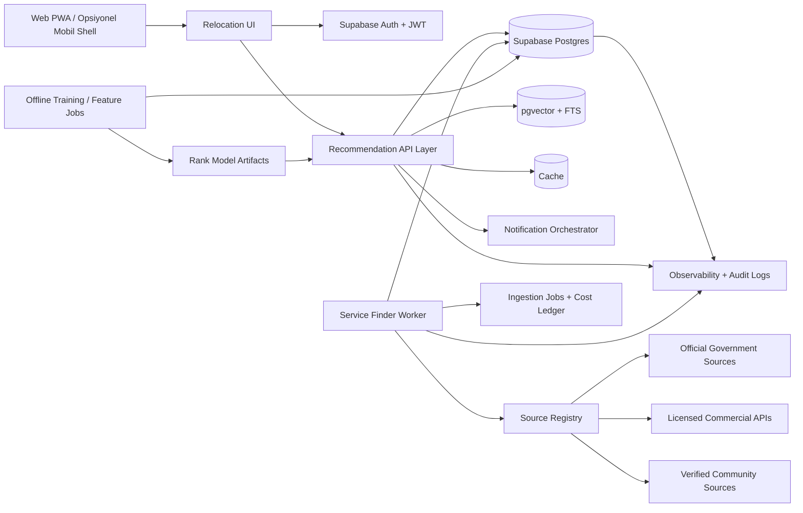
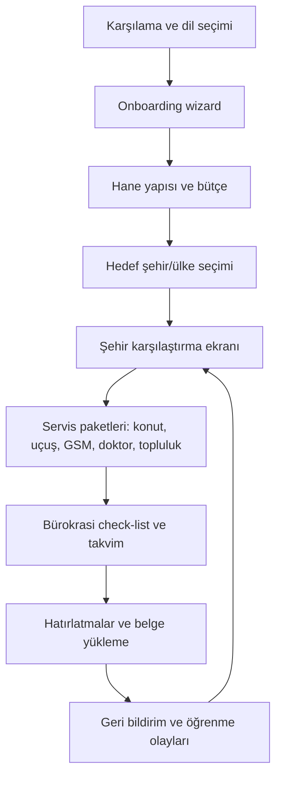

# CorteQS Relocation Recommendation Engine E2E Tasarım Dokümanı

## Yönetici Özeti

CorteQS’in mevcut deposu halihazırda React + Vite tabanlı bir SPA, Supabase Auth/Postgres/RLS omurgası, çok modüllü route yapısı, Docker/Coolify dağıtımı ve Postgres’ten iş claim edip aday kayıtları ile maliyet defteri yazan ayrı bir `workers/service-finder` worker’ı içeriyor. Bu nedenle en düşük teslim riski taşıyan yaklaşım, yeni taşınma motorunu ayrı bir mikro ürün olarak sıfırdan kurmak değil; mevcut repo içindeki modül kalıplarını, Supabase güvenlik modelini ve worker desenini genişleterek “relocation” dikeyini eklemektir. Bu yaklaşım hem mevcut operasyon modeline uyar hem de `lib/<modül>-api.ts`, `lib/<modül>-schemas.ts`, `lib/<modül>-types.ts`, `lib/<modül>-query-keys.ts` şeklindeki yerleşik modül organizasyonu ile tutarlıdır. citeturn2view0turn4view1turn8view0

Önerilen ürün mimarisi üç katmanlıdır: kullanıcıya dönük planlama ve keşif deneyimi; resmi ve lisanslı kaynaklardan veri alan kaynak-uyarlayıcı ve normalizasyon katmanı; son olarak kural tabanlı ve veri geldikçe öğrenen hibrit sıralama katmanı. Datasets henüz belirsiz olduğu için tasarımın omurgası “schema-first, source-registry-first, official-first” olmalıdır: yani önce veri sözleşmeleri, kaynak güvenilirlik puanı, yenileme sıklığı ve izin/lisans alanları tanımlanmalı; gerçek veri geldiğinde yalnızca adapter’lar ve eşleme kuralları doldurulmalıdır. OpenAPI 3.1 ve JSON Schema bu kontratları standartlaştırmak için uygundur; mevcut repodaki Zod doğrulama deseni de bu yaklaşımı frontend sınırında destekler. citeturn24search11turn24search2turn4view1

Bu dokümanda önerilen hedef durum, ilk fazda güvenilir bir kural motoru ve güçlü filtreleme ile çalışan MVP; ikinci fazda aday üretim + öğren-to-rank temelli hibrit sıralama; üçüncü fazda etkileşimlerden öğrenen kişiselleştirme ve çok dilli, çevrimdışı dayanıklı bir PWA deneyimidir. YouTube’un üretim öneri mimarisinde de aday üretim ve sıralama katmanlarının ayrılması ölçek ve bakım kolaylığı sağlar; LambdaMART ve BPR gibi yöntemler ise sıralama ve implicit feedback öğrenimi için endüstri-standardı seçimlerdir. citeturn23search0turn23search1turn23search14

Bu plan ayrıca güvenlik ve veri koruma açısından da repo ile uyumludur. Supabase RLS ve Postgres row security, istemciye açılan şemalarda satır-temelli erişim kontrolünü doğal olarak destekler; GDPR ve KVKK ise amaç sınırlaması, veri minimizasyonu ve varsayılan olarak mahremiyet ilkelerini zorunlu kılar. Özellikle doktor, erişilebilirlik veya aile yapısı gibi alanlar hassas veya hassasa yakın sinyaller üretebileceği için veri sınıflandırması ve saklama politikası ilk sprintte tasarlanmalıdır. citeturn10search0turn11search1turn12search0turn12search2turn12search6

İndirilebilir Markdown belgesi: [corteqs_relocation_engine_e2e_tr.md](sandbox:/mnt/data/corteqs_relocation_engine_e2e_tr.md)

## Mimari ve Dağıtım Tasarımı

Mevcut repo bağlamında tavsiye edilen hedef mimari, frontend’i repo içinde tutan; CRUD, plan üretimi ve orkestrasyon için Supabase tabanlı API’leri kullanan; dış veri toplama ve zenginleştirme için mevcut `service-finder` worker desenini genişleten; sıralama ve arama için önce Postgres + pgvector + full text, ancak ihtiyaç artarsa ayrı bir arama katmanına evrilebilen bir tasarımdır. Repo README’si uygulamanın bugün React + Vite, Supabase, Edge Functions ve Docker/Coolify ile çalıştığını; mimari doküman ise kuralların veritabanında yaşadığını ve frontend’in esasen yönlendirici rol oynadığını söylüyor. Aynı doküman frontend katmanlaşmasını zaten modül bazlı standartlaştırmış durumda. Bu yüzden yeni relocation modülü bu kalıbı bozmak yerine onun içine yerleşmelidir. citeturn2view0turn2view1turn4view1

Dikkat edilmesi gereken küçük ama önemli bir repo bulgusu da dokümantasyon ve paketler arasında bir kısmi sürüm sürüklenmesi olmasıdır: `ARCHITECTURE.md` içinde `react-router-dom 6` ifadesi geçerken, `package.json` bağımlılığı `react-router-dom` için `^7.17.0` göstermektedir. Taşınma motoru entegrasyonundan önce kısa bir “dependency inventory” çalışması yapılması gerekir; çünkü yeni modülün route guard ve lazy-loading tasarımı gerçek çalışma zamanını hedeflemelidir, dokümantasyon varsayımını değil. citeturn4view1turn5view0



Üretimde veri akışı şu sırayla işleyecek şekilde tasarlanmalıdır: kullanıcı onboarding sırasında ihtiyaçlarını ve taşınma bağlamını girer; sistem önce sert kısıtları uygular; sonra şehir, mahalle, servis ve görev adaylarını üretir; ardından bu adaylar kural skoru ve öğrenilmiş sıralama skoru ile birlikte harmanlanır; son aşamada kullanıcıya açıklanabilir paketler, zaman çizelgesi ve görev listesi döndürülür. Worker tarafı resmi kurum, düzenleyici veya lisanslı partner kaynaklardan gelen verileri normalize eder, kaynak güvenilirliği ve tazelik alanlarını ekler, gerektiğinde provider adayları üretir ve sonuçları maliyet/denetim defteriyle birlikte Postgres’e yazar. Mevcut worker’ın açıklaması tam olarak “claims jobs from Postgres, runs search/extract/classify providers, writes candidates and a cost ledger” dediği için relocation ingestion hattı için doğal bir başlangıç noktası zaten mevcuttur. citeturn8view0turn8view1

Dağıtım açısından üç uygulanabilir seçenek vardır. Mevcut repo pratikleri nedeniyle varsayılan seçim “evrimsel monorepo” olmalıdır; çünkü mevcut uygulama zaten Docker/Coolify ile servis edilmektedir, `server.mjs` runtime env injection yapmakta, `/api/chat` benzeri server-side proxy mantığı yürütmekte ve nginx katmanı güvenlik başlıklarını set etmektedir. Ayrıca kökte bakımlı belge sayısı kısıtlı tutulduğu için yeni mimari belgeler `docs/` altına eklenmelidir; root’a yeni kalıcı mimari döküman yığılmamalıdır. citeturn2view1turn3view0turn25view0

| Seçenek | Ne içerir | Artıları | Eksileri | Tavsiye |
|---|---|---|---|---|
| Evrimsel monorepo | Mevcut React/Vite + Supabase + worker + Docker/Coolify | En düşük entegrasyon riski; mevcut auth/RLS ve dokümantasyon kalıbı ile uyumlu; hızlı MVP | Ağır ML serving ve yoğun fan-out için sınırlı olabilir | **Başlangıç için varsayılan** citeturn2view0turn4view1turn8view0 |
| Ayrı API servisi | Repo içinde veya ayrı deploy edilen Fastify/NestJS recommendation service | Daha net servis sınırı; ağır sıralama ve cache yönetimi için iyi | Operasyonel karmaşıklık ve ek dağıtım yükü | Faz 2 sonrası, gerekirse |
| Ayrı arama/ML platformu | OpenSearch/Redis/feature store/model serving | En yüksek ölçek ve esneklik | En yüksek maliyet ve ekip olgunluğu ihtiyacı | Yalnızca veri hacmi/latans bunu zorunlu kıldığında |

Güvenlik tarafında nginx şablonu bugün bile `X-Frame-Options`, HSTS, `Referrer-Policy`, `Permissions-Policy`, `Cross-Origin-Opener-Policy`, `Cross-Origin-Resource-Policy` ve sıkı bir CSP tanımlıyor. Bu iyi bir temel; fakat relocation motoru eklendiğinde ayrıca kaynak-adapter servisleri için gizli anahtar ayrımı, kullanıcı istekleri ile partner istekleri arasında farklı rate-limit katmanları, idempotency anahtarları, signed webhook doğrulaması ve audit trail zorunlu hale gelmelidir. OWASP API Security Top 10, tam da bu tür partner ve kullanıcı-facing API’lerde nesne düzeyi yetkilendirme, oran sınırlama ve yanlış yapılandırma risklerini öne çıkarır. citeturn3view0turn11search2turn11search5

Mahremiyet ve GDPR/KVKK çerçevesinde temel prensip şudur: relocation yardımı için gerekli olmayan hiçbir PII toplanmamalı; belgeler ve hassas kullanıcı notları ile öneri özellikleri birbirinden ayrılmalı; doğrudan kimlik bilgileri ile öğrenme verisi arasında teknik ayrıştırma kurulmalıdır. GDPR Madde 5 veri minimizasyonu, amaç sınırlaması ve saklama süresi sınırlamasını; Madde 25 ise tasarımda ve varsayılanlarda veri korumasını gerektirir. KVKK 6698 de mahremiyet hakkını ve veri işleme ilkelerini bağlayıcı hale getirir; ayrıca açık rızanın belirli, bilgilendirilmiş ve özgür iradeye dayanması gerektiğini vurgular. citeturn12search0turn12search12turn12search2turn12search6

## Veri Modeli ve Kaynak Stratejisi

Veri modeli iki ayrı amacı birlikte desteklemelidir: birincisi operasyonel ürün deneyimi; ikincisi tavsiye motoru eğitimi ve denetimi. Bu yüzden şema yalnızca kullanıcı, taşınma ve servis kayıtlarından ibaret olmamalı; kaynak kimliği, güvenilirlik, tazelik, lisans tipi, geocoding doğruluğu, canonicalization durumu ve ingest lineage alanlarını da taşımalıdır. JSON Schema ile veri kontratları tanımlanmalı, OpenAPI 3.1 ile API yüzeyi yayımlanmalı, Zod ise repo içindeki mevcut istemci sınır doğrulama modeli olarak aynalanmalıdır. citeturn24search2turn24search11turn4view1

| Varlık | Çekirdek alanlar | Kritik ilişkiler | Not |
|---|---|---|---|
| `users` | `user_id`, `auth_user_id`, `preferred_language`, `country_of_residence`, `consent_version` | `households`, `moves`, `interactions` | Auth kimliği ile alan bazlı profil ayrılmalı |
| `households` | `household_id`, `user_id`, `adults`, `children`, `pets`, `accessibility_needs` | `moves` | Aile ve erişilebilirlik sinyalleri öneriyi güçlü etkiler |
| `moves` | `move_id`, `user_id`, `origin_location_id`, `target_geo_scope`, `move_window_start`, `move_window_end`, `budget_monthly`, `status` | `move_preferences`, `recommendations`, `bureaucratic_step_instances` | Ürünün ana aggregate root’u |
| `locations` | `location_id`, `country_code`, `city_code`, `district`, `lat`, `lon`, `cost_index`, `safety_index`, `language_availability` | `services`, `emergency_contacts`, `bureaucratic_steps` | Çok seviyeli geo hiyerarşisi gerekir |
| `services` | `service_id`, `category`, `provider_name`, `location_id`, `source_id`, `trust_score`, `freshness_at`, `price_min`, `price_max` | `service_offers`, `recommendations` | Housing, airline, GSM, doctor, community hub tek tabloda normalize edilebilir |
| `emergency_contacts` | `emergency_contact_id`, `country_code`, `city_code`, `type`, `phone`, `label`, `source_id` | `locations` | 112, polis, zehir hattı, konsolosluk vb. |
| `bureaucratic_steps` | `step_id`, `country_code`, `city_code`, `trigger`, `deadline_rule`, `required_docs`, `official_url_label`, `source_id` | `move_id` üzerinden örneklenir | Kural ve görev üretiminin omurgası |
| `source_registry` | `source_id`, `provider_name`, `authority_level`, `license_type`, `refresh_sla_hours`, `api_terms_summary` | tüm ingestion tabloları | Kaynak güvenilirliği burada merkezi olur |
| `interactions` | `event_id`, `user_id`, `move_id`, `entity_type`, `entity_id`, `event_type`, `rank_position`, `context` | eğitim veri havuzu | Save, dismiss, compare, convert |
| `recommendations` | `recommendation_id`, `move_id`, `entity_type`, `entity_id`, `hard_filter_pass`, `rule_score`, `ml_score`, `final_score`, `explanations` | `moves`, `services`, `locations` | Açıklanabilirlik için skor bileşenleri saklanmalı |

Aşağıdaki örnekler, gerçek veri gelmeden önce paylaşılabilecek minimum veri sözleşmeleridir. Bunlar özellikle veri sağlayıcı kabulü, fixture üretimi ve entegrasyon testleri için kullanılmalıdır. JSON Schema ve örnek payload’lar aynı anda tutulursa veri ekibi, backend ve frontend aynı sözlüğü konuşur. citeturn24search2turn24search6

```json
{
  "user_profile": {
    "user_id": "usr_01JX...",
    "preferred_language": "tr-TR",
    "secondary_languages": ["en-US"],
    "household": {
      "adults": 2,
      "children": 1,
      "pets": ["cat"],
      "accessibility_needs": ["elevator_preferred"]
    },
    "relocation_goals": ["work", "family_settlement"],
    "budget": {
      "currency": "EUR",
      "monthly_housing_max": 1800,
      "setup_budget_max": 6000
    },
    "privacy_flags": {
      "allow_personalization": true,
      "allow_partner_referrals": false
    }
  }
}
```

```json
{
  "move": {
    "move_id": "mov_01JX...",
    "origin": {"country": "TR", "city": "Istanbul"},
    "targets": [
      {"country": "DE", "city": "Berlin"},
      {"country": "NL", "city": "Amsterdam"}
    ],
    "move_window": {"start": "2026-09-01", "end": "2026-10-15"},
    "must_haves": ["turkish_community", "family_doctor_access", "5g_coverage"],
    "nice_to_haves": ["direct_flight", "international_school"]
  }
}
```

```json
{
  "service": {
    "service_id": "svc_01JX...",
    "category": "gsm_operator",
    "provider_name": "ExampleTel",
    "location": {"country": "DE", "city": "Berlin", "district": "Mitte"},
    "offer": {
      "plan_name": "Unlimited 5G M",
      "price": 34.99,
      "currency": "EUR",
      "contract_months": 12
    },
    "quality": {
      "coverage_score": 0.88,
      "source_trust": 0.97,
      "freshness_at": "2026-06-15T10:00:00Z"
    },
    "source": {
      "source_type": "regulator",
      "source_id": "src_bnetza_mobile"
    }
  }
}
```

```json
{
  "bureaucratic_step": {
    "step_id": "bst_01JX...",
    "country_code": "DE",
    "city_code": "BERLIN",
    "name": "Adres kaydı",
    "trigger": "after_arrival",
    "deadline_rule": "within_14_days",
    "required_documents": ["passport", "wohnungsgeberbestaetigung"],
    "output_artifacts": ["registration_certificate"],
    "source": {
      "source_id": "src_berlin_registration",
      "authority_level": "official_city"
    }
  }
}
```

Kaynak stratejisinde öncelik sırası “resmi kaynak > regülatör/veri portalı > lisanslı ticari API > doğrulanmış topluluk kaynağı > kullanıcı üretimi içerik” olmalıdır. Bunu ürün içinde de görünür kılmak gerekir; çünkü kullanıcıya önerilen bir doktor, SIM kart veya vize adımı yalnızca “en alakalı” değil aynı zamanda “en güvenilir” de olmalıdır. Avrupa içi taşınmalarda Your Europe ve EURES; Almanya için Make it in Germany ve Berlin servisleri; Hollanda için BRP/gemeente kayıt akışları; Birleşik Krallık için GOV.UK; Fransa için Service-Public; Türkiye tarafında ise YTB ve T.C. Dışişleri konsolosluk servisleri doğal Tier-1 kaynaklardır. citeturn13search0turn13search1turn13search7turn20search3turn19search1turn19search2turn20search2turn13search3turn13search4

| Kategori | Tier-1 varsayılan kaynaklar | Tier-2 ticari/lisanslı kaynaklar | Neden öncelikli |
|---|---|---|---|
| Göç ve bürokrasi | Your Europe, EURES, Make it in Germany, Berlin Service Portal, GOV.UK, Service-Public, Government.nl/BRP, T.C. Konsolosluk, YTB citeturn13search0turn13search1turn13search7turn20search3turn19search2turn20search2turn19search1turn13search4turn13search3 | Hukuk büroları veya özel danışmanlar yalnızca açıklayıcı/yardımcı katman | Resmi kaynaklar hukukî doğruluk ve güncellik için temel |
| Konut | Belediyelerin veya açık veri portallarının yayınları uygun oldukça önce; ardından Idealista API, ImmoScout24 API, Rightmove datafeed, Funda partner endpoints citeturn17search0turn17search1turn17search2turn17search15 | Aynı sütun | Lisanslı/partner erişim, scraping riskinden daha sürdürülebilir |
| Uçuş ve giriş şartları | IATA Timatic, resmi havayolu API’leri, devlet seyahat uyarıları citeturn16search6turn16search3turn13search9 | Amadeus, Skyscanner, Lufthansa Open API citeturn16search0turn16search1turn16search3 | Bir yanda uygunluk/giriş şartı, diğer yanda fiyat ve rota verisi gerekir |
| GSM ve kapsama | BNetzA, Ofcom, ARCEP, BTK/e-Devlet kapsama servisleri citeturn14search0turn14search1turn14search2turn14search7turn14search11 | Operatör katalog ve bayi API’leri | Regülatör verisi daha karşılaştırılabilir ve tarafsız |
| Doktor ve sağlık | NHS Find a GP, KBV/116117/gesund.bund.de, ameli Annuaire Santé, MHRS/e-Devlet citeturn15search1turn15search4turn15search12turn15search2turn15search3turn15search11 | Doctolib benzeri rezervasyon ortakları | Resmi dizin + rezervasyon hibriti güven ve eylem üretir |
| Türk topluluk merkezleri | YTB, konsolosluk bağlantıları, doğrulanmış dernek dizinleri; ülke bazında TGD gibi kurumsal çatı yapılar citeturn18search1turn18search5turn18search2 | InterNations, yerel community guide’lar, doğrulanmış WhatsApp/Telegram rehberleri citeturn18search0turn18search11 | Topluluk verisi faydalıdır ama resmi değildir; güven puanı ayrışmalıdır |

Özellikle ticari entegrasyonlarda “API var mı?” sorusu kadar “kullanım ve yeniden dağıtım şartı ne?” sorusu da önemlidir. Skyscanner partner dokümanları cache ve yeniden dağıtım sınırları hakkında açık kılavuz sunar; ImmoScout24 ve Rightmove ise veri erişimini partner/datafeed mantığıyla çerçeveler. Bu nedenle ürün kararı olarak HTML scraping’i varsayılan yöntem yapmamak, sadece hukuki onay ve alternatif yokluğu durumunda kontrollü fallback olarak düşünmek gerekir. citeturn16search9turn16search17turn17search1turn17search2

Bürokratik adımlar tablosu ülke ve şehir bazında parametrik olmalıdır; sabit içerik sayfaları yerine kural tabanlı görev üretmelidir. Örneğin Berlin’de ikamet kaydı resmi şehir servislerinde açıkça tanımlanır; Amsterdam çevresinde gemeente kaydı BSN üretiminin kapısıdır; Birleşik Krallık’ta NIN başvurusu ve Fransa’da adres değişikliği veya yerleşme adımları resmi portallar üzerinden yönetilir; Türkiye tarafında ise yurtdışı vatandaşın konsolosluk işlemleri merkezi portaldan izlenebilir. Bu veriler `bureaucratic_steps` için seed örnekleri üretmekte kullanılmalıdır. citeturn20search0turn20search3turn21search0turn19search1turn19search2turn20search2turn13search4

## API ve Öneri Motoru Tasarımı

API yüzeyi REST + async job deseniyle kurulmalıdır. Kullanıcı-facing akışlarda düşük gecikmeli senkron uçlar, kaynak içe alımı ve ağır zenginleştirme için ise job tabanlı asenkron uçlar kullanılmalıdır. Resmi kontrat formatı OpenAPI 3.1 olmalı; request/response gövdeleri JSON Schema ile doğrulanmalı; repo içinde Zod doğrulamaları ve React Query sorgu anahtarları ile eşlenmelidir. Supabase Auth JWT’leri kullanıcı kimliği için yeterlidir; ancak servisler arası uçlar için server-only anahtarlar ve ayrı scope’lar kullanılmalıdır. `SUPABASE_SERVICE_ROLE_KEY` gibi sırların frontend’e sızmaması gerektiği repo README’sinde zaten açıkça belirtilmiştir. citeturn24search11turn24search2turn4view1turn2view0

| Endpoint | Amaç | Auth | Varsayılan limit |
|---|---|---|---|
| `POST /v1/moves` | Yeni taşınma dosyası açar | User JWT | 20/saat/kullanıcı |
| `PATCH /v1/moves/{moveId}` | Taşınma bağlamını günceller | User JWT | 120/saat/kullanıcı |
| `POST /v1/moves/{moveId}/wizard` | Adım adım onboarding cevaplarını kaydeder | User JWT | 300/saat/kullanıcı |
| `GET /v1/locations/recommendations` | Şehir/mahalle önerileri döndürür | User JWT veya anonymous-lite | 60/dk |
| `GET /v1/services/recommendations` | Konut, uçuş, GSM, doktor, topluluk önerileri döndürür | User JWT | 60/dk |
| `GET /v1/checklists/{moveId}` | Bürokrasik görev listesini üretir | User JWT | 120/dk |
| `POST /v1/interactions` | Save, dismiss, compare, click, convert event’lerini yazar | User JWT | 600/saat/kullanıcı |
| `GET /v1/emergency-contacts` | Ülke/şehir bazlı acil numara ve kurumları getirir | User JWT veya anonymous-lite | 120/dk |
| `POST /v1/admin/ingestion/jobs` | Kaynak senkronizasyon işi başlatır | Admin/service token | 30/saat |
| `GET /v1/admin/ingestion/jobs/{jobId}` | Ingestion iş durumunu izler | Admin/service token | 120/dk |
| `POST /v1/admin/models/promote` | Yeni sıralama modelini aktif eder | Admin/service token | 10/gün |

Oran sınırlama değerleri burada tasarım önerisidir; gerçek partner sözleşmelerine göre ikinci bir rate-limit katmanı gerekir. Supabase Edge Functions dokümanları gateway’in JWT doğrulaması ve rate-limit gibi kontrolleri merkezîleştirebildiğini belirtir. Partner tarafında ise Skyscanner ve benzeri seyahat API’lerinin kullanım ve cache kısıtları ayrıca uygulanmalıdır. citeturn10search1turn16search17turn16search9

Aşağıdaki örnek, şehir önerileri için tavsiye edilen senkron uç modelidir:

```http
POST /v1/moves
Authorization: Bearer <supabase_jwt>
Content-Type: application/json
```

```json
{
  "origin": {"country": "TR", "city": "Istanbul"},
  "targets": [
    {"country": "DE"},
    {"country": "NL"}
  ],
  "move_window_start": "2026-09-01",
  "move_window_end": "2026-10-15",
  "budget_monthly": 2500,
  "currency": "EUR",
  "household": {"adults": 2, "children": 1, "pets": ["cat"]}
}
```

```json
{
  "move_id": "mov_01JX8P...",
  "status": "draft",
  "next_action": "complete_wizard",
  "created_at": "2026-06-19T08:30:14Z"
}
```

Şehir öneri cevabında yalnızca skor değil açıklama ve veri kalitesi de dönmelidir; aksi halde kullanıcı güveni düşer ve modeller denetlenemez. Tavsiye edilen yanıt örneği aşağıdadır:

```json
{
  "move_id": "mov_01JX8P...",
  "recommendations": [
    {
      "entity_type": "location",
      "entity_id": "loc_berlin",
      "title": "Berlin",
      "final_score": 0.86,
      "score_breakdown": {
        "constraint_fit": 1.0,
        "budget_fit": 0.72,
        "community_fit": 0.91,
        "service_density": 0.88,
        "bureaucracy_complexity_penalty": -0.11,
        "ml_score": 0.79
      },
      "why": [
        "Türk topluluğu ve Türkçe destekli servis yoğunluğu yüksek",
        "Aile hekimi ve ulaşım seçenekleri güçlü",
        "Konut bütçesi sınırda, erken arama önerilir"
      ],
      "source_quality": {
        "official_sources_ratio": 0.74,
        "freshness_hours": 18
      }
    }
  ]
}
```

Öneri motoru katmanlı tasarlanmalıdır. İlk katmanda sert filtreler bulunur: hedef ülkeye hukuki uygunluk, bütçe aralığı, move window, evcil hayvan kabulü, aile büyüklüğü, erişilebilirlik gereksinimi, servis mevcudiyeti ve veri tazeliği eşiği. İkinci katmanda kural tabanlı skor yer alır; bu skor veri yokluğunda bile güvenilir bir MVP sağlar. Üçüncü katmanda ise aday üretim + sıralama yaklaşımı gelir: önce SQL/geo/FTS/vectör ile adaylar çekilir, sonra öğrenilmiş bir ranker son skoru üretir. Endüstri ölçeğinde bu “candidate generation then ranking” yaklaşımı yaygındır ve YouTube makalesi bunu açık biçimde anlatır. citeturn23search0turn23search4turn10search2turn11search0

Hibrit sıralama için tavsiye edilen kurgu şudur. Faz 1’de açıklanabilir ağırlıklı skor kullanılmalıdır; örneğin `0.30 budget_fit + 0.20 bureaucracy_ease + 0.15 healthcare_access + 0.15 gsm_coverage + 0.10 community_fit + 0.10 flight_access`. Faz 2’de LambdaMART benzeri learning-to-rank modeli devreye alınmalıdır; çünkü bu tip modeller çok sayıda heterojen özelliği iyi taşır ve sıralama metriklerine optimize edilebilir. Implicit event’ler yoğunlaştığında BPR benzeri yaklaşım veya pairwise training de eklenebilir. Böylece sistem hem kural güvenilirliğini hem de davranış sinyalini birlikte kullanır. citeturn23search1turn23search5turn23search14

Özellik kümesi en az şu alanları kapsamalıdır: fiyat ve bütçe uyumu, kira aralığı, depozito tahmini, uçuş erişimi, doğrudan uçuş sayısı, GSM kapsama skoru, aile hekimi/uzman yoğunluğu, resmi bürokrasi yükü, topluluk merkezi uzaklığı, güvenlik ve yaşam maliyeti indeksleri, kaynak güvenilirliği, veri tazeliği, çok dilli destek oranı, kullanıcı geçmişindeki etkileşimler, benzer hane segmentlerinin başarı oranı ve mevsimsellik. Sağlık ve aile özellikleri teknik olarak çok değerli olsa da, bunlar özel nitelikli veriye yaklaşabileceği için coarse-grained tutulmalı; örneğin “çocuk doktoru erişimi önemli” gibi ürün etiketleri kullanılmalı, doğrudan sağlık teşhisi depolanmamalıdır. GDPR ve KVKK ilkeleri burada açıkça uygulanmalıdır. citeturn12search0turn12search2

Cold-start stratejisi veri gelene kadar ürünün kaderini belirler. Bu nedenle cold-start yalnızca “popular items” ile çözülmemelidir. En doğru kurgu, onboarding anketi + household bağlamı + move amacı + country/city hedefi + resmi kural ve availability filtreleri ile başlayan knowledge-based bootstrap’tır; üzerine cohort priors, popüler ama güvenilir seçenekler ve hızlı öğrenen dismiss/save sinyalleri eklenmelidir. Cold-start literatürü knowledge-based recommender’ların sistem veya kullanıcı cold-start’ında yararlı olduğunu vurgular; daha yeni araştırmalar da LLM çağında bile cold-start’ın merkezi problem olmaya devam ettiğini söyler. citeturn23search7turn23search15turn23search3

Eğitim verisi ihtiyacı net biçimde sınıflanmalıdır: gösterim, tıklama, kart açma, save, hide, compare, partner click-out, randevu/rezervasyon başlangıcı, check-list task completion, support eskalasyonu ve nihai “move success” gibi outcome sinyalleri ayrışmalıdır. Bu olaylar `interactions` tablosunda anonimize kullanıcı kimliği ve bağlamla saklanmalı; eğitim verisine taşınırken doğrudan PII çıkarılmalıdır. Başarı metriği yalnızca CTR olmamalıdır; aksi halde sistem düşük kaliteli ama dikkat çekici önerilere kayar. Daha iyi bir metrik seti; offline’da Recall@K, NDCG@K, MRR, coverage, diversity ve freshness, online’da shortlist rate, click-out to action rate, completed-step rate, time-to-first-viable-plan ve complaint rate kombinasyonudur. Sıralama literatürü özellikle order-sensitive metriklerin önemini vurgular. citeturn23search1turn23search13turn23search14

## Deneyim, Operasyon ve Uyum

Kullanıcı deneyimi PWA-first tasarlanmalıdır. Bunun temel nedeni hem mevcut repo’nun web SPA oluşu hem de relocation kullanım senaryosunun cihazlar arası ve düşük bağlantı koşullarında gerçekleşmesidir. MDN servis worker dokümanları, service worker’ların ağ ile uygulama arasında proxy gibi davranarak çevrimdışı deneyimler ve akıllı cache davranışı mümkün kıldığını açıklar. Bu nedenle ilk günden native uygulama yerine web/PWA çekirdeği kurup, gerekirse daha sonra mobil shell veya tam native katman eklemek daha düşük riskli olacaktır. citeturn22search1turn22search5turn2view0



Web ve mobil wireframe mantığı üç ana akış üzerine kurulmalıdır. Birincisi onboarding ve move wizard: kullanıcıyı tek seferde boğmak yerine 5–7 kısa adımda hedef ülke/şehir, aile yapısı, zaman aralığı, bütçe, olmazsa olmazlar ve izin verilen kişiselleştirme kapsamı toplanmalıdır. İkincisi planlama ekranı: şehir skoru, mahalle alternatifleri, resmi görev listesi, servis paketleri ve tahmini kurulum bütçesi aynı yerde görünmelidir. Üçüncüsü günlük hayata iniş ekranı: yakın doktorlar, SIM seçenekleri, acil numaralar, konsolosluk bilgileri ve Türk topluluğu merkezleri, kullanıcının varış sonrası ilk haftasını desteklemelidir. citeturn15search1turn15search4turn14search1turn13search4turn18search1

Bildirim sistemi olaysal tasarlanmalıdır. “Varıştan sonraki 14 gün içinde adres kaydı”, “şehirde 5G kapsaması daha güçlü bir operatör bulundu”, “seçtiğiniz mahallede yeni kiralık ilan eşiği geçti”, “GP/doctor listesi güncellendi” veya “resmi kayıt randevu linki değişti” gibi tetikleyiciler gerekir. Repo bugün e-posta bildirimleri için Supabase Edge Function kullanıyor; relocation motoru ilk fazda e-posta + in-app bildirim ile başlamalı, push ise sonraki fazda eklenmelidir. citeturn2view0turn10search1

Operasyon tarafında gözlemlenebilirlik zorunludur. Ölçülmesi gereken çekirdek göstergeler; ingestion latency, source freshness SLA, provider dedup oranı, recommendation p50/p95 latency, rule-pass vs ml-rank dağılımı, cache hit rate, click-out conversion, failed sync count ve partner API hata kodlarıdır. Log tarafında tüm istekler `request_id`, `move_id`, `user_segment`, `source_id`, `model_version` ve `policy_version` ile işaretlenmelidir. Worker tarafında retry, exponential backoff ve dead-letter eşleniği için Postgres tabanlı hata kuyruk tabloları kullanılmalıdır. Mevcut worker zaten Postgres claim modeli ve cost ledger mantığını kullandığı için bu genişletme organiktir. citeturn8view0

CI/CD planı mevcut repo gerçekliğine göre yazılmalıdır. Mimari doküman, Vitest tarafında 509+ test bulunduğunu, Playwright’ın yapılandırıldığını, ancak tam `npm run lint` komutunun repodaki eski hatalar nedeniyle başarısız olduğunu söylüyor. Bu nedenle relocation modülü için pipeline aşamaları “targeted lint”, typecheck, unit, contract, integration ve e2e olarak ayrıştırılmalı; yeni modül, var olan lint backlog’una takılmadan koruma altına alınmalıdır. Release doğrulamasında repo’nun zaten kullandığı `npm run verify:release` akışı aynen korunmalıdır. citeturn4view3turn2view1

Test stratejisi dört düzeyli olmalıdır. Birincisi domain unit testleri: skor fonksiyonları, eligibility kuralları, deadline üretimi, mapper’lar ve schema validator’lar. İkincisi contract testleri: resmi ve ticari kaynak adapter’larının response map’leri, lisans ve null davranışları. Üçüncüsü entegrasyon testleri: Postgres migration’ları, RLS policy’leri, Edge Function çağrıları ve worker-DB etkileşimi. Dördüncüsü E2E: onboarding, şehir karşılaştırma, doktor arama, emergency contacts ve bureaucracy checklist tam akışları. Sağlık ve göç verileri kullanıcı güvenini doğrudan etkilediği için “golden datasets” ve sentetik fixture’lar testlerde kritik olacaktır. SDV çok tablolı ilişkisel sentetik veri üretimini, Faker ise kontrollü fixture bootstrap’ini destekler. citeturn24search0turn24search4turn24search1

Yerelleştirme ve erişilebilirlik ilk günden çekirdek gereksinim olmalıdır. W3C, uluslararasılaştırmayı yalnız çeviri değil; karakter kümeleri, yön bilgisi, sayı/tarih/para birimi formatları ve kültürel uyarlama alanı olarak tanımlar. Unicode CLDR yerel biçimlendirme verisinin standart kaynağıdır; WCAG 2.2 ise erişilebilirlik seviyesini tanımlar ve insan dilinin programatik olarak belirlenebilmesini açıkça ister. Bu yüzden ürün en az `tr-TR` ve `en-US` locale’lerini, CLDR tabanlı formatlamayı, tüm serbest metin alanlarında dil etiketi taşımayı ve WCAG 2.2 AA hedefini benimsemelidir. citeturn22search0turn22search3turn22search6turn22search8turn22search2

Çevrimdışı veya sınırlı bağlantı davranışı için minimum kapsam; uygulama kabuğu, aktif taşınma planı, son indirilen bürokrasi adımları, emergency contacts, check-list öğeleri ve kullanıcı short-list’lerinin cihazda cache’lenmesi olmalıdır. Network geri geldiğinde sync queue devreye girmeli, çakışmalar sunucu zaman damgası ve entity version alanı ile çözülmelidir. Belgelerin kendisi istemci cache’ine açık metin olarak değil, tercihen yalnız metadata düzeyinde alınmalıdır. Bu tasarım aynı zamanda GDPR/KVKK minimizasyon ilkesine daha uyumludur. citeturn22search1turn12search0turn12search2

## Repo Göç Planı ve Yol Haritası

Entegrasyon planı repo’nun mevcut klasör ve belge disipliniyle uyumlu olmalıdır. `docs/README.md`, kökte yalnızca dört bakımlı dokümanın yaşaması gerektiğini ve yeni aktif dokümanların `docs/` altına eklenmesini söylüyor. Bu nedenle relocation motoru için ana tasarım ve ADR’ler `docs/plans/relocation-engine/` veya `docs/modules/relocation/` altında tutulmalıdır. Uygulama kodu ise mevcut feature slicing modelini takip etmelidir. citeturn25view0turn4view1

Önerilen dosya/folder yapısı aşağıdaki gibidir:

```text
src/
  components/relocation/
    RelocationWizard.tsx
    CityComparisonTable.tsx
    ServiceRecommendationCard.tsx
    BureaucracyTimeline.tsx
    EmergencyContactsPanel.tsx
  pages/relocation/
    routes.tsx
    RelocationHomePage.tsx
    MoveWizardPage.tsx
    CityComparePage.tsx
    MoveChecklistPage.tsx
  lib/
    relocation-api.ts
    relocation-schemas.ts
    relocation-types.ts
    relocation-query-keys.ts
    relocation-ranking.ts
    relocation-explanations.ts
  content/relocation/
    locales/tr-TR.json
    locales/en-US.json
supabase/
  migrations/
    <timestamp>_relocation_core.sql
    <timestamp>_relocation_rls.sql
    <timestamp>_relocation_recommendations.sql
  functions/
    relocation-recommendations/
    relocation-notifications/
workers/
  service-finder/
    src/relocation/
      adapters/
      normalizers/
      jobs/
      scoring/
docs/
  plans/relocation-engine/
    relocation-engine-e2e.md
    source-registry.md
    dataset-acceptance-contract.md
    adr-001-relocation-stack.md
```

Teknoloji seçimi açısından tavsiye edilen varsayılan yığın, repo’nun bugünkü yatırımını bozmayacak ama veri geldikçe büyüyebilecek bir yığındır. Supabase Auth ve RLS kullanıcı erişimi için zaten doğal seçimdir; pgvector aynı Postgres içinde embedding ve similarity search imkânı verir; Edge Functions API orkestrasyonu için uygundur; fakat ağır ETL ve geniş partner fan-out işlerini Node worker’da tutmak daha doğrudur. Bu denge, hem mevcut repo pratiklerini hem de Supabase’in kendi yetenek setini iyi kullanır. citeturn10search0turn10search1turn10search2turn8view0

| Katman | Varsayılan tercih | Alternatif | Seçim gerekçesi |
|---|---|---|---|
| Frontend | Mevcut React + Vite SPA’yı PWA’ya evriltmek | Ayrı React Native/Expo uygulaması | Mevcut repo ile maksimum yeniden kullanım ve daha hızlı teslim |
| Auth ve kullanıcı verisi | Supabase Auth + Postgres + RLS | Ayrı auth sunucusu + ayrı DB | Repo zaten bunu kullanıyor; RLS exposed schema için kritik citeturn10search0turn10search3 |
| API orkestrasyonu | Supabase Edge Functions + gerektiğinde küçük Node gateway | Baştan NestJS/Fastify mikroservisi | Edge Functions, JWT kontrolü ve üçüncü taraf çağrıları için yeterli başlangıç noktası citeturn10search1 |
| Arama | Postgres FTS + pgvector | OpenSearch/Elasticsearch | Veri hacmi belli değil; önce daha az hareketli parça |
| Cache | Başlangıçta DB + CDN cache; sonra Redis/Upstash | Baştan Redis | Gereksiz erken karmaşıklığı önlemek |
| ML | Faz 1’de TS/SQL rule engine; Faz 2’de offline LTR eğitimi | Baştan yoğun online ML | Dataset yokken öğrenilmiş model yerine açıklanabilir kural motoru daha güvenli |
| Ingestion | Mevcut `service-finder` worker’ı genişletmek | Baştan yeni queue/worker sistemi | Repo içinde zaten iş claim/cost ledger deseni var citeturn8view0 |
| Containerization | Mevcut Docker/Coolify hattı | Kubernetes | Şimdilik repo ve ekip ölçeği için daha uygun |

Teslim planı takım boyutu belirsiz olduğu için en doğru şekilde “person-week” cinsinden ifade edilmelidir. Aşağıdaki tablo küçük veya orta ölçekli bir ekibin paralelleştirebileceği çalışma paketlerini verir. Gerçek takvim, veri erişimlerinin ve partner onaylarının gecikmesine duyarlıdır.

| Paket | Çıktı | Tahmini efor |
|---|---|---|
| Discovery ve data-contract | Varlık listesi, dataset acceptance contract, source registry şablonu, ADR’ler | 2–3 person-week |
| Core schema ve migration | `users/moves/locations/services/bureaucratic_steps/interactions/recommendations` şemaları, RLS, seed veriler | 3–5 person-week |
| Ingestion altyapısı | Kaynak adapter SDK’sı, job tabloları, dedup, freshness, audit, maliyet defteri entegrasyonu | 4–6 person-week |
| MVP rule engine | Hard filters, açıklanabilir skor, `/v1/*` temel endpoint’ler | 4–5 person-week |
| UI/PWA akışları | Wizard, compare, checklist, emergency contacts, local tips, offline cache | 4–6 person-week |
| Eval ve LTR alpha | Etkileşim olayları, feature extraction, offline metrikler, ilk rank model denemesi | 4–6 person-week |
| Hardening ve launch | Güvenlik incelemesi, rate-limit, contract tests, e2e, observability dashboard’ları | 3–4 person-week |

Pratikte iyi bir milestone sırası şu şekilde olmalıdır: önce veri sözleşmesi ve migration, sonra ingestion skeleton, ardından rule-based MVP ve UI wizard, sonra event instrumentation, en son hibrit ranking. Dataset yokken ML’yi öne çekmek yerine ürünün karar yüzeyini netleştirmek daha doğru olur; çünkü kural sistemi sonradan öğrenilmiş modele de feature ve explanation iskeleti sağlar. citeturn23search0turn23search1

Veri setleri geldiğinde kabul için aşağıdaki kontrol listesi kullanılmalıdır:

- [ ] Her dosya veya API için kaynak sahibi, erişim yöntemi ve lisans/yeniden kullanım koşulu tanımlandı mı? Ticari API’lerde cache ve redistribution kısıtları ayrıca işlendi mi? citeturn16search9turn17search1turn17search2
- [ ] UTF-8 encoding, tarih biçimi, zaman dilimi, para birimi ve locale alanları açık mı? Repo zaten text encoding doğrulamasına önem veriyor. citeturn2view1turn25view0
- [ ] Stabil bir birincil anahtar veya güvenilir dedup anahtarı var mı? Yoksa canonicalization kuralı tanımlandı mı?
- [ ] Geo verilerde ülke kodu, şehir kodu, lat/lon, adres normalizasyonu ve hassasiyet seviyesi var mı?
- [ ] PII, hassas veri veya hassasa yakın alanlar işaretlendi mi? Yasal dayanak, saklama süresi ve silme politikası yazıldı mı? citeturn12search0turn12search2
- [ ] Kaynak tazeliği, güncellenme sıklığı ve son başarılı ingest zamanı izlenebilir mi?
- [ ] Null, bilinmiyor, yok, uygulanamaz ve silinmiş değerleri birbirinden ayıran semantik sözlük var mı?
- [ ] En az 50–200 satırlık örnek veri ile schema validation ve mapper testleri geçti mi? citeturn24search2
- [ ] Kaynak güvenilirliği ve authority level alanı dolduruldu mu? Resmi, regülatör, lisanslı ticari, doğrulanmış topluluk, kullanıcı üretimi ayrıldı mı?
- [ ] Backfill ve incremental update stratejisi tanımlandı mı?
- [ ] Veri sağlayıcının test/sandbox bilgileri ve rate-limit sınırları kaydedildi mi? citeturn16search17turn17search1

Sonuç olarak, CorteQS için en doğru relocation recommendation engine stratejisi; mevcut repo’nun Supabase/RLS/worker omurgasını koruyan, resmi kaynakları birinci sınıf veri kaynağı yapan, veri sözleşmesi merkezli ilerleyen ve kural motorundan hibrit sıralamaya evrilen bir tasarımdır. Bu tasarım repo gerçekliğine en uyumlu, hukuken en savunulabilir ve veri belirsizliği altında en dayanıklı seçenektir. citeturn2view0turn4view1turn8view0turn12search0turn12search2